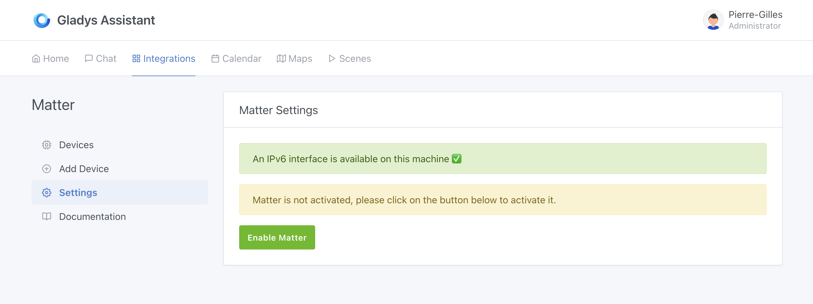
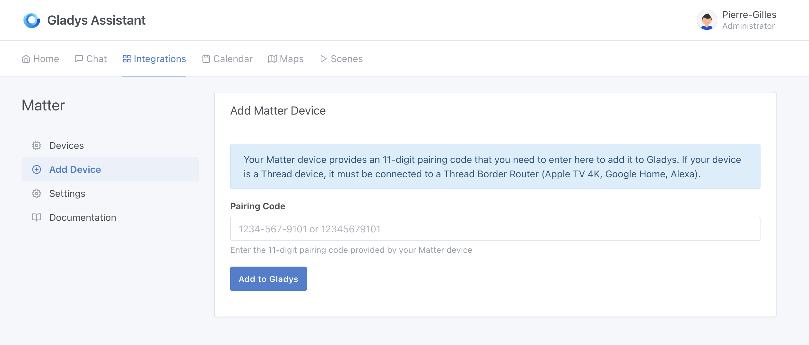
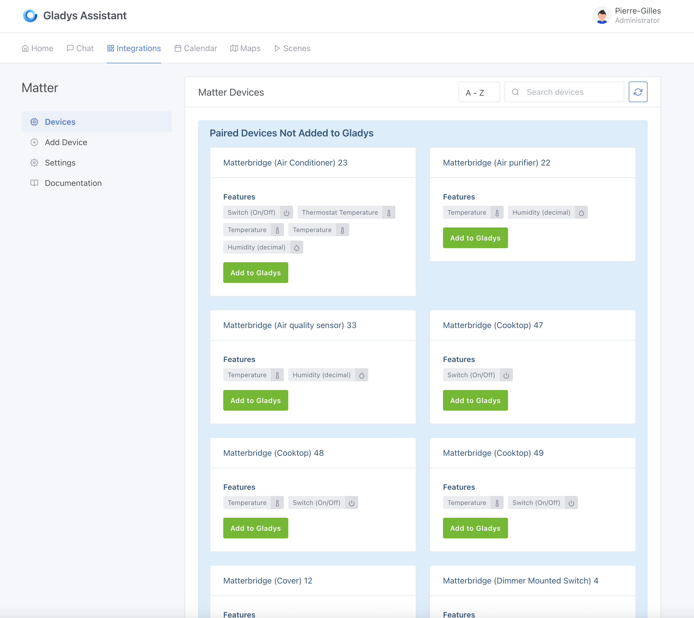
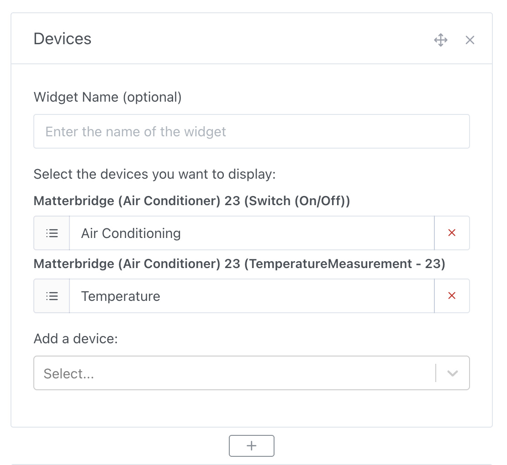
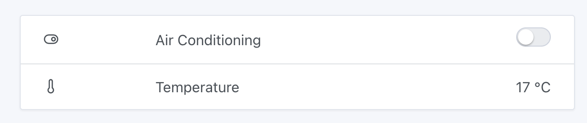

The Matter protocol is a small revolution in the world of smart homes: it finally allows unified communication between smart devices from different manufacturers.

Gladys Assistant is compatible with Matter, so you can integrate Matter devices into your setup.

## Compatibility

Gladys supports the following features:

- **On/Off**: plugs, lights, air conditioning, heating, fans, etc.
- **Lights**: brightness and color control.
- **Roller shutters / curtains**: open, close, pause + position control.
- **Thermostats**: target temperature setting.
- **Air conditioners**: target temperature setting.
- **Motion sensors**
- **Light sensors**
- **Temperature sensors**
- **Humidity sensors**

If you have a device that is not yet supported, feel free to share it on the [forum](https://community.gladysassistant.com/), and we’ll work on adding support.

## Matter vs Thread

Matter is an **application protocol**, meaning it defines how devices communicate in terms of exchanged messages: what kinds of commands are possible (e.g., turning on a light, getting the temperature), in what format those messages are sent, and how devices handle their state, pairing, or security.

In short, Matter focuses on the “what” and the “how” of smart device interactions.

Thread, on the other hand, is a **low-level mesh network protocol**, designed for communication between low-power wireless devices. It acts as an alternative to Zigbee or Wi-Fi, but unlike them, it is based on IP standards (IPv6), making it natively Internet-compatible.

Thread handles the “how it travels” part — that is, transporting messages over a reliable, fast, and secure wireless network.

Some Matter devices use Thread as their network protocol, but not all! Matter devices can also use Wi-Fi, Ethernet, or even Bluetooth.

### If your device is already on your network

If your device is Matter-compatible and uses Wi-Fi or Ethernet, it's already on your network and can be used directly in Gladys!

This is the case for all Matter bridges offered by manufacturers like Philips Hue, IKEA via their DIRIGERA hub, etc.

It's also true for all Wi-Fi devices like smart plugs or bulbs directly connected to Wi-Fi.

### Matterbridge

[Matterbridge](https://github.com/Luligu/matterbridge) is an open-source project that aims to import into a Matter network devices that are not natively Matter-compatible.

As of today, Matterbridge supports:

- [Shelly](https://github.com/Luligu/matterbridge-shelly)
- [Somfy Tahoma](https://github.com/Luligu/matterbridge-somfy-tahoma)
- [Zigbee2mqtt](https://github.com/Luligu/matterbridge-zigbee2mqtt)
- [Home Assistant](https://github.com/Luligu/matterbridge-homeassistant)
- [Webhooks](https://github.com/Luligu/matterbridge-webhooks)
- [BTHome](https://github.com/Luligu/matterbridge-bthome)
- [Loxone](https://github.com/andrasg/matterbridge-loxone)

### If your device uses Thread only

If your device uses Thread, you need to connect it to a Thread router before using it in Gladys.

A Thread router (or “Thread Border Router”) bridges your Thread devices to your home network.

Many commercial devices are Thread routers:

- Apple TV 4K Ethernet 128 GB
- Apple HomePod
- Google Nest Hub Max
- Google Nest Hub (2nd generation)
- Google Nest Wi-Fi Pro
- Google TV Streamer 4K
- Amazon Echo (4th generation)
- Amazon Echo Hub
- Amazon Echo Studio
- Amazon Echo Show (21, 15, 10, and 8)

You can also set up your own Thread router using a USB Thread dongle and OpenThread.

## Configuration in Gladys Assistant

Go to the "Integrations" tab, then "Matter".

First, enable Matter in the settings:

:::note
Matter works with IPv6, so IPv6 must be enabled on your router and your machine.
Gladys lists the interfaces available on your machine. If no interface is found, it will display an error message.
:::

Then, go to the "Add a device" tab to pair a new Matter device:

To add a Matter device, you will need an 11-digit pairing code.

:::note
If your device is already connected to another Matter controller, you will need a pairing code provided by that controller, not the device’s original code. **Example:** I have an Eve smart plug connected to my Apple TV 4K Ethernet. The pairing code is available in the “Home” app on iOS.
:::

Once the device is paired, go to the "Devices" tab to add it to Gladys.

In this tab, you’ll see all paired Matter devices and those already added to Gladys:

Once added, you can use the device on your dashboard and in scenes.

## Example: Control your air conditioner from the dashboard

On the dashboard, you can now add a “Devices” widget and select your Matter air conditioner:

After saving the dashboard, you can control this AC:

