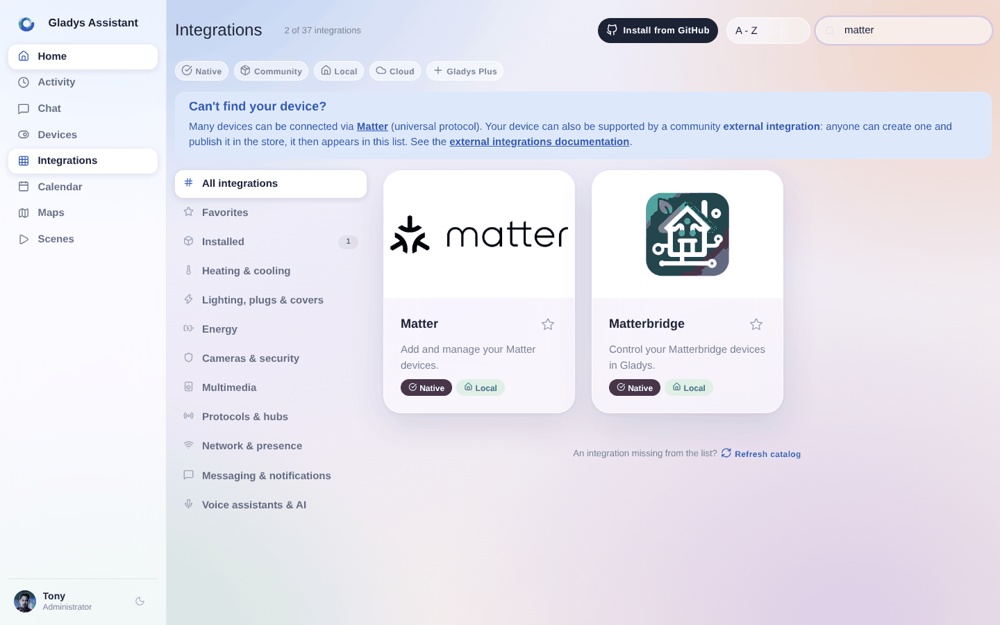
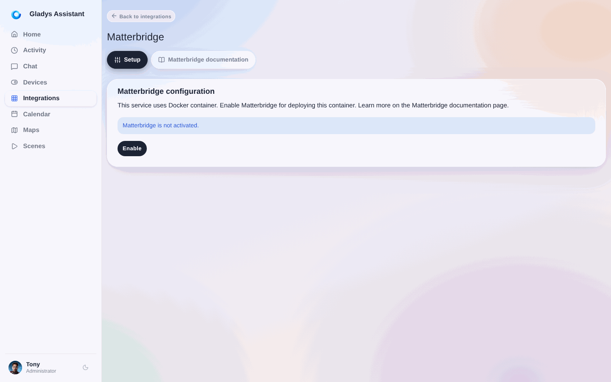

:::tip
To add a device or a service that has no native integration, [external integrations](/docs/integrations/external/) are the recommended path: you install them in one click from Gladys, and anyone can [create one](/docs/dev/external-integrations/). This page documents Matterbridge for the setups that rely on it, such as the [Somfy TaHoma](/docs/integrations/somfy-tahoma/) guide.
:::

[Matterbridge](https://github.com/Luligu/matterbridge) is a Matter bridge that allows you to connect non-Matter devices to a Matter ecosystem. Thanks to its many plugins, Matterbridge can expose devices from various manufacturers (Shelly, Somfy, etc.) to Gladys via the Matter protocol.

## Enable Matterbridge

In Gladys, go to `Integrations / Matterbridge`.

Gladys needs to install a Docker container to run Matterbridge. Don't worry, everything has been automated.

Click the **Enable** button to start the Matterbridge container.

After a few moments (depending on your hardware and bandwidth), Matterbridge will be operational.

## Usage

Once Matterbridge is running, you can access its web interface to:

- Install plugins (Shelly, Somfy Tahoma, etc.)
- Configure your devices
- Get the Matter pairing code

Check the [official Matterbridge documentation](https://github.com/Luligu/matterbridge) for more details on plugin configuration.
