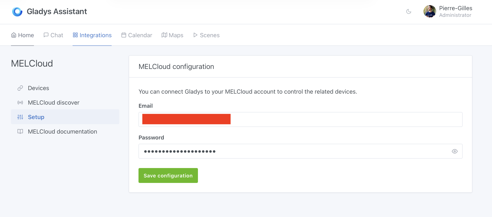
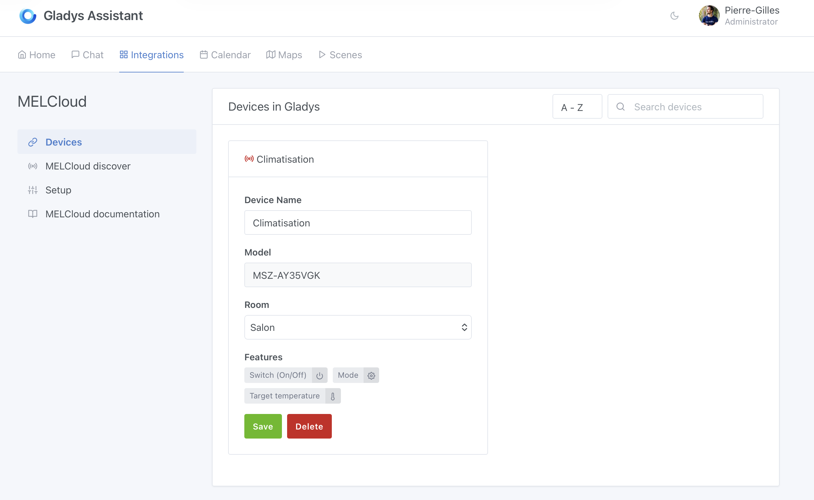
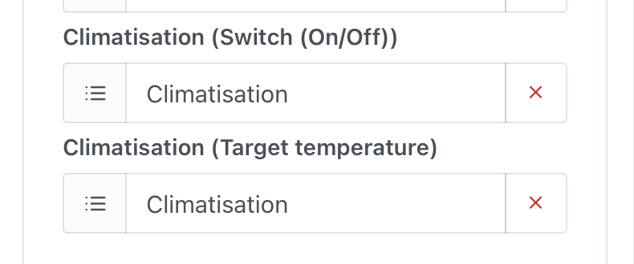
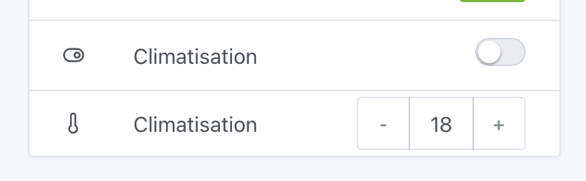

MELCloud is Mitsubishi Electric's cloud service that allows you to control your Mitsubishi air conditioning units remotely. With this integration, you can control your Mitsubishi AC directly from Gladys Assistant.

## Prerequisites

- A Mitsubishi air conditioning unit compatible with MELCloud
- A MELCloud account (create one at [app.melcloud.com](https://app.melcloud.com))
- Your AC unit must be configured and working in the MELCloud app

## Connect MELCloud to Gladys

Go to `Integrations -> MELCloud` in Gladys.

### Step 1: Configure your MELCloud account

In the `Setup` tab, enter your MELCloud credentials:

- **Email**: Your MELCloud account email
- **Password**: Your MELCloud account password

Click on `Save configuration` to connect Gladys to your MELCloud account.

### Step 2: Discover and add your devices

Once connected, go to the `MELCloud discover` tab to see all your available devices.

For each device you want to add to Gladys:

1. Select the room where the device is located
2. Click on `Save` to add the device to Gladys

The device will appear in the `Devices` tab with its features:

- **Switch (On/Off)**: Turn the AC on or off
- **Mode**: Change the operating mode (cooling, heating, etc.)
- **Target temperature**: Set the desired temperature

### Step 3: Add to your dashboard

To control your AC from the dashboard, go to `Dashboard` and edit your dashboard to add the device features you want to display.

### Step 4: Control your AC

You can now control your Mitsubishi AC directly from the Gladys dashboard:

- Toggle the AC on/off
- Adjust the target temperature

## Using in scenes

You can also use your MELCloud devices in Gladys scenes to automate your air conditioning. For example:

- Turn on the AC when the temperature rises above a certain threshold
- Turn off the AC when you leave home
- Set a specific temperature at a scheduled time

## FAQ

### My devices are not appearing

Make sure your devices are properly configured in the MELCloud app and that you can control them from there. Then try refreshing the discovery in Gladys.

### Connection issues

If you have connection issues, verify that:

- Your MELCloud credentials are correct
- Your MELCloud account is active
- You have internet connectivity

If you have any questions, ask on [the forum](https:/community.gladysassistant.com/).
