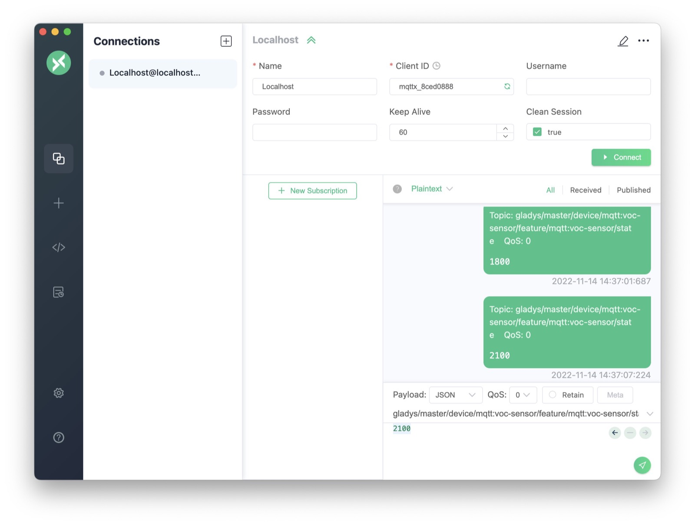

The goal of this tutorial is to explain how MQTT works in Gladys Assistant.

MQTT is a "publish / subscribe" protocol which is widely used in home automation. It is popular because it is very light and is implemented on many DIY platforms (Arduino, ESP8266 NodeMCU). It consists mainly of programming languages (Javascript / Node.js, Python, PHP, C / C ++, Java,...).

MQTT allows you to send a value **to** Gladys from a connected device (e.g. a temperature sensor taking temperature readings every 10 minutes). You can also use MQTT to send a home automation command **from** Gladys to a actuator (e.g.: send the command to a rolling handwheel to open).

Gladys therefore implements a MQTT API in both directions:

- "Peripheral -> Gladys"
- "Gladys -> Peripheral"

The MQTT API is described in [the MQTT documentation](/docs/api/mqtt-api).

## Configure an MQTT broker in Gladys Assistant

The following tutorial assumes that you have either (1) installed Gladys Assistant 4 with the official Rasbian image as [explained here](/docs/), or (2) that you have Gladys installed witg Docker.

First, go to Gladys, `Integrations` section, and open the MQTT integration:

Then, go to the "Configuration" tab to configure your MQTT broker.

There are 2 optionsat this step:

- EITHER you let Gladys launch an MQTT broker all alone (via Docker). This is the preferred option as it is the easiest way to use MQTT in Gladys.
- OR you configure an MQTT broker yourself (locally or remotely). This option can be useful if you already have an MQTT broker running on a server, or if you want to use an online MQTT broker.

In this tutorial, we will go through option #1 (letting Gladys launch the MQTT broker).

You can therefore launch the creation of the MQTT broker automatically with Gladys.

Depending on your internet connection, and the power of your machine, this can take a few seconds and a few minutes.

You can click on the little eye to see the password that Gladys generated for your MQTT broker.

We recommend that you write this password down somewhere.

We therefore have a running MQTT broker which is connected to Gladys!

## Declare an MQTT device in Gladys

In this tutorial, we will use the example of a temperature sensor placed in the kitchen which returns temperature values every 10 minutes to Gladys.

First, go to the "Devices" tab of the MQTT integration, then click on the "New +" button:

Fill out the form with your device information.

For example, let's fill it in with the following information:

- Name: "Temperature sensor"
- External ID: `mqtt:kitchen:temperature-sensor`. This must not have spaces and must start with `mqtt:`. We recommend that you keep a convention throughout your Gladys installation, such as `mqtt:room_name:device_name`.
- Room: "Kitchen".

Next, we are going to add features to this device.

Indeed, in Gladys, a "physical" device can have several "features". Some manufacturers offer "multi-sensor" peripherals (temperature/humidity/brightness is a classic).

In the search bar, search for "temperature" and select "Temperature / temperature sensor". Click on "Add feature".

You can then fill out the form with the following information:

- Name: "Temperature". It is this name that will be displayed on the dashboard.
- External feature ID: `mqtt:kitchen:temperature-sensor:temperature`. We advise you here to also keep a convention, such as for example `mqtt:room_name:device_name:feature_name`.
- Unit: "° C"
- Minimum value: -50 (Let's assume your temperature sensor goes down to -50°C)
- Maximum value: 200 (Let's assume your temperature sensor goes that high!)
- Is it a sensor ?: This box is used to indicate if your peripheral works in the direction "Peripheral -> Gladys" or "Gladys -> Peripheral". If you put "Yes", then this device is "read-only", it just returns values to Gladys. This is the case with our temperature sensor. If you put "no", this device is an actuator which can be controlled by Gladys.
- MQTT Topic: This is the topic in which Gladys will "listen" to the new values for this device. We advise you to copy it somewhere for later.

Click "Save", you should on a screen like this:

## Test the MQTT device

We suggest you use an MQTT client to test this MQTT device.

You can use the MQTT client [MQTT X](https://mqttx.app/).

After installing and launching the software, click on "New connection".

Fill out the form with the following information:

- Name: "MQTTGladys". This name is only useful for display in the software.
- Host: The IP address of your Rasperry Pi on the network. You must be on the same network as your Raspberry Pi for this tutorial.
- Port: 1883
- Username: `gladys`
- Password: The password that Gladys generated in the first part of this tutorial.

:::note
If you had not kept the password, you can still find it by going back to the configuration of the MQTT module and clicking on the little eye on the password field.
:::

Save the configuration by clicking on "Connect".

In the bar at the bottom, put the MQTT topic that you had copied when creating the feature earlier.

In the bottom field, enter a temperature, in this case "21.2", then click on "Publish":

On the dashboard, add a new "devices in room" box and select your room.

You should see your device with the temperature we just sent:

Bravo !

## To go further

If you want to write a program that sends data to your MQTT broker, there are MQTT libraries in all languages.

For example, in Node.js, you can use the [npm mqtt package](https://www.npmjs.com/package/mqtt).

There are plenty of tutorials on the internet for all platforms :)
