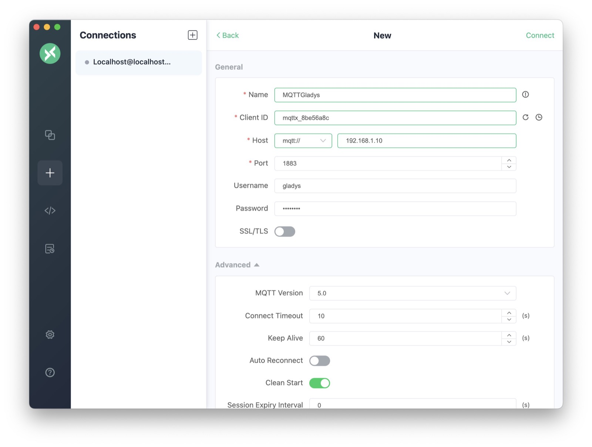

The goal of this tutorial is to explain how the MQTT works in Gladys Assistant.

MQTT is a "publish / subscribe" protocol which is widely used in home automation because it is very light and is implemented on many DIY platforms (Arduino, ESP8266 NodeMCU) and in most programming languages (Javascript / Node.js, Python, PHP, C / C ++, Java, and so on).

Concretely, the MQTT allows you to send a value from a connected device (e.g. a temperature sensor taking temperature readings every 10 minutes) to Gladys, or on the contrary, to send from Gladys a home automation command to a actuator (Ex: send the order to a rolling handwheel to open).

Gladys therefore implements an MQTT API in both directions:

- "Peripheral -> Gladys"
- "Gladys -> Peripheral"

The MQTT API is described in [the MQTT documentation](/en/docs/api/mqtt-api).

## Configure an MQTT broker in Gladys Assistant

The following tutorial implies that you have installed Gladys Assistant 4 with the official Rasbian image as [explained here](/en/docs/), or that you have Gladys installed witg Docker.

First step, go to Gladys, section `Integrations`, and open the MQTT integration:

Then, go to the "Configuration" tab to configure your MQTT broker.

There are 2 possibilities at this step:

- Either you let Gladys launch an MQTT broker all alone (via Docker). This option is recommended, it is the easiest way to use MQTT in Gladys.
- Either you configure an MQTT broker yourself (locally or remotely). This option can be useful if you already have an MQTT broker running on a server of your own, or if you want to use an online MQTT broker.

In this tutorial, we will take option #1.

You can therefore launch the creation of the MQTT broker automatically by Gladys.

Depending on your internet connection, and the power of your machine, this can take a few seconds and a few minutes.

You can click on the little eye to see the password that Gladys generated for your MQTT broker.

I recommend that you write this password down somewhere.

We therefore have a running MQTT broker which is connected to Gladys!

## Declare an MQTT device in Gladys

In this tutorial, we will take the example of a temperature sensor placed in the kitchen which returns temperature values every 10 minutes to Gladys.

First, go to the "Devices" tab of the MQTT integration, then click on the "New +" button:

Fill out the form with your device information.

For example, let's fill it in with the following information:

- Name: "Temperature sensor"
- External ID: `mqtt:kitchen:temperature-sensor`. This must not have spaces and must start with `mqtt:`. I recommend that you keep a convention throughout your Gladys installation, such as `mqtt:room_name:device_name`.
- Room: "Kitchen".

Next, we are going to add features to this device.

Indeed, in Gladys, a "physical" device can have several "features". Some manufacturers offer "multi-sensor" peripherals (temperature/humidity/brightness is a classic).

In the search bar, search for "temperature" and select "Temperature / temperature sensor". Click on "Add feature".

You can then fill out the form with the following information:

- Name: "Temperature". It is this name that will be displayed on the dashboard.
- External feature ID: `mqtt:kitchen:temperature-sensor:temperature`. I advise you here also to keep a convention such as for example `mqtt:room_name:device_name:feature_name`.
- Unit: "° C"
- Minimum value: -50 (Let's say your temperature sensor goes down to -50°C)
- Maximum value: 200 (Let's say your temperature sensor goes high!)
- Is it a sensor ?: This box is used to indicate if your peripheral works in the direction "Peripheral -> Gladys" or "Gladys -> Peripheral". If you put "Yes", then this device is "read-only", it just returns values ​​to Gladys. This is the case with our temperature sensor. If you put "no", this device is an actuator which can be controlled by Gladys.
- MQTT Topic: This is the topic in which Gladys will "listen" to the new values ​​for this device. I advise you to copy / paste it somewhere for later.

Click "Save", you should on a screen like this:

## Test the MQTT device

I suggest you use an MQTT client to test this MQTT device.

You can use the MQTT client [MQTT.fx](https://mqttfx.jensd.de/).

After installing and launching MQTT.fx, click on the small cogwheel to add the connection information to your MQTT broker.

Fill out the form with the following information:

- Name: "Gladys MQTT". This name is only useful for display in the software.
- Broker Address: The IP address of your Rasperry Pi on the network. You must be on the same network as your Raspberry Pi for this tutorial.
- Broker Port: 1883

Then, go to the "User Credentials" tab, then fill in with the login information.

- User Name: `gladys`
- Password: The password that Gladys generated in the first part of this tutorial. If you had not kept the password, you can still find it by going back to the configuration of the MQTT module and clicking on the little eye on the password field.

Save the configuration by clicking on "Ok", then click on "Connect" at the top of the screen to connect to the MQTT broker.

In the bar at the top, put the MQTT topic that you had copied and pasted when creating the feature earlier.

In the middle field, enter a temperature, in my case "21.2", then click on "Publish":

On the dashboard, add a new "devices in room" box and select your room.

You should see your device with the temperature we just sent:

Bravo !

## To go further

If you want to write a program that sends data to your MQTT broker, there are MQTT libraries in all languages.

For example, in Node.js, you can use the [npm mqtt package](https://www.npmjs.com/package/mqtt).

There are plenty of tutorials on the internet for all platforms :)
