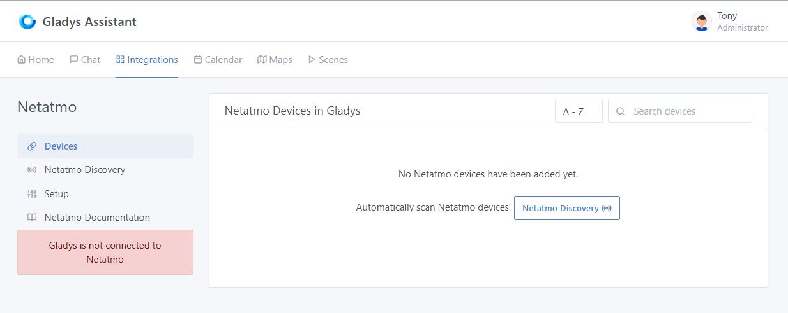
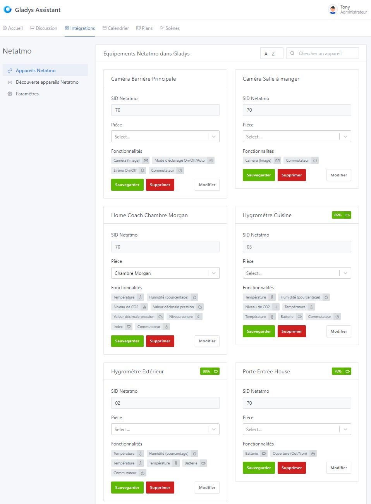

## Prerequisites

### Step 1 - Compatible Devices and Netatmo Mobile Apps

To add your Netatmo devices to Gladys, they must first be added in their respective apps, which you should download from the Play Store or Apple Store.
Below are only the devices compatible with Gladys:

#### "Energy" App on [Play Store](https://play.google.com/store/apps/details?id=com.netatmo.thermostat) : 

- Thermostats "NATherm1"

### Step 2 - Netatmo Connect

Then, go to the [Netatmo Connect](https://dev.netatmo.com/) page and click on the "LOG IN" link to create an account with your email address and password.

#### Creating an "app"

Then go to your [My app](https://dev.netatmo.com/apps/) page and click on the "Create" button to create a link to your Gladys account. Enter the necessary information (fields with a \*) as shown below:

#### Retrieving Client Connection IDs

After clicking "Save", you will then have access to the necessary information in the frame below (see [Step 1 of the tutorial](/en/docs/integrations/netatmo#step-1--netatmo-api-connection))

## Tutorial

To add your Netatmo devices to Gladys, go to `Integrations / Netatmo`.

### Step 1: Netatmo API Connection

From the `Settings` tab,

Enter the information retrieved during the [previous step](/en/docs/netatmo#integrations/step-2---netatmo-connect):

- Enter your email address for connecting to your "Netatmo Connect" account
- The password for this same account
- The client ID,
- The client secret,

Finally, click "Save".
After a few seconds, you should now be connected to the Netatmo API.

### Step 2: Discovering Netatmo Devices

In the `Netatmo Device Discovery` tab,

You will find all the devices you previously configured in the various applications [from step 1 of the prerequisites](/en/docs/integrations/netatmo#step-1---compatible-devices-and-netatmo-mobile-apps). They are listed by their name defined in their respective apps. You can integrate them with a simple click on the "Add" button. The button then changes to "Already Created".

On this page, you also find a "Update" button to refresh the names of the devices in case of changes in the Netatmo apps.

### Step 3: Assigning a Room to Devices and Modifying Features

In the `Netatmo Devices` tab, you will find the added devices with their characteristics.

#### 1) Assigning a Room

To display a device on the dashboard, you must first associate it with a room. Select it from the following dropdown menu:

Then click on the "Save" button.

#### 2) Modifying Features

You can modify the display name of the features that will appear on the home page. Moreover, some features can be displayed in different ways. Click on the "Modify" button of a device plug :

  Don't forget to save your changes before leaving the page !!

## Progress and forecast of service evolution

### February 2021

To date, the following devices :
- Smoke detector "NSD",
- Bell "NDB"

Cannot be traced back to Gladys for the moment because the API does not offer status feedback. However, the "webhooks" are under development via Gladys Plus. For all those who have a subscription, it will soon be possible to retrieve the status feedbacks of these devices.

The status feedbacks of all the devices seen in [step 1 of the prerequisites](/en/docs/integrations/netatmo#step-1---compatible-devices-and-mobile-applications-netatmo) are functional. The controls are being programmed.

You're done! You can now add the devices and features you want to enjoy on your home page or create your alert scenes.

