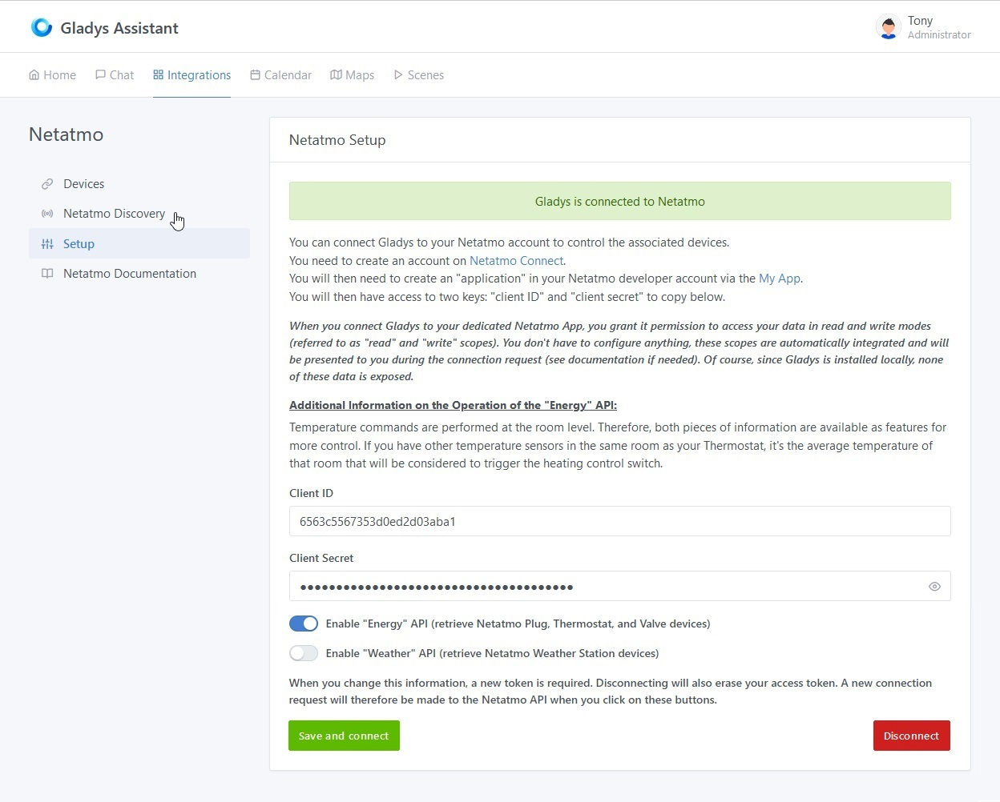
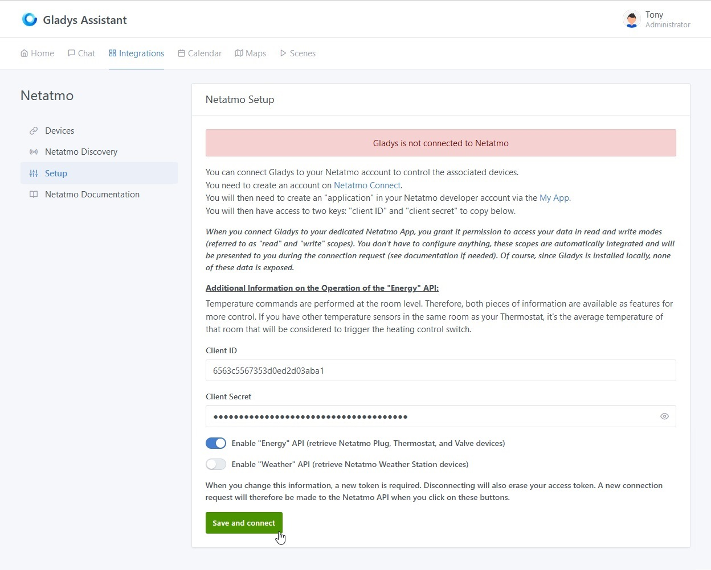
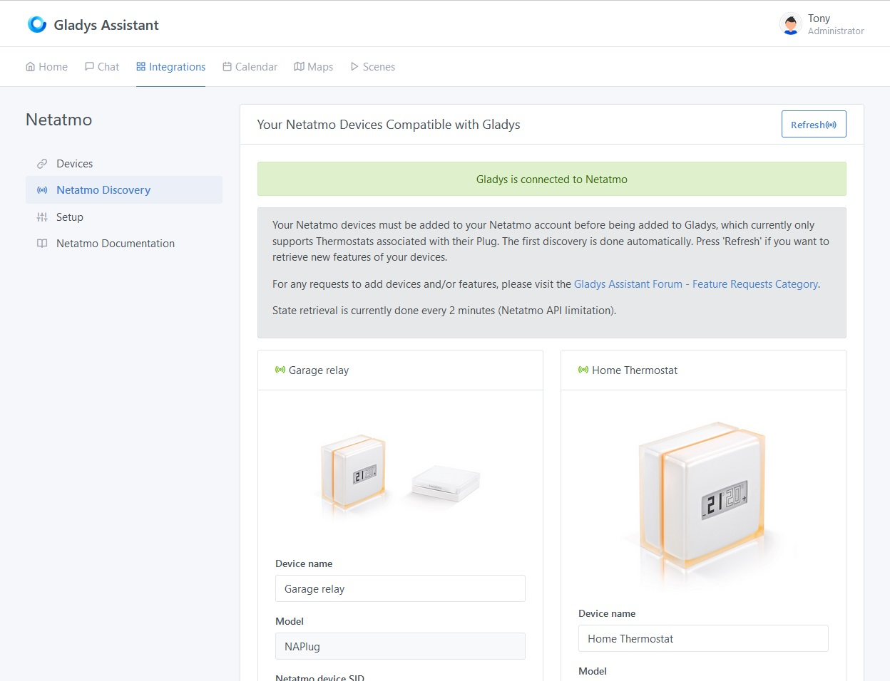
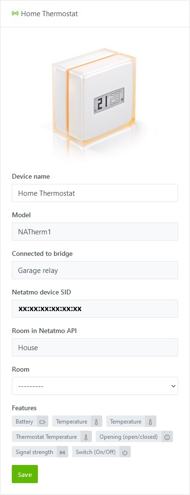

## Prerequisites

### Step 1 - Compatible Devices and Netatmo Mobile Apps

To add your Netatmo devices to Gladys, they must first be added to their respective apps, which you should download from the Play Store or Apple Store.
Below are only the devices compatible with Gladys:

- #### "NATherm1" Thermostats :
    - [Netatmo Energy on Play Store](https://play.google.com/store/apps/details?id=com.netatmo.thermostat) 
    - [Netatmo Energy on Apple Store](https://apps.apple.com/us/app/netatmo-energy/id730893725)

### Step 2 - Netatmo Connect

You must then go to the [Netatmo Connect](https://dev.netatmo.com/) page and click on the `LOG IN` link to create an account with your email and password.

#### Creating an "app"

Go to your [My app](https://dev.netatmo.com/apps/) page and click on the `Create` button to create a link to your Gladys account. 

Enter the necessary information (fields with a \*) as in the example below:

#### Retrieving Client Connection ID and secret

By clicking on `Save`, you will then have access to the necessary information in the frame below (see [Step 1 of the tutorial](/docs/integrations/netatmo#step-11-setup-netatmo-api-connection-credentials))

## Tutorial

To add your Netatmo devices to Gladys, go to `Integrations -> Netatmo`.

Then click on the `Setup` tab to access the Netatmo API connection page.

### Step 1.1: Setup Netatmo API Connection Credentials

From the `Setup` tab, enter the information retrieved during the [previous step](/docs/integrations/netatmo#step-2---netatmo-connect) :
- The client ID,
- The client secret

Then click on the `Save and connect` button.
[You will then be redirected to the Netatmo website to accept the connection from Gladys.](/docs/integrations/netatmo#step-12-authorizing-gladys-application-to-connect-to-your-netatmo-account)

### Step 1.2: Authorizing Gladys Application to Connect to Your Netatmo Account
It is important to note that by clicking on `YES, I ACCEPT` you allow Gladys to access in read and write mode for all currently supported devices as well as read-only for devices not yet supported to facilitate their future integration. No data or access is shared outside of your local Gladys instance.

For any new integration of devices not yet supported, you will have to go through this step again to accept the writing (commands) on these new devices.

### Step 1.3: Validation and Connection of the Application
After acceptance, you will be redirected back to your previous Gladys page, you should now be connected to the Netatmo API.

### Step 1.4: Disconnecting from the application
You can completely disconnect from the Netatmo application by clicking on the `Disconnect` button. This will clear the credentials and associated permissions.

### Step 2.1: Discovering Compatible Netatmo Devices

In the `Netatmo Discovery` tab, you will find all compatible devices that you previously configured in the dedicated app [from step 1 of the prerequisites](/docs/integrations/netatmo#step-1---compatible-devices-and-netatmo-mobile-apps).

Currently compatible devices are [(Go to the next step)](/docs/integrations/netatmo#step-22-discovery-of-non-compatible-netatmo-devices):
- **The Hub (NAPlug)**, you will find the name of the device configured in the Netatmo app, the model, its Netatmo ID, the room to which the device is attached in the app, and the currently supported features.

- **The Thermostat (NATherm1)**, you will find the name of the device configured in the Netatmo app, the model, the bridge to which it is connected, its Netatmo ID, the room to which the device is attached in the app, and the currently supported features.

You can select the Gladys room in which they are installed and then integrate them with a simple click on the `Save` button. The button then changes to `Already Created`.

On this page, you will also find a `Refresh` button at the top to refresh the features of the devices in case of changes in the Netatmo apps or in case of new support in Gladys.

### Step 2.2: Discovery of Non-Compatible Netatmo Devices

You will also be able to find devices in your possession that are not yet compatible with Gladys.

You can request support for these devices through the `Suggest this device` button, which will take you to the Github page to directly create an issue request with the properties of the new device.
:::warning
Do not forget to replace sensitive data such as the device ID, house ID, room ID, or hub ID.
:::

### Step 3: `Devices` Tab

In the `Devices` tab, you will find the added devices with their characteristics, including their connection status  or  and the battery level.

#### 1) Assigning a Room

To display a device on the dashboard, you must first assign it to a room. Select it from the following dropdown menu, then click on the `Save` button:

#### 2) Modifying Features

For now, you can only change the display name of the device. Soon, you will also have access to an `Edit` button, allowing you to modify the display names of features that will appear on the homepage. 
Moreover, some features will be able to be displayed in different ways.

## Road Map - Service Evolution Forecast

- #### Pull request 1 - Netatmo "Energy" : Valves (NRV)
- #### Pull request 2 - Netatmo "Weather" : Main weather station (NAMain)
- #### Pull request 3 - Netatmo "Weather" : Additional indoor modules (NAModule4)
- #### Pull request 4 - Netatmo "Weather" : Outdoor module (NAModule1)
- #### Pull request 5 - Netatmo "Weather" : Anemometer (NAModule2)
- #### Pull request 6 - Netatmo "Weather" : Rain gauge (NAModule3)
- #### Pull request 7 - Netatmo "Aircare" Homecoach : Air quality sensor (NHC)
- #### Pull request 8 - Netatmo "Home + Security" : Indoor Camera (NACamera)
- #### Pull request 9 - Netatmo "Home + Security" : Door and window opening sensor (NACamDoorTag)
- #### Pull request 10 - Netatmo "Home + Security" : Siren (NIS)
- #### Pull request 11 - Netatmo "Home + Security" : Outdoor Camera (NOC) with or without siren
- #### Pull request 12 - Netatmo "Home + Security" : Smoke detector (NSD)
- #### Pull request 13 - Adding the "Edit" button : Ability to modify the feature names of Netatmo devices
- #### Pull request 14 - Adding webhooks ([For Gladys Plus users](/plus/))
This feature will enable real-time reception of alerts and state changes for certain devices (temperature settings, camera detection, door opening detection, device connection/disconnection alerts, etc.) for those who have a Gladys Plus subscription.
#### ... As per requests for additional features ...

## Conclusion
The status feedback of all devices described in [step 1 of the prerequisites](/docs/integrations/netatmo#step-1---compatible-devices-and-netatmo-mobile-apps) is now functional.

And there you have it! You can now add the devices and features you want to enjoy on your homepage or create your alert or command scenes by following the part of the documentation dedicated to the [Dashboard](/docs/dashboard/intro/) or [Scenes](/docs/scenes/intro/).

Please post a message on [the forum](https://en-community.gladysassistant.com), if you need any help.