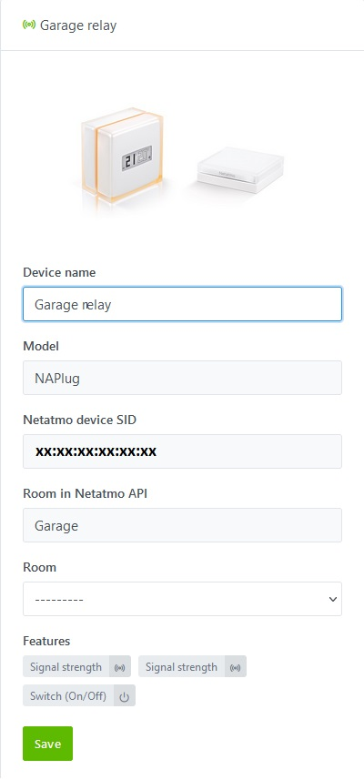

## Prerequisites

### Step 1 - Compatible Devices and Netatmo Mobile Apps

To add your Netatmo devices to Gladys, they must first be added to their respective apps, which you should download from the Play Store or Apple Store.
Below are only the devices compatible with Gladys:

#### "Energy" App [Play Store](https://play.google.com/store/apps/details?id=com.netatmo.thermostat): 

- "NATherm1" Thermostats

### Step 2 - Netatmo Connect

You must then go to the [Netatmo Connect](https://dev.netatmo.com/) page and click on the "LOG IN" link to create an account with your email and password.

#### Creating an "app"

Go to your [My app](https://dev.netatmo.com/apps/) page and click on the "Create" button to create a link to your Gladys account. Enter the necessary information (fields with a \*) as in the example below:

#### Retrieving Client Connection IDs

By clicking on "Save", you will then have access to the necessary information in the frame below (see [Step 1 of the tutorial](/docs/integrations/netatmo#step-11-netatmo-api-connection-credentials))

## Tutorial

To add your Netatmo devices to Gladys, go to `Integrations / Netatmo`.

### Step 1.1: Netatmo API Connection Credentials

From the `Setup` tab, enter the information retrieved during the [previous step](/docs/integrations/netatmo#step-2---netatmo-connect) :
- The client ID,
- The client secret

Then click on the "Save configuration and connect to Netatmo" button.
[You will then be redirected to the Netatmo website to accept the connection from Gladys.](/docs/integrations/netatmo#step-12-authorizing-gladys-application-to-connect-to-your-netatmo-account)

### Step 1.2: Authorizing Gladys Application to Connect to Your Netatmo Account
It is important to note that by clicking on "YES, I ACCEPT", you allow Gladys to access in read and write mode for all currently supported devices as well as read-only for devices not yet supported to facilitate their future integration. No data or access is shared outside of your local Gladys instance.

For any new integration of devices not yet supported, you will have to go through this step again to accept the writing (commands) on these new devices.

### Step 1.3: Validation and Connection of the Application
After acceptance, you will be redirected back to your previous Gladys page, you should now be connected to the Netatmo API.

(If an error occurs, please refer to the "Possible Errors Encountered" chapter - To be written)

### Step 2.1: Discovering Compatible Netatmo Devices

In the `Netatmo Discovery` tab, you will find all compatible devices that you previously configured in the dedicated app [from step 1 of the prerequisites](/docs/integrations/netatmo#step-1---compatible-devices-and-netatmo-mobile-apps).

Currently compatible devices are [(Go to the next step)](/docs/integrations/netatmo#step-22--discovery-of-non-compatible-netatmo-devices):
- **The Hub (NAPlug)**, you will find the name of the device configured in the Netatmo app, the model, its Netatmo ID, the room to which the device is attached in the app, and the currently supported features.

- **The Thermostat (NATherm1)**, you will find the name of the device configured in the Netatmo app, the model, the bridge to which it is connected, its Netatmo ID, the room to which the device is attached in the app, and the currently supported features.

You can select the Gladys room in which they are installed and then integrate them with a simple click on the "Save" button. The button then changes to "Already Created".

On this page, you will also find a "Refresh" button at the top to refresh the features of the devices in case of changes in the Netatmo apps or in case of new support in Gladys.

### Step 2.2: Discovery of Non-Compatible Netatmo Devices

You will also be able to find devices in your possession that are not yet compatible with Gladys.

You can request support for these devices through the "Propose this device" button, which will take you to the Github page to directly create an issue request with the properties of the new device.
:::warning
Do not forget to replace sensitive data such as the device ID, house ID, room ID, or hub ID.
:::

### Step 3: Assigning a Room to Devices and Modifying Features

In the `Netatmo Devices` tab, you will find the added devices with their characteristics.

#### 1) Assigning a Room

To display a device on the dashboard, you must first associate it with a room. Select it from the following dropdown menu:

Then click on the "Save" button.

#### 2) Modifying Features

You can modify the display name of the features that will appear on the home page. Moreover, some features can be displayed in different ways. Click on the "Modify" button of a device plug :

  Don't forget to save your changes before leaving the page !!

## Progress and forecast of service evolution

### February 2021

To date, the following devices :
- Smoke detector "NSD",
- Bell "NDB"

Cannot be traced back to Gladys for the moment because the API does not offer status feedback. However, the "webhooks" are under development via Gladys Plus. For all those who have a subscription, it will soon be possible to retrieve the status feedbacks of these devices.

The status feedbacks of all the devices seen in [step 1 of the prerequisites](/docs/integrations/netatmo#step-1---compatible-devices-and-mobile-applications-netatmo) are functional. The controls are being programmed.

You're done! You can now add the devices and features you want to enjoy on your home page or create your alert scenes.

