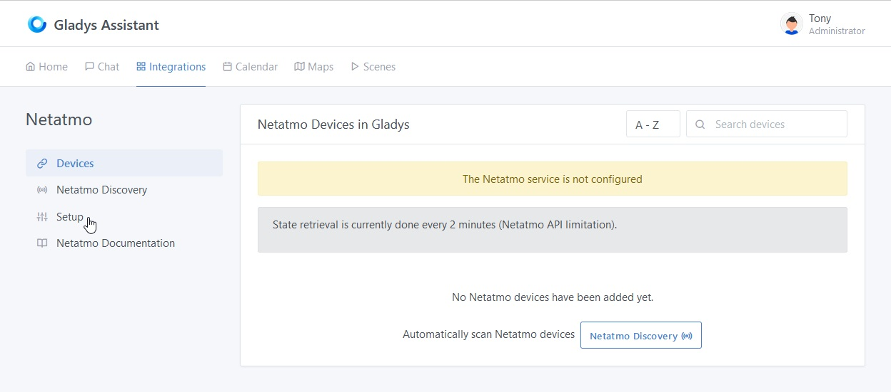
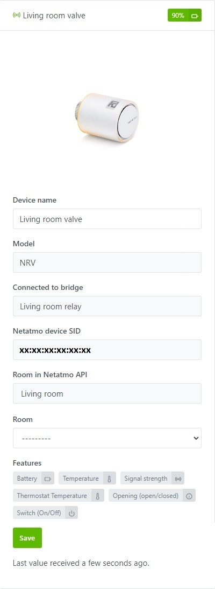
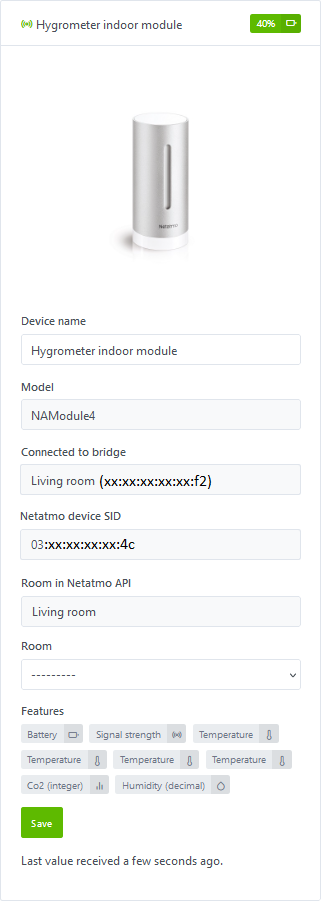
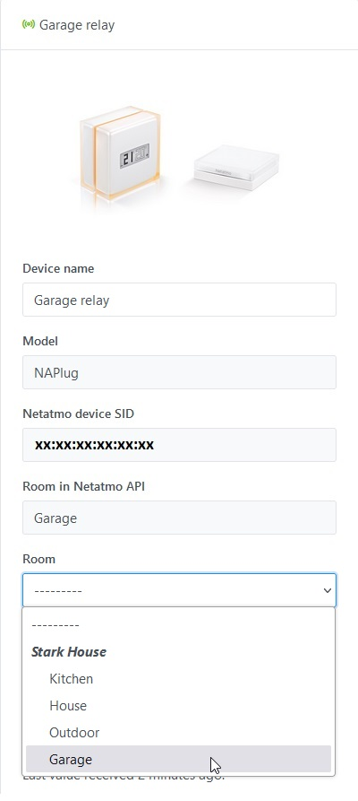
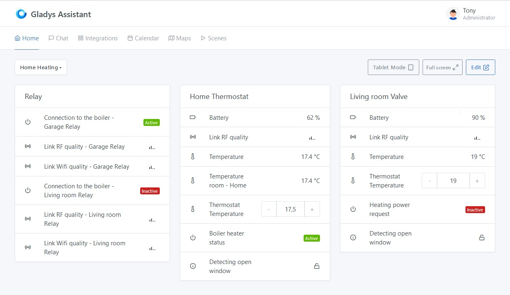

## **Prerequisites**

### **Step 1 - Compatible Devices and Netatmo Mobile Apps**

To add your Netatmo devices to Gladys, they must first be added to their respective apps, which you should download from the Play Store or Apple Store.
Below are only the devices compatible with Gladys:

#### - "NATherm1" Thermostats and "NRV" Valves
- [Netatmo Energy on Play Store](https://play.google.com/store/apps/details?id=com.netatmo.thermostat) 
- [Netatmo Energy on Apple Store](https://apps.apple.com/us/app/netatmo-energy/id730893725)

#### - "NAMain" weather stations and the associable
- [Netatmo Weather on Play Store](https://play.google.com/store/apps/details?id=com.netatmo.netatmo) 
- [Netatmo Weather on Apple Store](https://apps.apple.com/us/app/netatmo-weather/id532538499)

### **Step 2 - Netatmo Connect**

You must then go to the [Netatmo Connect](https://dev.netatmo.com/) page and click on the `LOG IN` link to create an account with your email and password.

#### - Creating an "app"

Go to your [My app](https://dev.netatmo.com/apps/) page and click on the `Create` button to create a link to your Gladys account. 

Enter the necessary information (fields with a \*) as in the example below:

#### - Retrieving Client Connection ID and secret

By clicking on `Save`, you will then have access to the necessary information in the frame below (see [Step 1 of the tutorial](/docs/integrations/netatmo#step-11-setup-netatmo-api-connection-credentials))

## **Tutorial**

To add your Netatmo devices to Gladys, go to `Integrations -> Netatmo`.

Then click on the `Setup` tab to access the Netatmo API connection page.

### **Step 1.1: Setup Netatmo API Connection Credentials**

From the `Setup` tab, enter the information retrieved during the [previous step](/docs/integrations/netatmo#step-2---netatmo-connect) :
- **The client ID**,
- **The secret shopper**
- **Activate the "Energy" API** if you have at least one thermostat, a valve or a plug as well as the Netatmo Energy application on Play Store or Apple Store functional
- **Activate the "Weather" API** if you have at least the basic weather station as well as the Netatmo Weather application on Play Store or Apple Store functional

Then click on the `Save and connect` button.
[You will then be redirected to the Netatmo website to accept the connection from Gladys.](/docs/integrations/netatmo#step-12-authorizing-gladys-application-to-connect-to-your-netatmo-account)

### **Step 1.2: Authorizing Gladys Application to Connect to Your Netatmo Account**
It is important to note that by clicking on `YES, I ACCEPT`, you authorize Gladys to access in reading and writing mode for all currently supported devices and also in read-only mode for all your devices, even those not yet supported, with the aim of facilitating their future integration.

For any new integration of devices not yet supported, you will have to go through this step again to accept the writing (commands) on these new devices.

### **Step 1.3: Validation and Connection of the Application**
After acceptance, you will be redirected back to your previous Gladys page, you should now be connected to the Netatmo API.

### **Step 1.4: Disconnecting from the application**
You can completely disconnect from the Netatmo application by clicking on the `Disconnect` button. This will clear the credentials and associated permissions.

### **Step 2.1: Discovering Compatible Netatmo Devices**

In the `Netatmo Discovery` tab, you will find all compatible devices that you previously configured in the dedicated app [from step 1 of the prerequisites](/docs/integrations/netatmo#step-1---compatible-devices-and-netatmo-mobile-apps).

Currently compatible devices are **(you can move on to the next step by clicking [here](/docs/integrations/netatmo#step-22-discovery-of-non-compatible-netatmo-devices))**:

#### **Heating management - "Energy"**

##### - *The Hub (NAPlug)*
**Description :**
You will find the name of the device configured in the Netatmo app, the model, its Netatmo ID and the room to which the device is attached in the application.

**The currently supported features :**
- the strength of the wifi signal,
- the intensity of the overall radio signal,
- the state of connection of the bridge to a boiler.

##### - *The Thermostat (NATherm1)*
**Description :**
You will find the name of the device configured in the Netatmo app, the model, the bridge to which it is connected, its Netatmo ID and the room to which the device is attached in the application.

**The currently supported features :**
- the exact battery status (in %),
- the measured temperature of the thermostat,
- the temperature of the room (average of the temperatures of the various Netatmo devices located in this room),
- the thermostat setpoint temperature on which you can also control either from the dashboard or from a scene,
- detection of a window opened by any Netatmo device located in the same room,
- the intensity of the radio signal with the bridge NAPlug,
- the boiler heating request state (activated if the set temperature is higher than the room temperature).

##### - *The valve (NRV)*
**Description :**
You will find the name of the device configured in the Netatmo application, the model, the bridge to which it is connected, its Netatmo ID and the room in which the device is attached in the application.

**The currently supported features :**
- the battery status divided into 6 states and converted into %:
    - max: 100%
    - full: 90%
    - high: 75%
    - medium: 50%
    - low: 25%
    - very low: 10%
- the temperature of the room (average of the temperatures of the various Netatmo devices located in this room),
- the set temperature of the room on which you can also control either from the dashboard or from a scene,
- detection of a window opened by any Netatmo device located in the same room,
- the intensity of the radio signal with the bridge NAPlug,
- the boiler heating request state (activated if the set temperature is higher than the room temperature).

#### **The weather station - "Weather"**

##### - *Indoor Hygrometer Station (NAMain)*
**Description :**
It also acts as a hub for your other modules linked to the weather station.
There you will find the name of the device configured in the Netatmo application (modifiable for Gladys only), the model, its Netatmo ID and the room in which the device is attached in the application.

**Currently supported features:**
- the temperature measured by the hygrometer,
- if you have at least one device in the "Energy" category (plug, thermostat or valve), the calculated room temperature will be accessible (average of the temperatures of the various Netatmo devices located in this room),
- the minimum temperature measured over the last 24 hours,
- the maximum temperature measured over the last 24 hours,
- the humidity measured by the hygrometer (in %),
- the CO2 measured by the hygrometer (in particles per million - ppm),
- the sound volume measured by the hygrometer (in decibels - dB),
- the atmospheric pressure measured by the hygrometer,
- the absolute pressure calculated by the hygrometer,
- the strength of the wifi signal.
All of these measurements reflect the air quality in your home.

##### - *Outdoor module (NAModule1)*
**Description :**
There you will find the name of the device configured in the Netatmo application (modifiable for Gladys only), the model, the bridge to which it is connected, its Netatmo ID and the room in which the device is attached in the application ( if available).

**Currently supported features:**
- the exact battery status (in %),
- the temperature measured by the module,
- the minimum temperature measured over the last 24 hours,
- the maximum temperature measured over the last 24 hours,
- the humidity measured by the module (in %),
- the strength of the radio signal with the NAMain bridge.

##### - *Anemometer Module (NAModule2)*
**Description :**
There you will find the name of the device configured in the Netatmo application (modifiable for Gladys only), the model, the bridge to which it is connected, its Netatmo ID and the room in which the device is attached in the application ( if available).

**Currently supported features:**
- the exact battery status (in %),
- the current wind speed measured by the module (averaged over 5 minutes - in km/h),
- the speed of the gusts measured by the module (max speed over 5 minutes - in km/h),
- the maximum wind speed of the day measured by the module (maximum averages over 5 minutes of the day - in km/h),
- the current wind angle measured by the module (averaged over 5 minutes - in degree of angle),
- the angle of the gusts measured by the module (in degrees of angle),
- the angle of the maximum speed of the day measured by the module (in degrees of angle),
- the strength of the radio signal with the NAMain bridge.

##### - *Rain Gauge Module (NAModule3)*
**Description :**
There you will find the name of the device configured in the Netatmo application (modifiable for Gladys only), the model, the bridge to which it is connected, its Netatmo ID and the room in which the device is attached in the application ( if available).

**Currently supported features:**
- the exact battery status (in %),
- current precipitation measured by the module (cumulative over 5 minutes - in mm),
- precipitation over 1 hour measured by the module (cumulative over 1 hour - in mm/h),
- precipitation over 24 hours measured by the module (cumulative over 24 hours - in mm/d),
- the strength of the radio signal with the NAMain bridge.

##### - *Additional module Indoor hygrometer (NAModule4)*
**Description :**
There you will find the name of the device configured in the Netatmo application (modifiable for Gladys only), the model, the bridge to which it is connected, its Netatmo ID and the room in which the device is attached in the application ( if available).

**Currently supported features:**
- the exact battery status (in %),
- the temperature measured by the hygrometer,
- if you have at least one device in the "Energy" category (plug, thermostat or valve), the calculated room temperature will be accessible (average of the temperatures of the various Netatmo devices located in this room),
- the minimum temperature measured over the last 24 hours,
- the maximum temperature measured over the last 24 hours,
- the humidity measured by the hygrometer (in %),
- the CO2 measured by the hygrometer (in particles per million - ppm),
- the strength of the radio signal with the NAMain bridge.
All of these measurements reflect the air quality in your home.

You can select the Gladys room in which they are installed and then integrate them with a simple click on the `Save` button. The button then changes to `Already Created`.

On this page, you will also find a `Refresh` button at the top to refresh the features of the devices in case of changes in the Netatmo apps or in case of new support in Gladys.

### **Step 2.2: Discovery of Non-Compatible Netatmo devices and/or Setup problem**

#### Non-Compatible Netatmo devices
You will also be able to find devices in your possession that are not yet compatible with Gladys.

You can request support for these devices through the `Suggest this device` button, which will take you to the Github page to directly create an issue request with the properties of the new device.
:::warning
Do not forget to replace sensitive data such as the device ID, house ID, room ID, or hub ID.
:::

#### Setup problem
You may encounter the following cases on the `Netatmo Discovery` page:
- Save not possible for Netatmo "Energy" devices if you have Concentrator (NAPlug), Thermostat (NATherm1/NTH01) or Valve (NRV/NAV) devices but you have not selected the `Enable "Energy" API` in the `Setup` page.

- Save not possible for Netatmo "Weather" devices in case you have Weather Station (NAMain) devices but you have not selected the `Enable "Weather" API` option in the `Setup` page.

In any of these cases, you will need to go to the `Setup` page to select the corresponding option(s) and click `Save and connect` again to allow data recovery.

### **Step 3: `Devices` Tab**

In the `Devices` tab, you will find the added devices with their characteristics, including their connection status  or  and the battery level.

#### Assigning a Room

To display a device on the dashboard, you must first assign it to a room. Select it from the following dropdown menu, then click on the `Save` button:

#### Modifying Features

For now, you can only change the display name of the device. Soon, you will also have access to an `Edit` button, allowing you to modify the display names of features that will appear on the homepage. 
Moreover, some features will be able to be displayed in different ways.

## **Road Map - Service Evolution Forecast**

### **Pull requests completed**

- **~~Pull request 1 - *Netatmo "Energy" : Valves (NRV)*~~**
    
    Implemented in February 2024 - This functionality has been added to allow the management of NRV valves as part of the Netatmo "Energy" service. For details, see PR [#2014](https://github.com/GladysAssistant/Gladys/pull/2014).

- **~~Pull request 2 - *Netatmo "Weather" : Main weather station (NAMain)*~~**
    
    Implemented in March 2024 - This functionality has been added to allow the management of indoor stations as part of the Netatmo “Weather” service. For details, see PR [#2021](https://github.com/GladysAssistant/Gladys/pull/2021).

- **~~Pull request 3 - *Netatmo "Weather" : Additional indoor modules (NAModule4)*~~**
    
    Implemented in March 2024 - This functionality has been added to allow the management of additional interior modules as part of the Netatmo “Weather” service. For details, see PR [#2021](https://github.com/GladysAssistant/Gladys/pull/2021).

- **~~Pull request 4 - *Netatmo "Weather" : Outdoor module (NAModule1)*~~**
    
    Implemented in March 2024 - This functionality was added to allow the management of outdoor modules as part of the Netatmo "Weather" service. For details, see PR [#2021](https://github.com/GladysAssistant/Gladys/pull/2021).

- **~~Pull request 5 - *Netatmo "Weather" : Anemometer (NAModule2)*~~**
    
    Implemented in March 2024 - This functionality was added to allow the management of anemometers as part of the Netatmo "Weather" service. For details, see PR [#2021](https://github.com/GladysAssistant/Gladys/pull/2021).

    
- **~~Pull request 6 - *Netatmo "Weather" : Rain gauge (NAModule3)*~~**
    
    Implemented in March 2024 - This functionality was added to allow the management of rain gauges as part of the Netatmo "Weather" service. For details, see PR [#2021](https://github.com/GladysAssistant/Gladys/pull/2021).

### **Pull requests coming soon**

#### Pull request 7 - *Netatmo "Aircare" Homecoach : Air quality sensor (NHC)*
- **Status: Unstarted** - This feature has not yet been started.

#### Pull request 8 - *Netatmo "Home + Security" : Indoor Camera (NACamera)*
- **Status: Development in progress** - This feature does not yet have a Pull Request created but is under development.

#### Pull request 9 - *Netatmo "Home + Security" : Door and window opening sensor (NACamDoorTag)*
- **Status: Unstarted** - This feature has not yet been started.

#### Pull request 10 - *Netatmo "Home + Security" : Siren (NIS)*
- **Status: Unstarted** - This feature has not yet been started.

#### Pull request 11 - *Netatmo "Home + Security" : Outdoor Camera (NOC) with or without siren*
- **Status: Unstarted** - This feature has not yet been started.

#### Pull request 12 - *Netatmo "Home + Security" : Smoke detector (NSD)*
- **Status: Unstarted** - This feature has not yet been started.

#### Pull request 13 - *Adding the "Edit" button : Ability to modify the feature names of Netatmo devices*
- **Status: Unstarted** - This feature has not yet been started.

#### Pull request 14 - *Adding webhooks ([For Gladys Plus users](/plus/))*
- **Status: Unstarted** - This feature has not yet been started. This feature will enable real-time reception of alerts and state changes for certain devices (temperature settings, camera detection, door opening detection, device connection/disconnection alerts, etc.) for those who have a Gladys Plus subscription.

**... As per requests for additional features ...**

## Conclusion
The status feedback of all devices described in [step 1 of the prerequisites](/docs/integrations/netatmo#step-1---compatible-devices-and-netatmo-mobile-apps) is now functional.

And there you have it! You can now add the devices and features you want to enjoy on your homepage or create your alert or command scenes by following the part of the documentation dedicated to the [Dashboard](/docs/dashboard/intro/) or [Scenes](/docs/scenes/intro/).

Please post a message on [the forum](https://en-community.gladysassistant.com), if you need any help.