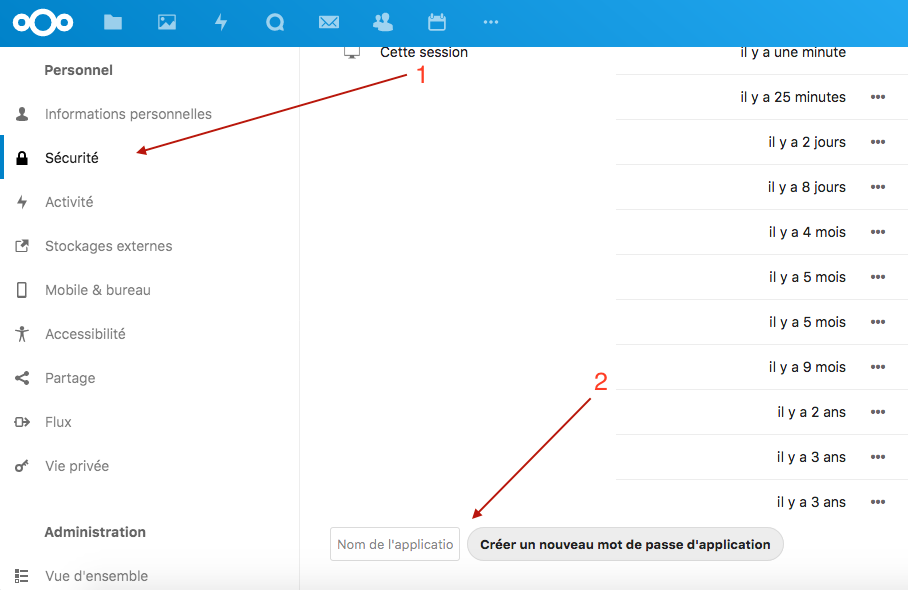
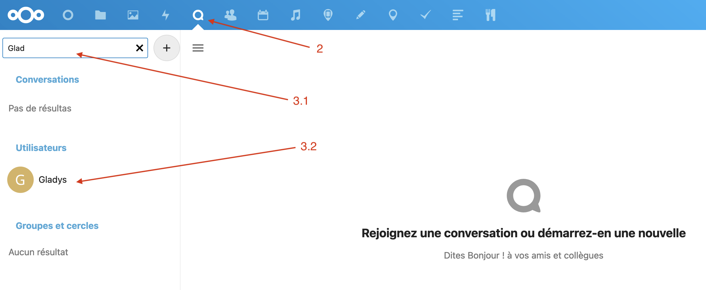
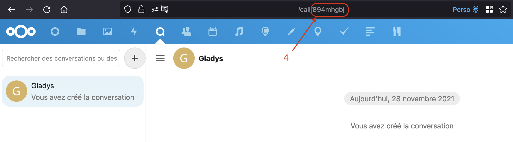
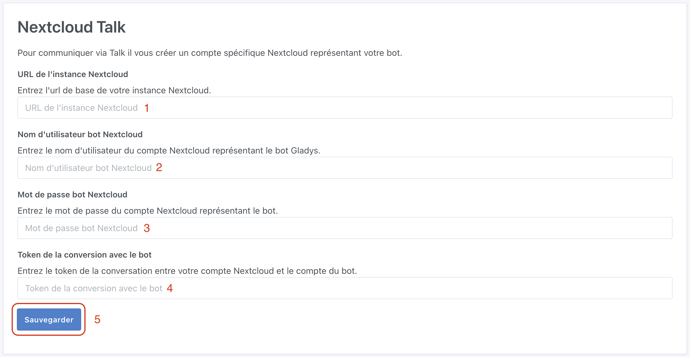

This integration allows you to use Nextcloud [Talk](https://nextcloud.com/talk/) app to talk to Gladys.

Available on Android, iOS and web, it will allow you to communicate with Gladys Assistant by giving it instructions, receiving information or questions...

## Nextcloud account for your bot

Bots does not exist natively in Nextcloud Talk. It is necessary to create a Nextcloud account for your bot.

On Nextcloud, login with your bot account:
1. Go to config page, then click on Security tab
2. At the bottom enter "Gladys" and click on "Create new app password"

Note the generated password

## Get your conversation token

To indicate which Nextcloud Talk conversation Gladys should listen to:
1. From a **browser**, with your **personnal account** on Nextcloud
2. Go to Talk application
3. Start conversation with your bot account

4. Write down the token, you can find it in conversation url

## Enter full Nextcloud Talk bot configuration in Gladys Assistant

Go to the `Integrations -> Nextcloud Talk` page in Gladys.

1. Enter your Nextcloud instance base url
2. Enter the username of your bot's Nextcloud account
3. Paste here previously generated password 
4. Paste conversation token

Click on `Save`.

## First communication between Telegram and Gladys Assistant

On Nextcloud web or mobile application, enter your first question for your Gladys Assistant, for example : what's the weather like?

Wait a bit and ......... magic !!!

Your assistant answers you ! Isn't fun ?

Please post a message on [the forum](https://en-community.gladysassistant.com), if you need any help.
