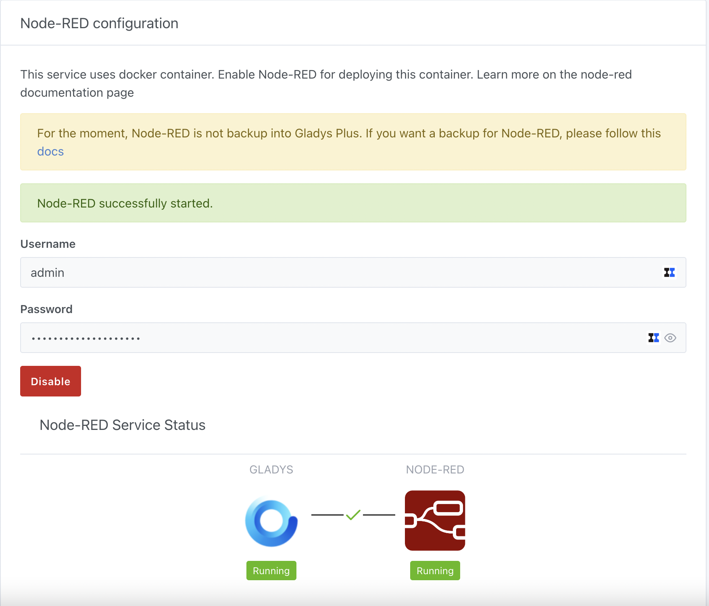
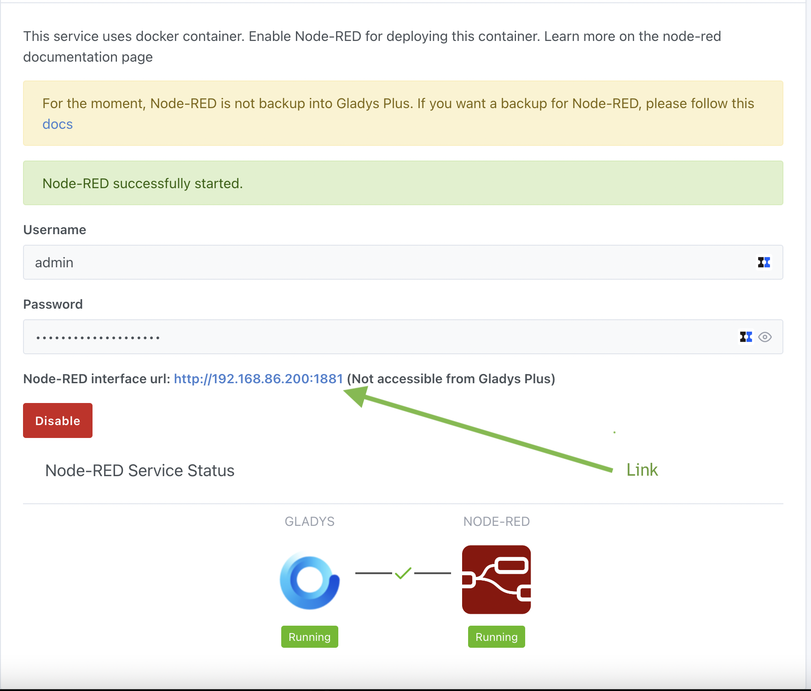
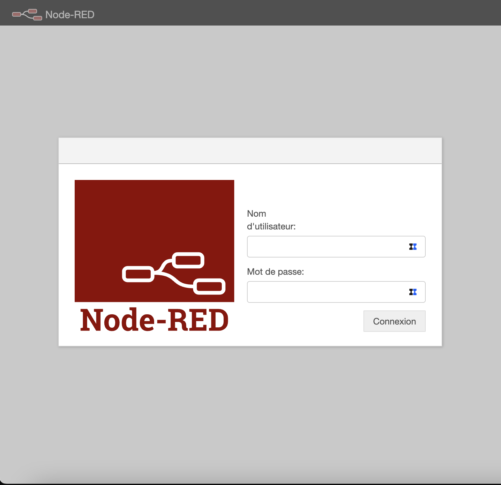
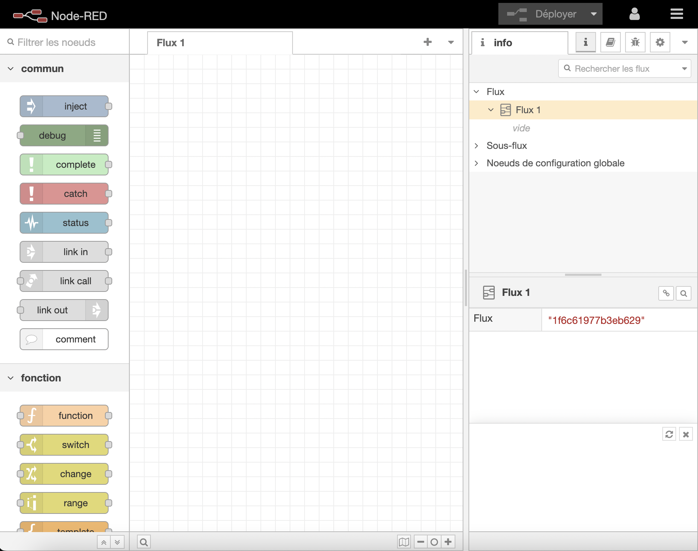

In this tutorial, we will show you how to integrate [Node-RED](https://nodered.org/) to Gladys Assistant.

This will allow you to connect hardware devices, APIs and online services.

## Activate Node-RED
In Gladys, go to in `Integrations / Node-RED`.

Gladys needs to install a container. Don’t worry, it’s all been automated.

Go to the `Configuration` section and click on the **Enable** button. After a few moments (the time depends on your Raspberry Pi model and your bandwidth), you should visualize all the initialized elements and the links between each in green.

## Connect to Node-RED

You can open the Node-RED interface by clicking on the link
:warning: Attention, the link is not accessible from Gladys Plus

You arrive at your local Node-RED instance. 

To connect, you must use the connection information provided in the `Configuration` section. 

## Use

You can now create your Node-RED flows

