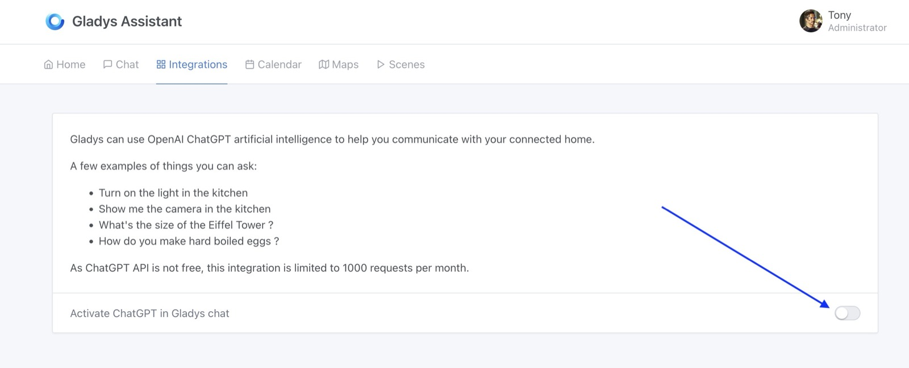

OpenAI definitely revolutionized the world of artificial intelligence when it launched ChatGPT last year.

What if you could use ChatGPT to control your connected home?

We wouldn't be far from having our very own Jarvis at home, just a quick message away!

## Prerequisites

As the OpenAI API is not free, this integration is part of Gladys Plus. Start by creating your account to get access to ChatGPT 🙂

## Configuration

It's very simple, just activate ChatGPT in the OpenAI ChatGPT integration in "Integrations":

Then you can chat with ChatGPT in the chat tab or via our Telegram integration.

## Available commands

There are currently 7 commands available:

| Action                    | Example                                     |
| ------------------------- | ------------------------------------------- |
| Show camera in a room     | Show me the camera in the living room       |
| Turn on the light         | Turn on the light in the kitchen            |
| Turn off the light        | Turn off the light in the kitchen           |
| Get temperature in a room | What’s the temperature in the garden ?      |
| Get humidity in a room    | What’s the humidity level in the bathroom ? |
| Start a scene             | Start the “cinema” scene                    |
| Get useful informations   | How do you boil an egg?                     |
