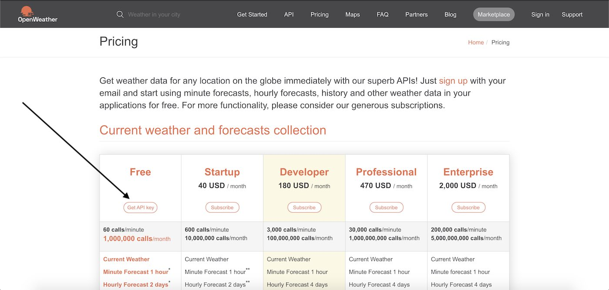

This integration let you get the weather in Gladys Assistant.

## Create an OpenWeather account

To configure OpenWeather, first go to [https://openweathermap.org/api](https://openweathermap.org/api).

Click on "Subscribe" under "Current Weather Data".

Then click on "Get API key"

Then enter your informations to create an account.

Fill this modal with what you want. Your firstname is fine :)

Confirm your email, and you'll receive another email with your API key.

This API key is not immediately valid, **you have to wait**.

## Enter the API key in Gladys Assistant

Go to "Integrations" -> "OpenWeather". Enter your API key, and click "save".

## Add a weather box to the dashboard

Go to the dashboard, and click on "edit".

Add a weather box.

Select your home. The latitude + longitude of your home will be used to get the weather.

Click on "Save".

Voilà !

