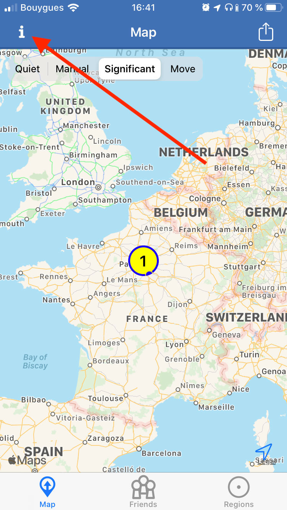
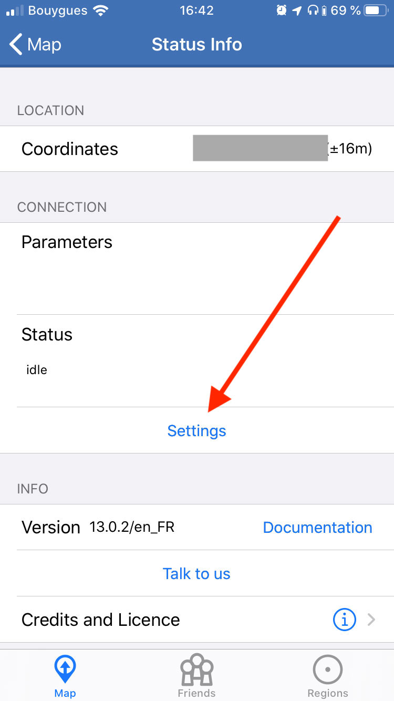
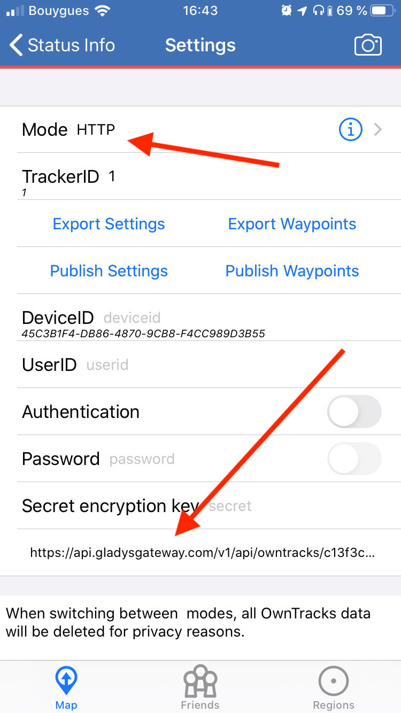

[Owntracks](https://owntracks.org/) is an open-source mobile app which sends the phone location to a server, periodically.

Gladys Plus allows you to receive Owntracks message and create location in Gladys.

### Download Owntracks

First download Owntracks on iOS or Android.

### Create an API key in Gladys Plus

Go to [plus.gladysassistant.com](https://plus.gladysassistant.com/), connect.

Then go to "settings" => "Open API", and create a key.

### Go to Owntracks

Click on the button in the top-left corner:



Click on settings:



Select "HTTP", and in the "URL" input, enter:

```
https://api.gladysgateway.com/v1/api/owntracks/[YOUR-API-KEY]
```

Fill in the `UserID` and `DeviceID` field with the terms of your choice (they are mandatory).

I put "iphone" for the `DeviceID`, and "pierre-gilles" for the `UserID`.

Gladys uses the API key to identify who is making the request.



### See your location in Gladys

You should see your location in Gladys in the "Maps" tab.
