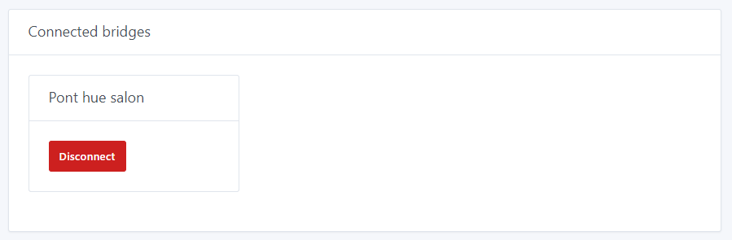
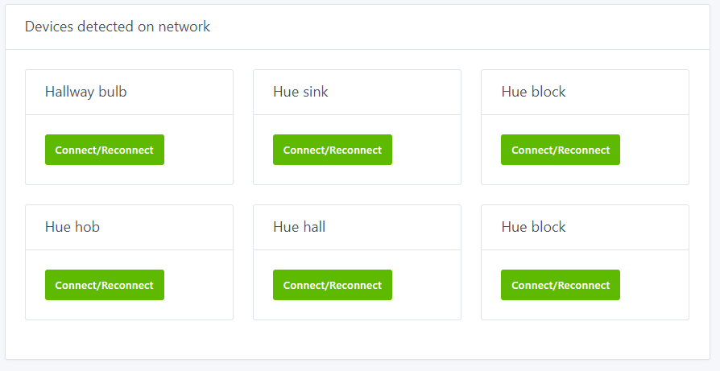
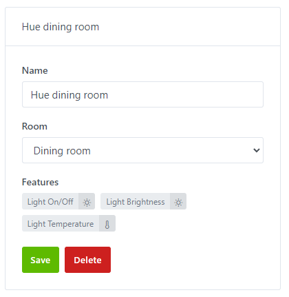
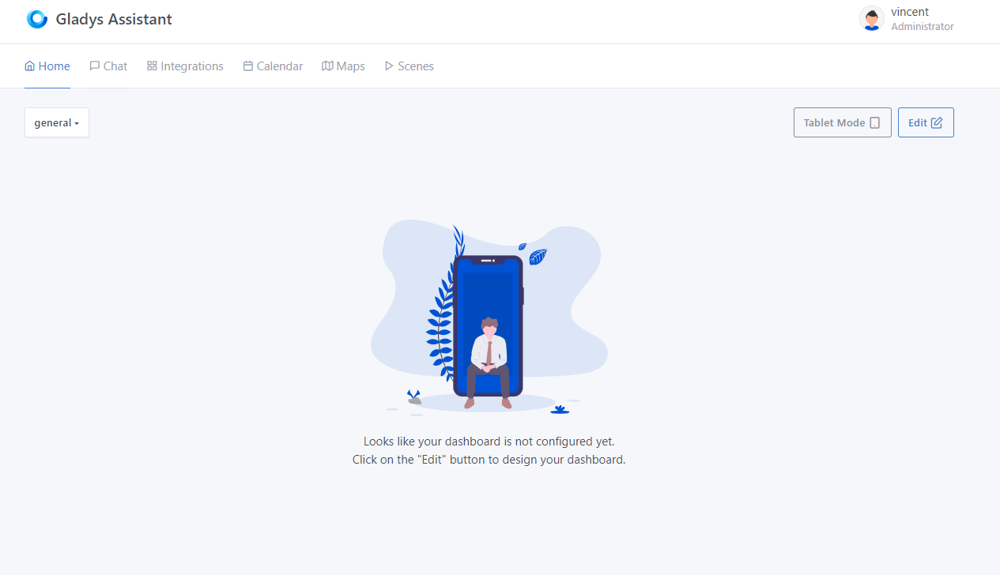
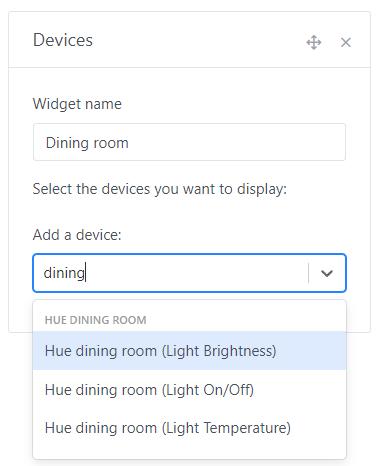
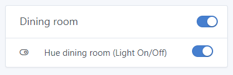

# Connect your Philips Hue to Gladys Assistant

Because it's always better on video, here's a little demonstration of Philips Hue integration in Gladys 🙂

[Contrôler ses Philips Hue dans Gladys Assistant 4](https://youtu.be/PjLx7TYZdRM)

## Tutorial

To connect your Philips Hue bulbs, go to `Integrations -> Philips Hue` in Gladys.

## Press the button on your Philips Hue bridge

On your Philips Hue bridge connected to your internet box, click on the central button.

## Connect a bridge to Gladys

In `Configure bridges`, click `Connect/Reconnect` on your bridge.

If you don't see your bridge, check that Gladys is on the same network as the Hue bridge.

Another box will appear with the bridge you've just connected.

NOTE

Make sure you have the Philips Hue Bridge v2 (the square one). Integration will not work with the v1 Bridge (round).

## Add a bulb to Gladys

In `Apparatus`, click `Connect/Reconnect` on each bulb you want to add to Gladys.

There you go!

## Control your lights on the dashboard

You can now add a **devices widget** to your dashboard and control your lights.

Go to Gladys' dashboard and click on the `Edit` button to modify the dashboard.

Click on `add +` then select the `apparatus` widget, which you can move to a column. Select your lamps according to your functionalities, give your widget a name and click on `Save`.

You can add several lamps to the same widget.

That's it! Your widget is visible on the dashboard.

Please post a message on [the forum](https://en-community.gladysassistant.com), if you need any help.