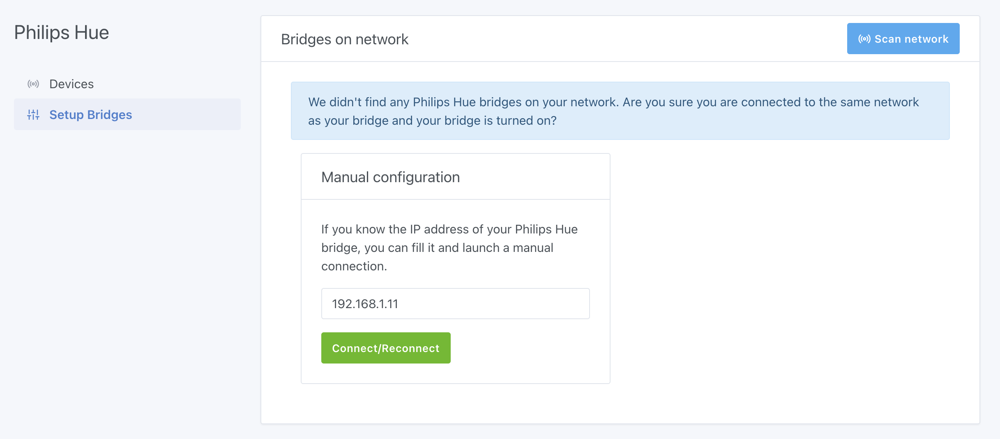

import JsonLd from '@site/src/components/seo/JsonLd';

The Philips Hue integration connects your Hue bridge and lights directly to Gladys Assistant. Because Gladys talks to your bridge locally over your own network, your lights keep working even when your internet connection is down, and no data leaves your home.

Once your lights are connected, you can switch them on and off, dim them, change their colour, group them by room, and use them in [scenes](/docs/scenes/intro/): turn the hallway on at sunset, flash the living room when a door opens, or wake up to a gradual sunrise. You can also control them with the [voice assistant](/docs/dashboard/voice-assistant) or from the [mobile app](/docs/installation/phone).

Gladys connects to the bridge, which speaks Zigbee to your bulbs, so any light, plug or accessory paired to your Hue bridge shows up in Gladys. If you would rather not use a bridge at all, you can also pair Hue bulbs directly through the [Zigbee2mqtt integration](/docs/integrations/zigbee2mqtt/).

## What you need

- A **Philips Hue Bridge v2** (the square one). The original round bridge (v1) is not supported.
- Your Hue bridge connected to the same local network as the machine running Gladys.
- Your Hue lights already paired to the bridge (for example through the official Hue app).

To connect your Philips Hue to Gladys, go to `Integrations / Philips Hue` (in Gladys).

## Press the button on your bridge

Press the physical button on the top of your bridge.

## Connect your bridge in Gladys

In `Configure bridge`, click on `Connect` on your bridge.

If you don't see your bridge, make sure it's on the same network as your machine running Gladys.

If you still don't see your bridge, you can add it manually by filling its IP Address.

:::note
Make sure you have the Hue Bridge v2 (the square one). The integration will not work with the original Hue Bridge (round bridge).
:::

## Add your lights in Gladys

In `Devices`, click on `Connect` on each lamp you want to control in Gladys.

Success!

## Frequently asked questions

### Does the Philips Hue integration work locally, without the cloud?

Yes. Gladys communicates with your Hue bridge directly over your local network, so your lights can be controlled even without an internet connection and none of your data is sent to a third party server. This is one of the main reasons to use Gladys, a local and open source home automation solution, instead of a cloud only app.

### Do I need a Philips Hue Bridge?

For the official Philips Hue integration, yes: Gladys connects to the Hue Bridge v2, which then controls your bulbs over Zigbee. If you prefer not to buy a bridge, you can instead pair your Hue bulbs directly with a Zigbee dongle through the [Zigbee2mqtt integration](/docs/integrations/zigbee2mqtt/).

### Which Philips Hue Bridge is supported?

You need the Hue Bridge v2, the square shaped model. The original round Hue Bridge (v1) is not supported by the integration.

### Can I use my Philips Hue lights in scenes?

Yes. Once your lights are connected, they are available in the [scenes](/docs/scenes/intro) editor. You can turn them on or off, set their brightness and colour, and combine them with any other device, sensor or schedule, for example turning the lights on automatically at sunset or when motion is detected.

### Can I control Philips Hue with my voice in Gladys?

Yes. Connected Hue lights can be controlled through the Gladys [voice assistant](/docs/dashboard/voice-assistant) and from the chat, so you can say things like "turn off the living room lights" and Gladys will send the command to your bridge locally.

<JsonLd
  data={{
    "@context": "https://schema.org",
    "@type": "FAQPage",
    mainEntity: [
      {
        "@type": "Question",
        name: "Does the Philips Hue integration work locally, without the cloud?",
        acceptedAnswer: {
          "@type": "Answer",
          text: "Yes. Gladys communicates with your Hue bridge directly over your local network, so your lights can be controlled even without an internet connection and none of your data is sent to a third party server.",
        },
      },
      {
        "@type": "Question",
        name: "Do I need a Philips Hue Bridge to use the integration?",
        acceptedAnswer: {
          "@type": "Answer",
          text: "For the official Philips Hue integration, yes: Gladys connects to the Hue Bridge v2, which then controls your bulbs over Zigbee. If you prefer not to buy a bridge, you can instead pair your Hue bulbs directly with a Zigbee dongle through the Zigbee2mqtt integration.",
        },
      },
      {
        "@type": "Question",
        name: "Which Philips Hue Bridge is supported by Gladys?",
        acceptedAnswer: {
          "@type": "Answer",
          text: "You need the Hue Bridge v2, the square shaped model. The original round Hue Bridge (v1) is not supported by the integration.",
        },
      },
      {
        "@type": "Question",
        name: "Can I use my Philips Hue lights in scenes?",
        acceptedAnswer: {
          "@type": "Answer",
          text: "Yes. Once your lights are connected, they are available in the scenes editor. You can turn them on or off, set their brightness and colour, and combine them with any other device, sensor or schedule.",
        },
      },
      {
        "@type": "Question",
        name: "Can I control Philips Hue with my voice in Gladys?",
        acceptedAnswer: {
          "@type": "Answer",
          text: "Yes. Connected Hue lights can be controlled through the Gladys voice assistant and from the chat, so you can say things like turn off the living room lights and Gladys will send the command to your bridge locally.",
        },
      },
    ],
  }}
/>

