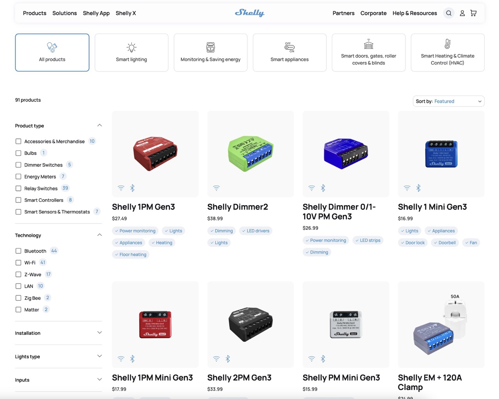

Shelly is a popular brand in the home automation field, known for its compact, affordable, and easy-to-integrate Wi-Fi modules. They allow you to automate lighting, outlets, or roller shutters without requiring a central hub.



Version 4.58 of **Gladys Assistant** introduces official support for the **Matter** standard. While Shelly's 4th generation devices are fully compatible with Matter, previous versions unfortunately aren't all compatible.

Fortunately, thanks to the open-source project [Matterbridge](https://github.com/luligu/matterbridge), you can make devices that aren't natively compatible with Matter compatible, and thus control them in Gladys as easily as native devices.

This step-by-step guide will explain how to:

1. Deploy Matterbridge in a Docker container.
2. Commission the bridge in Gladys.
3. Expose and control your Shelly modules.

### Prerequisites

- Gladys Assistant 4.58 installed and functional
- IPv6 local network enabled
- At least one Shelly module (Gen 1/2/3/Plus/BLU)
- Docker + Docker Compose available on the host machine
- Terminal/SSH access & text editor

### 1. Deploy Matterbridge in Docker

On your Gladys server, create a `matterbridge` folder:

```bash
mkdir ~/matterbridge && cd ~/matterbridge
```

Copy and paste the `docker-compose.yml` below (with `nano docker-compose.yml` for example):

```yaml
services:
  matterbridge:
    image: luligu/matterbridge:latest
    container_name: matterbridge
    restart: unless-stopped
    network_mode: host
    environment:
      - TZ=Europe/Paris
    ports:
      - "8283:8283" # Exposes Matterbridge Web UI
    volumes:
      - "${HOME}/matterbridge:/root/Matterbridge" # Mounts the Matterbridge plugin directory
      - "${HOME}/.matterbridge:/root/.matterbridge" # Mounts the Matterbridge storage directory
```

Start the container:

```bash
docker compose up -d
```

Follow the logs to get the commissioning QR code:

```bash
docker compose logs -f
```


**Access the Web interface**: open `http://YOUR-SERVER-IP-ADDRESS:8283`.

Go to the main page of Matterbridge. You should first check if an update is available. If so, run it and wait until it restarts.


To install the Shelly plugin, click on the 3 dots **matterbridge-shelly → INSTALL**,


Once the plugin is installed, Matterbridge should restart automatically. If not, you can restart manually by clicking on the icon in the top right corner of the interface.


Your Shelly devices connected to the network will be automatically discovered without additional intervention. You can verify this in the interface logs and under the **Devices** tab.


### 2. Commission the bridge in Gladys

First, get the **Manual pairing code** from the **Home** main page.


In Gladys, open the "Matter" integration from the **Integrations → Matter** menu.

If you haven't already done so, enable "Matter" from the **Settings** menu.


Click on the **Add a device** tab, then paste or enter the **Pairing code** previously displayed by Matterbridge. Click on **Add to Gladys**.


Wait a few seconds: You can now integrate your compatible **Shelly** devices into **Gladys Assistant**.


You can add these devices by clicking on "Add to Gladys".

The bridge now appears in the **Settings** tab.


### 3. Going further

- Enable other Matterbridge plugins: Zigbee2MQTT, Somfy Tahoma, Home Assistant, etc.
- Add these devices to your dashboard
- Create Gladys scenes (e.g., turn off all lights at night).

### Conclusion

In just a few minutes, you've transformed your **Shelly** modules into **Matter**-compatible devices fully integrated with **Gladys Assistant**.

Thanks to the Matter standard and the **Matterbridge** project that make the ecosystem even more open!

### Useful resources

- [Integrating Matter devices in Gladys Assistant](/docs/integrations/matter/)
- [Matterbridge GitHub Repository](https://github.com/luligu/matterbridge)
