import JsonLd from '@site/src/components/seo/JsonLd';

Somfy is a French industrial group specializing in motorization, automation of home and building openings, as well as in the connected home.

With the TaHoma® by Somfy application and a home automation box, it is possible to remotely manage shutters, blinds, garage doors, gates, security systems, cameras, and other connected intercoms.

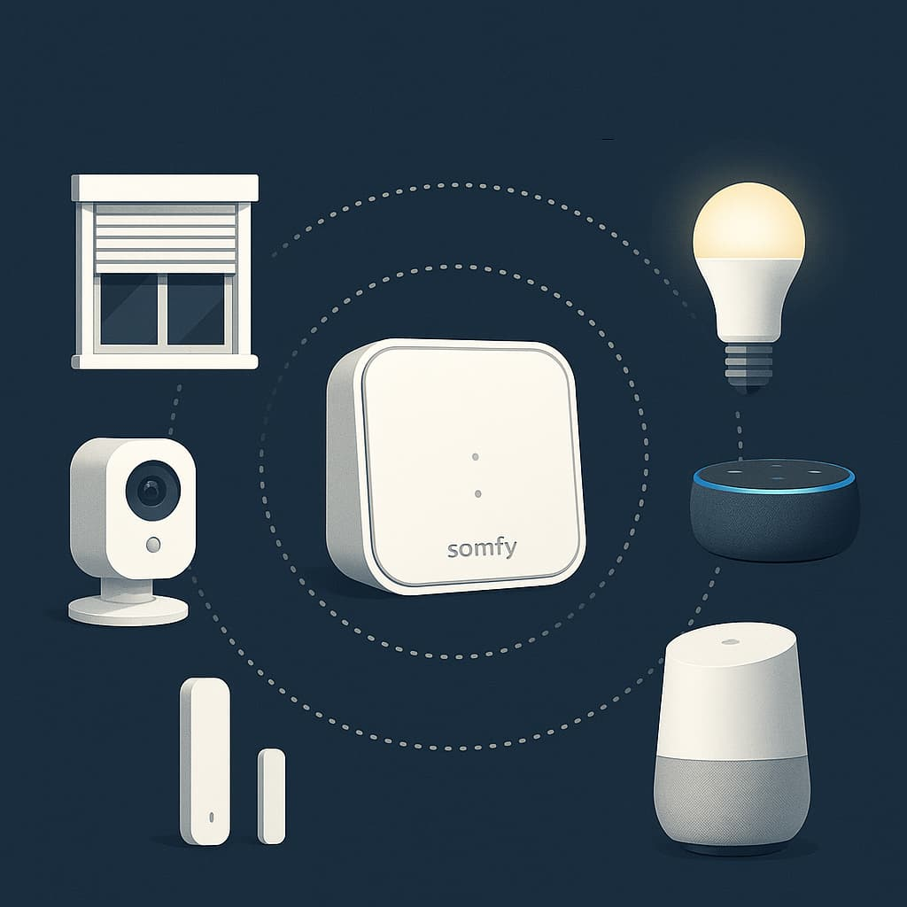

Currently, complete home management is limited to this application and a connection to the Somfy cloud.

To go further in interactions, Gladys will allow more extensive management thanks to its various integrations.

Version 4.58 of **Gladys Assistant** introduces official support for the **Matter** standard.
Thanks to the open-source project [Matterbridge](https://github.com/luligu/matterbridge), you can make devices that are not natively compatible with Matter compatible, and thus control them in Gladys as easily as native devices.
This is what we will do for Somfy devices.

This step-by-step guide will explain how to expose and control your Somfy roller shutters, blinds, and other openings.

## Is Somfy compatible with Matter?

Somfy devices (io-homecontrol® and RTS) are **not natively exposed over Matter** to third-party controllers: there is no built-in Matter bridge in the **TaHoma**, **TaHoma Switch** or **Connexoon** boxes today, and control still goes through the Somfy cloud.

The good news is that you don't have to wait for Somfy. Using the open-source [Matterbridge](https://github.com/luligu/matterbridge) project, Gladys turns your Somfy **TaHoma**, **TaHoma Switch** and **Connexoon** devices into Matter devices, so you can control your roller shutters, blinds, awnings and other openings directly from Gladys Assistant. The rest of this guide shows you how, step by step.

### Prerequisites

- Gladys Assistant 4.58 installed and functional
- Local IPv6 network enabled
- Docker + Docker Compose available on the host machine
- Terminal/SSH access & text editor
- A Somfy box: **Connexoon** (io-homecontrol® protocol), **TaHoma** (io, RTS), **TaHoma Switch** (io, RTS, Zigbee)
- A valid and active Somfy account

### 1. Deploy Matterbridge

First, you need to deploy Matterbridge in Gladys. Follow the [Matterbridge integration guide](/docs/integrations/matterbridge/) to enable and start Matterbridge.

Once Matterbridge is running, access its web interface at `http://YOUR-SERVER-IP-ADDRESS:8283`.

Go to the main page of Matterbridge. You should first check if an update is available. If so, run it and wait until it restarts.

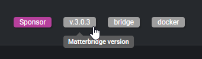

### 2. Installing the Somfy/TaHoma plugin

To install the Somfy/TaHoma plugin, click on the 3 dots, select **matterbridge-somfy-tahoma** then click on **INSTALL**,

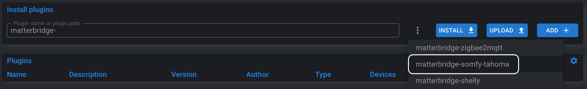

Once the plugin is installed, Matterbridge should restart on its own if needed. If not, you can restart manually by clicking on the icon at the top right of the interface.

The plugin is installed and an error message in the logs indicates that the plugin needs to be configured:

To do this, click on the **Plugin config** icon:

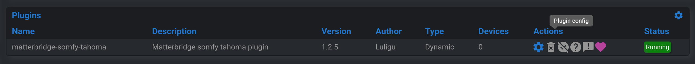

Fill in **email** and **password** of your Somfy account, select the **Somfy Europe** server, and validate by clicking on **Confirm**:

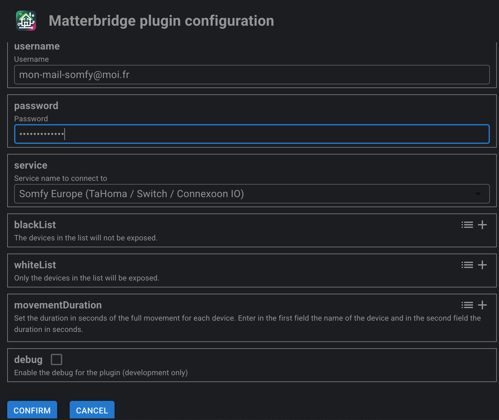

A manual restart of Matterbridge is necessary to activate the plugin configuration:

Once restarted, your devices appear in Matterbridge under **Devices** in the plugin line and in the **Devices** tab:

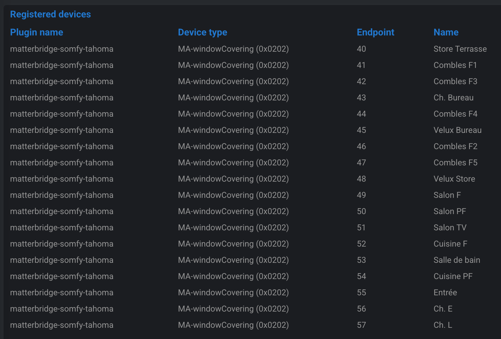

### 3. Commissioning the bridge in Gladys

First, retrieve the **Manual pairing code** from the main **Home** page

If it doesn't appear, you can force its display by clicking on **Share fabrics** in the menu at the top right `...`:

In Gladys, open the "Matter" integration from the **Integrations** → **Matter** menu.
If not already done, enable "Matter" from the **Settings** menu:

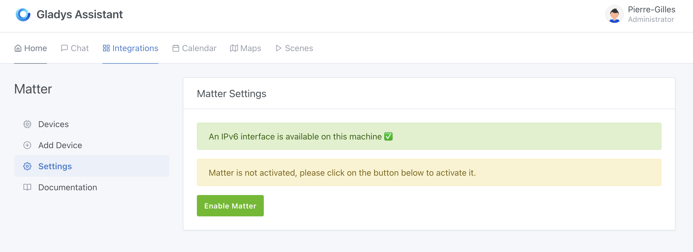

Click on the **Add a device** tab, then paste or enter the **Pairing code** previously displayed by Matterbridge. Click on **Add to Gladys**

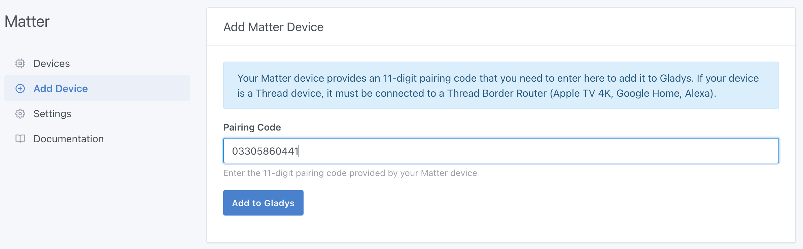

Wait a few seconds: you can now integrate your compatible **Somfy** equipment into **Gladys Assistant**:

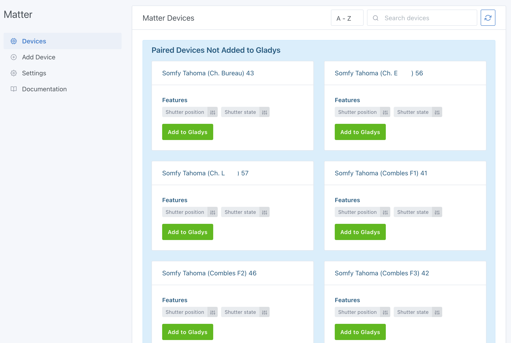

You can add these devices by clicking on **Add to Gladys**.

The bridge now appears in the **Settings** tab:

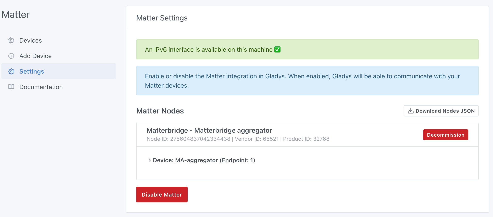

### 4. Going further

- Activate other Matterbridge plugins: Zigbee2MQTT, Shelly, Home Assistant, etc.
- Add these devices to your dashboard
- Create Gladys scenes (e.g., close all upstairs shutters when it starts to get dark, then those on the ground floor 30 minutes later).

### 5. Future developments:

- **Local API**
  Currently everything goes through the Somfy Cloud: you must have a functional Internet connection to be able to control your openings.
  Development to be able to use the local API of the Somfy box has started but is not yet operational. Plugin updates will eventually allow everything to be done locally.

- **Position (%) of shutters**
  Matterbridge manages openings autonomously, meaning there is no querying of Somfy servers to know the current position of openings if they are controlled by their remote controls or the Tahoma mobile application:
  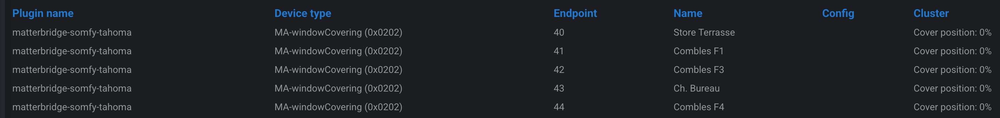
  A reflection is underway to be able to retrieve the different positions.

### Conclusion

In just a few minutes, you have transformed your **Somfy** openings into **Matter** compatible devices fully integrated with **Gladys Assistant**.

Thanks to the **Matter** standard and the **Matterbridge** project which make the ecosystem even more open!

### Useful resources

- [Integrating Matter devices in Gladys Assistant](/docs/integrations/matter/)
- [Matterbridge GitHub Repository](https://github.com/luligu/matterbridge)

## Frequently asked questions

### Is Somfy compatible with Matter?

Somfy boxes don't natively expose your io-homecontrol® and RTS devices over Matter to third-party controllers. There is no built-in Matter bridge in the TaHoma, TaHoma Switch or Connexoon. However, you can make them Matter-compatible with the open-source Matterbridge project and control them in Gladys Assistant.

### Is the Somfy TaHoma Switch compatible with Matter?

The TaHoma Switch doesn't act as a native Matter bridge for your io and RTS devices. Using Matterbridge and the `matterbridge-somfy-tahoma` plugin, Gladys can still expose your TaHoma Switch devices over Matter and control them.

### Do I need the Somfy cloud and an internet connection?

Yes, for now. The Matterbridge Somfy/TaHoma plugin communicates with the Somfy cloud, so an active internet connection and a valid Somfy account are required. Support for the Somfy box local API is in development and will eventually allow fully local control.

### Which Somfy devices can I control in Gladys?

Once bridged through Matter, you can control your roller shutters, blinds, awnings and other openings managed by your Somfy box (Connexoon, TaHoma or TaHoma Switch) over the io-homecontrol® and RTS protocols.

### Can I see the position (%) of my shutters?

Matterbridge controls openings autonomously and doesn't query the Somfy servers for the current position when devices are operated from their remote controls or the TaHoma mobile app. Retrieving live positions is being investigated.

<JsonLd
  data={{
    "@context": "https://schema.org",
    "@type": "FAQPage",
    mainEntity: [
      {
        "@type": "Question",
        name: "Is Somfy compatible with Matter?",
        acceptedAnswer: {
          "@type": "Answer",
          text: "Somfy boxes don't natively expose your io-homecontrol and RTS devices over Matter to third-party controllers: there is no built-in Matter bridge in the TaHoma, TaHoma Switch or Connexoon. However, you can make them Matter-compatible with the open-source Matterbridge project and control them in Gladys Assistant.",
        },
      },
      {
        "@type": "Question",
        name: "Is the Somfy TaHoma Switch compatible with Matter?",
        acceptedAnswer: {
          "@type": "Answer",
          text: "The TaHoma Switch doesn't act as a native Matter bridge for your io and RTS devices. Using Matterbridge and the matterbridge-somfy-tahoma plugin, Gladys can still expose your TaHoma Switch devices over Matter and control them.",
        },
      },
      {
        "@type": "Question",
        name: "Do I need the Somfy cloud and an internet connection?",
        acceptedAnswer: {
          "@type": "Answer",
          text: "Yes, for now. The Matterbridge Somfy/TaHoma plugin communicates with the Somfy cloud, so an active internet connection and a valid Somfy account are required. Support for the Somfy box local API is in development and will eventually allow fully local control.",
        },
      },
      {
        "@type": "Question",
        name: "Which Somfy devices can I control in Gladys?",
        acceptedAnswer: {
          "@type": "Answer",
          text: "Once bridged through Matter, you can control your roller shutters, blinds, awnings and other openings managed by your Somfy box (Connexoon, TaHoma or TaHoma Switch) over the io-homecontrol and RTS protocols.",
        },
      },
      {
        "@type": "Question",
        name: "Can I see the position (%) of my Somfy shutters in Gladys?",
        acceptedAnswer: {
          "@type": "Answer",
          text: "Matterbridge controls openings autonomously and doesn't query the Somfy servers for the current position when devices are operated from their remote controls or the TaHoma mobile app. Retrieving live positions is being investigated.",
        },
      },
    ],
  }}
/>
