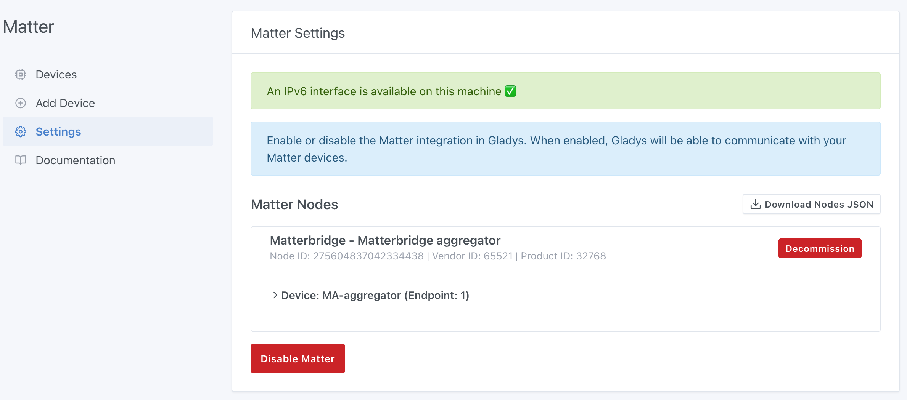

Somfy is a French industrial group specializing in motorization, automation of home and building openings, as well as in the connected home.

With the TaHoma® by Somfy application and a home automation box, it is possible to remotely manage shutters, blinds, garage doors, gates, security systems, cameras, and other connected intercoms.

import SomfyImage from '../../static/img/docs/en/configuration/somfy-tahoma/1-somfy-tahoma.jpg';


Currently, complete home management is limited to this application and a connection to the Somfy cloud.

To go further in interactions, Gladys will allow more extensive management thanks to its various integrations.

Version 4.58 of **Gladys Assistant** introduces official support for the **Matter** standard.
Thanks to the open-source project [Matterbridge](https://github.com/luligu/matterbridge), you can make devices that are not natively compatible with Matter compatible, and thus control them in Gladys as easily as native devices.
This is what we will do for Somfy devices.

This step-by-step guide will explain how to expose and control your Somfy roller shutters, blinds, and other openings.

### Prerequisites

- Gladys Assistant 4.58 installed and functional
- Local IPv6 network enabled
- Docker + Docker Compose available on the host machine
- Terminal/SSH access & text editor
- A Somfy box: **Connexoon** (io-homecontrol® protocol), **TaHoma** (io, RTS), **TaHoma Switch** (io, RTS, Zigbee)
- A valid and active Somfy account

### 1. Deploy Matterbridge with Docker

On your Gladys server, create a `matterbridge` folder:

```bash
mkdir ~/matterbridge && cd ~/matterbridge
```

Copy and paste the `docker-compose.yml` below (with nano for example, `nano docker-compose.yml`):

```yaml
services:
  matterbridge:
    image: luligu/matterbridge:latest
    container_name: matterbridge
    restart: unless-stopped
    network_mode: host
    environment:
      - TZ=Europe/Paris
    ports:
      - "8283:8283" # Exposes the Matterbridge Web UI
    volumes:
      - "${HOME}/matterbridge:/root/Matterbridge" # Mounts the Matterbridge plugin directory
      - "${HOME}/.matterbridge:/root/.matterbridge" # Mounts the Matterbridge storage directory
```

Launch the container:

```bash
docker compose up -d
```

Follow the logs to retrieve the commissioning QR code:

```bash
docker compose logs -f
```


**Access the Web interface**: open `http://YOUR-SERVER-IP-ADDRESS:8283`.

Go to the main page of Matterbridge. You should first check if an update is available. If so, execute it and wait until it restarts


### 2. Installing the Somfy/TaHoma plugin

To install the Somfy/TaHoma plugin, click on the 3 dots, select **matterbridge-somfy-tahoma** then click on **INSTALL**,


Once the plugin is installed, Matterbridge should restart on its own if needed. If not, you can restart manually by clicking on the icon at the top right of the interface.


The plugin is installed and an error message in the logs indicates that the plugin needs to be configured:


To do this, click on the **Plugin config** icon:


Fill in **email** and **password** of your Somfy account, select the **Somfy Europe** server, and validate by clicking on **Confirm**:


A manual restart of Matterbridge is necessary to activate the plugin configuration:


Once restarted, your devices appear in Matterbridge under **Devices** in the plugin line and in the **Devices** tab:


### 3. Commissioning the bridge in Gladys

First, retrieve the **Manual pairing code** from the main **Home** page

If it doesn't appear, you can force its display by clicking on **Share fabrics** in the menu at the top right `...`:


In Gladys, open the "Matter" integration from the **Integrations** → **Matter** menu.
If not already done, enable "Matter" from the **Settings** menu:


Click on the **Add a device** tab, then paste or enter the **Pairing code** previously displayed by Matterbridge. Click on **Add to Gladys**


Wait a few seconds: you can now integrate your compatible **Somfy** equipment into **Gladys Assistant**:


You can add these devices by clicking on **Add to Gladys**.

The bridge now appears in the **Settings** tab:



### 4. Going further

- Activate other Matterbridge plugins: Zigbee2MQTT, Shelly, Home Assistant, etc.
- Add these devices to your dashboard
- Create Gladys scenes (e.g., close all upstairs shutters when it starts to get dark, then those on the ground floor 30 minutes later).

### 5. Future developments:

- **Local API**
  Currently everything goes through the Somfy Cloud: you must have a functional Internet connection to be able to control your openings.
  Development to be able to use the local API of the Somfy box has started but is not yet operational. Plugin updates will eventually allow everything to be done locally.

- **Position (%) of shutters**
  Matterbridge manages openings autonomously, meaning there is no querying of Somfy servers to know the current position of openings if they are controlled by their remote controls or the Tahoma mobile application:
  
  A reflection is underway to be able to retrieve the different positions.

### Conclusion

In just a few minutes, you have transformed your **Somfy** openings into **Matter** compatible devices fully integrated with **Gladys Assistant**.

Thanks to the **Matter** standard and the **Matterbridge** project which make the ecosystem even more open!

### Useful resources

- [Integrating Matter devices in Gladys Assistant](/docs/integrations/matter/)
- [Matterbridge GitHub Repository](https://github.com/luligu/matterbridge)
