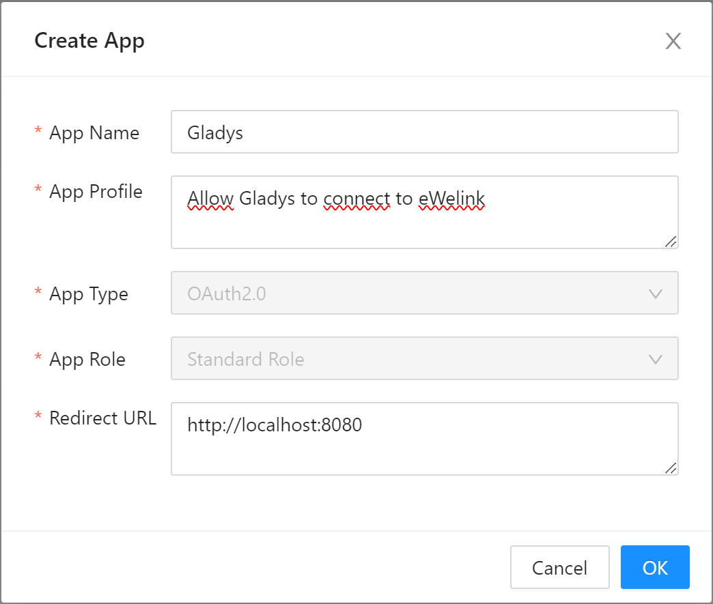

Sonoff devices can be used with [Tasmota](/docs/integrations/tasmota/) OpenSource firmware.

## Prerequisite

You must have an "eWeLink" cloud account:

- [eWeLink for Android](https://play.google.com/store/apps/details?id=com.coolkit "eWeLink for Android")
- [eWeLink for iPhone/iPad](https://apps.apple.com/fr/app/ewelink-smart-home/id1035163158 "eWeLink for iPhone/iPad")

## Configure eWeLink cloud access

To be able to manage your eWeLink devices with Gladys, you will have to create a developer account on eWeLink cloud.

### Create a developer account

Go to https://dev.ewelink.cc/ website, click on "Login/Register" link to get access to your own developer account.

If you create a new account, it can take a few days to be activated by eWeLink support team. You will receive a e-mail confirming your registration. Please wait.

### Create an new application

Now, you have to create a new application clicking on the "Create" button.

This application will open eWeLink API access, so Gladys will be able to connect to your devices.

Then, fill required information:
- App Name: a name to easily identify the usage (eg. _Gladys_)
- App Profile: a simple description (eg. _Allow Gladys to connect to eWeLink_)
- App Type: let _OAuth2.0_
- App Role: let _Standard Role_
- Redirect URL: enter the URL of your Gladys instance, followed by `/dashboard/integration/device/sonoff/setup/login` (eg: _http://localhost:1440/dashboard/integration/device/sonoff/setup/login_)

Now you will have to wait a bit to be taken in account.

### Retrieve application information

Once the new application is well created, click on "View" button to retrieve the application ID and secret values, and keep them for next steps.

## Gladys integration

### Configure Gladys with eWeLink information

Once you get _APPID_ and _APP SECRET_ values, go to your Gladys instance : 

1. go to `Intégration -> eWeLink` page
2. select `Setup` menu
3. fill application information
4. save

### Connect your own eWeLink user account into Gladys

Once eWeLink application is setup in Gladys, you have to connect with your eWeLink user clicking on "Connect" button.

### Add device to Gladys

Once your account created, go back to Gladys:

1. to `Integration -> eWeLink` page
4. select `eWeLink discover` menu
5. click on `Scan` button (if device is not already listed)
6. then `Save`

And voilà!

You need help, please post a message on [Gladys forum](https://en-community.gladysassistant.com/).
