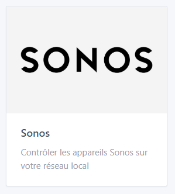
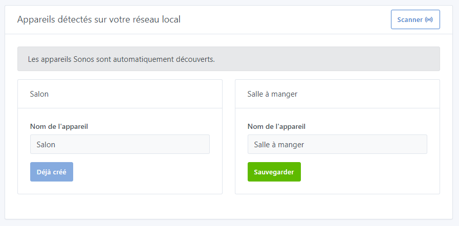
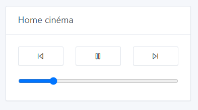

# Connect a Sonos speaker to your home automation system

## Prerequisites

You must have the Sonos application to connect your Sonos speakers (sonos Play 1, sonos One, sonos Playbar, sonos Sub, sonos Port, ...)

- [Sonos for Android](https://play.google.com/store/apps/details?id=com.sonos.acr2&hl=fr&gl=US)
- [Sonos for Apple](https://apps.apple.com/fr/app/sonos/id1488977981)

If you create a group of speakers in the Sonos application, this group will be recognized as a single speaker in Gladys. If you have a Sonos Port, it will also be detected in the integration.

## Add a speaker in Gladys

After adding your speakers in the Sonos application, go back to Gladys:

1. go to the `Integration -> Sonos` page in Gladys
2. select the `Sonos Discovery` menu
    
    
    
3. click on the `Scanner` button at top right (if the device is not already in the list)
4. finally, click on `Save` for the speakers you want to integrate into Gladys
5. and you're done!

## Rename / place a speaker in a room

If necessary, you can go to the `Apparatus` menu to modify / complete the configuration of your speakers by adding them to a room or renaming them.

## Control music on the dashboard

Now you can add a **music widget** to your dashboard and control your Sonos speakers with the music player.

Go to the Gladys dashboard and click on the `edit` button to modify the dashboard.

Click on `add +` then select the `music` widget - you can move it to a column.

Select your speaker, and click `Record`.

That's it! Your widget is visible on the dashboard.

Please post a message on [the forum](https://community.gladysassistant.com/), if you need any help.