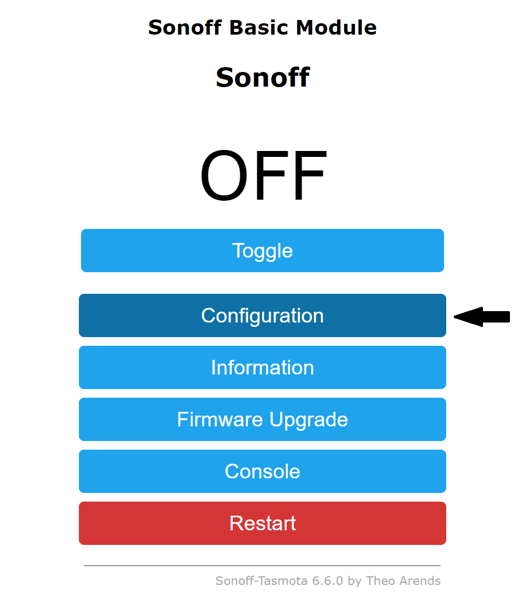
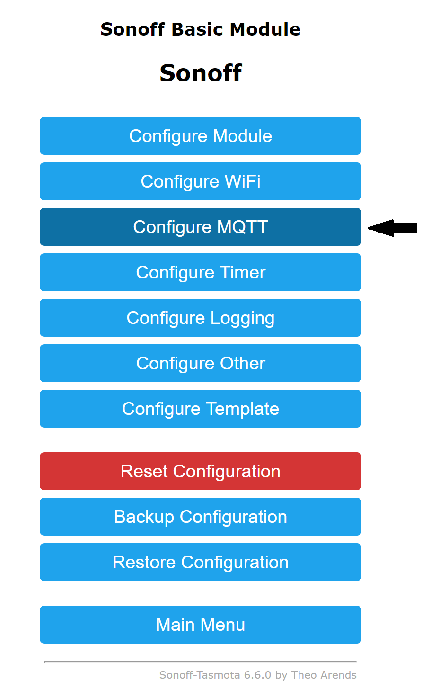
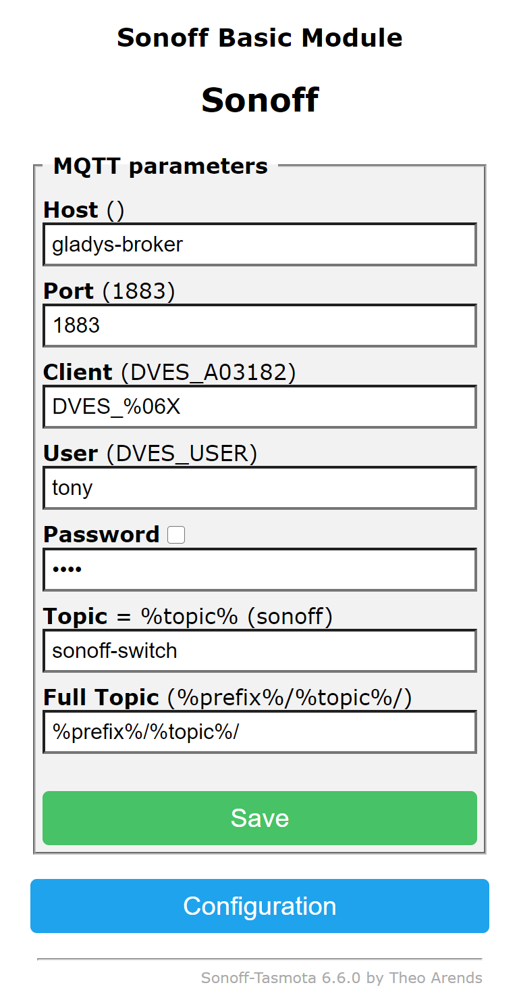

import JsonLd from '@site/src/components/seo/JsonLd';

[Tasmota](https://tasmota.github.io/docs/) is a free, open-source firmware for ESP8266, ESP8285 and ESP32 based devices. It replaces the manufacturer's cloud firmware on smart plugs, switches, bulbs and sensors so they run **entirely locally**, with no vendor account and no internet dependency, and exposes them over MQTT, HTTP or serial.

Because Tasmota talks plain MQTT, it's a perfect match for Gladys Assistant: once flashed, your devices are discovered and controlled locally, on your own network, without going through any third-party cloud.

To connect a Tasmota device to Gladys, there are three steps:

- flash your device with the Tasmota firmware
- configure MQTT on the device
- add it in `Integrations / Tasmota` in Gladys

## Why use Tasmota with Gladys?

- **Fully local and private**: the device no longer phones home to the manufacturer's servers. It communicates only with your local MQTT broker and Gladys.
- **No cloud, no subscription**: Tasmota is free and open source, and keeps working even if the original manufacturer shuts down their service.
- **Reuse cheap hardware**: many affordable smart plugs and switches (Sonoff, and other ESP-based devices) can be re-flashed instead of being thrown away.
- **Reliable and fast**: local commands don't depend on your internet connection, so automations run instantly.

:::tip Tasmota or Zigbee?
Tasmota runs on Wi-Fi devices, so each one connects directly to your router — convenient for a few mains-powered plugs and switches. For battery-powered sensors and large fleets of devices, a low-power [Zigbee](./zigbee2mqtt.md) mesh is usually a better fit. Both are local and both work great in Gladys, and you can mix them. See our [Zigbee dongle buyer's guide](/best-zigbee-dongle/) if you go the Zigbee route.
:::

## Flash your device with Tasmota

The easiest way to install Tasmota is the official **web installer**: [tasmota.github.io/install](https://tasmota.github.io/install/). It flashes your device straight from a Chrome or Edge browser over USB (using the WebSerial API), with no extra software to install.

It supports every Espressif ESP8266, ESP8285, ESP32, ESP32-S and ESP32-C3 based device.

If your device needs a manual flash, follow the [Tasmota installation guide](https://tasmota.github.io/docs/Getting-Started/). There are many device-specific tutorials online; you'll find the right one for your exact model by searching for its name plus "Tasmota".

## Configure MQTT on the device

Once flashed, open the device's web page (its IP address on your network) and configure MQTT as described in the [Tasmota MQTT documentation](https://tasmota.github.io/docs/MQTT/).

Click on the `Configuration` menu.

Click on the `Configure MQTT` menu.

Then fill in the configuration form with your MQTT broker information:

- `Host`: MQTT broker URL
- `Port`: MQTT broker port
- `User`: user to connect to the MQTT broker
- `Password`: password to connect to the MQTT broker
- `Topic`: a unique identifier for this device

:::note
Gladys ships with its own MQTT broker. If you haven't set one up yet, install the [MQTT integration](./mqtt.md) in Gladys first, then point your Tasmota devices to it.
:::

## Add the device to Gladys

Once the device is configured, go back to Gladys:

1. open the `Integrations -> Tasmota` page
2. select the `MQTT discover` menu
3. click the `Scan` button (if the device isn't already listed)
4. then click `Save`
5. and voilà!

Your Tasmota device is now controllable from Gladys, included in your dashboards and usable in your [scenes](/docs/scenes/intro/) — all locally.

## Frequently asked questions

### Is Tasmota compatible with Gladys Assistant?

Yes. Tasmota communicates over MQTT, and Gladys has a native Tasmota integration that discovers and controls Tasmota devices on your local network. You just flash the firmware, configure MQTT on the device, and scan for it in `Integrations / Tasmota`.

### Does Tasmota work without the cloud or internet?

Yes. That's the whole point of Tasmota: it replaces the manufacturer's cloud firmware with local control over MQTT and HTTP. Once flashed and paired with Gladys, your device works entirely on your local network, even with no internet connection.

### Which devices can run Tasmota?

Any device based on an Espressif ESP8266, ESP8285, ESP32, ESP32-S or ESP32-C3 chip can be flashed with Tasmota. This includes many smart plugs, switches, relays, bulbs and sensors (such as a number of Sonoff devices).

### How do I flash Tasmota?

The easiest method is the official web installer at tasmota.github.io/install, which flashes your device directly from a Chrome or Edge browser over USB, with no software to install. Manual flashing is also possible following the Tasmota installation guide.

### Do I need a separate MQTT broker for Tasmota?

You need an MQTT broker, but Gladys ships with one. Install the MQTT integration in Gladys, then point your Tasmota devices' MQTT settings to that broker. Gladys will then discover them automatically.

<JsonLd
  data={{
    "@context": "https://schema.org",
    "@type": "FAQPage",
    mainEntity: [
      {
        "@type": "Question",
        name: "Is Tasmota compatible with Gladys Assistant?",
        acceptedAnswer: {
          "@type": "Answer",
          text: "Yes. Tasmota communicates over MQTT, and Gladys has a native Tasmota integration that discovers and controls Tasmota devices on your local network. You flash the firmware, configure MQTT on the device, then scan for it in Integrations / Tasmota.",
        },
      },
      {
        "@type": "Question",
        name: "Does Tasmota work without the cloud or internet?",
        acceptedAnswer: {
          "@type": "Answer",
          text: "Yes. Tasmota replaces the manufacturer's cloud firmware with local control over MQTT and HTTP. Once flashed and paired with Gladys, your device works entirely on your local network, even with no internet connection.",
        },
      },
      {
        "@type": "Question",
        name: "Which devices can run Tasmota?",
        acceptedAnswer: {
          "@type": "Answer",
          text: "Any device based on an Espressif ESP8266, ESP8285, ESP32, ESP32-S or ESP32-C3 chip can be flashed with Tasmota. This includes many smart plugs, switches, relays, bulbs and sensors, such as a number of Sonoff devices.",
        },
      },
      {
        "@type": "Question",
        name: "How do I flash Tasmota?",
        acceptedAnswer: {
          "@type": "Answer",
          text: "The easiest method is the official web installer at tasmota.github.io/install, which flashes your device directly from a Chrome or Edge browser over USB, with no software to install. Manual flashing is also possible by following the Tasmota installation guide.",
        },
      },
      {
        "@type": "Question",
        name: "Do I need a separate MQTT broker for Tasmota?",
        acceptedAnswer: {
          "@type": "Answer",
          text: "You need an MQTT broker, but Gladys ships with one. Install the MQTT integration in Gladys, then point your Tasmota devices' MQTT settings to that broker, and Gladys will discover them automatically.",
        },
      },
    ],
  }}
/>
