This integration allows you to use the Telegram messaging app.

Telegram is a messaging service focused on the speed and security of data transfer.

Available on many platforms (Android, IOs, Windows Phone, website, PC, Mac, Linux), it will allow you to communicate with Gladys Assistant by giving it instructions, receiving information or questions...

## Create a Telegram account

Go to the Telegram website: [https://telegram.org/](https://telegram.org/).

Choose the device you want to use Telegram on.

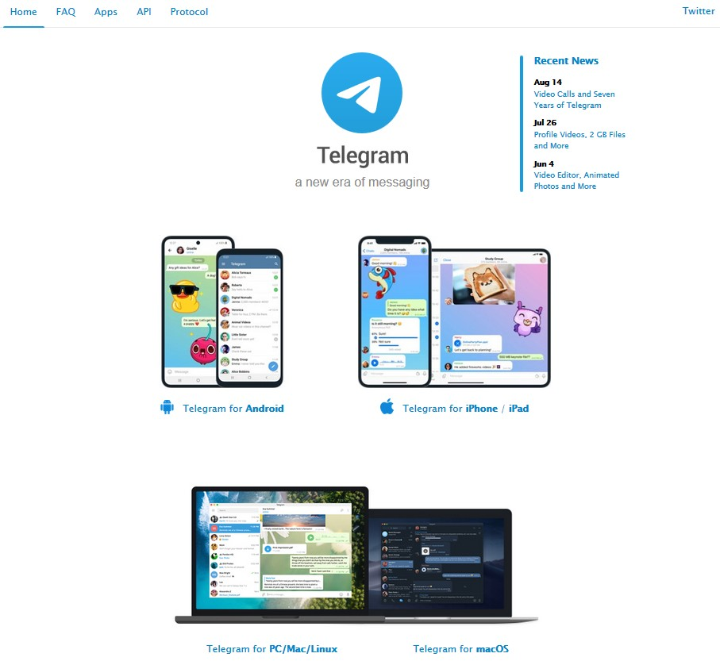

- on Android, click on the "Telegram for Android" section, log into your account, optionally choose the device you want to install it on, then click "Install".

- on IOs, go to the App Store of your device (IPhone or IPad), search for Telegram and install it.

- on PC, click on the "Telegram for PC / Mac / Linux" section, optionally click on "Show all platforms", download the software, then install it.

Start the app or software.

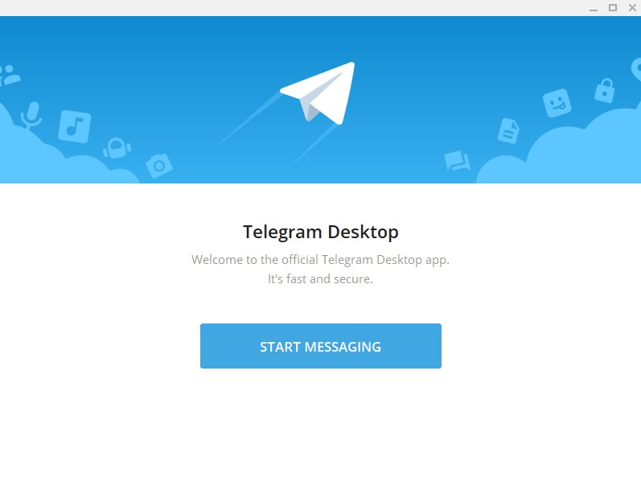

Enter your mobile phone number, and activate your account using the code received by SMS.

Then enter the information to create your account.

## Create the Telegram Bot API key

When launching Telegram for the first time, you get this window (on Windows):

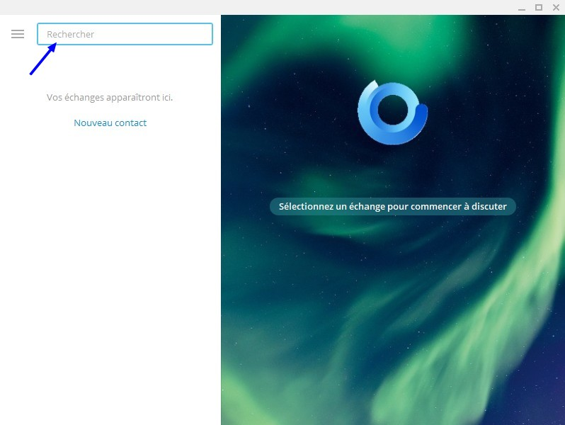

In the "Search" box, type `@BotFather` and then press the Enter key.

Click on the BotFather icon (the first in the list).

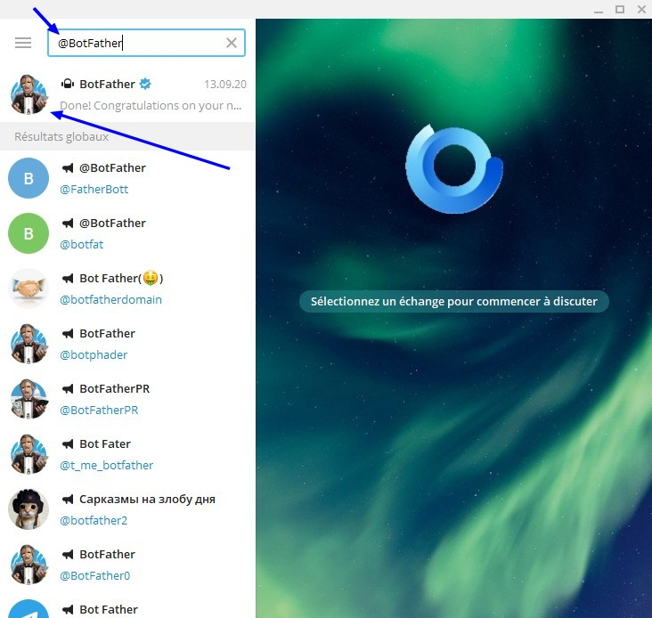

Click on the "Start" button at the bottom of the message viewing window...

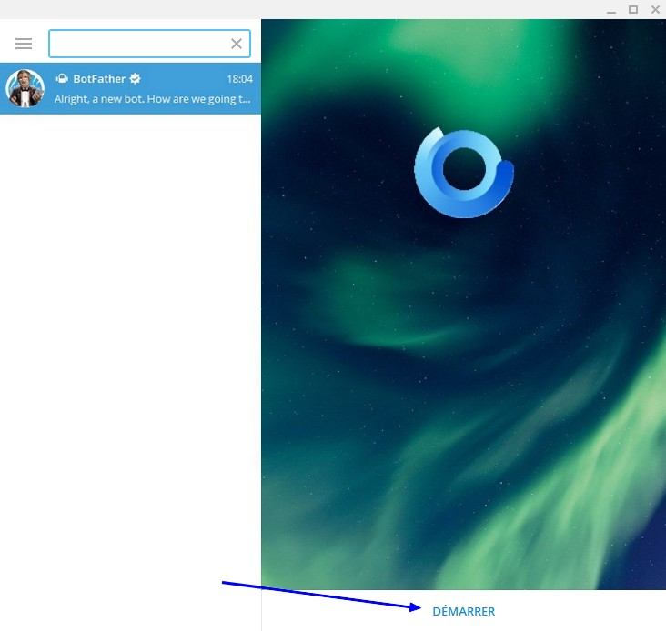

...and type `/newbot` to ask Telegram Bot to create a new Bot for you.

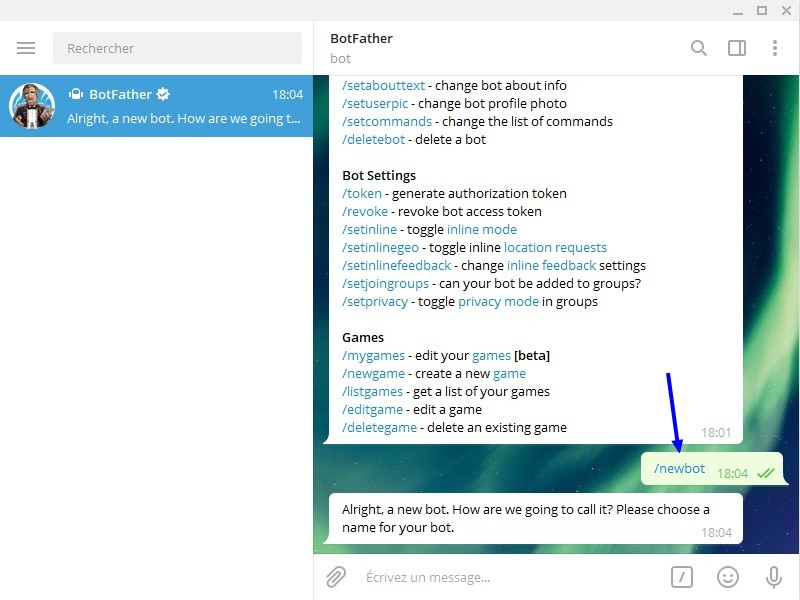

BotFather asks you for the name you want to give to your bot. This will be the name displayed in your chats.

Then, you will have to indicate a "public" name, which will make it possible to find it in the directory. We have to chose a unique name.

Please note that the name must end with "bot", to clearly identify that it is a robot.

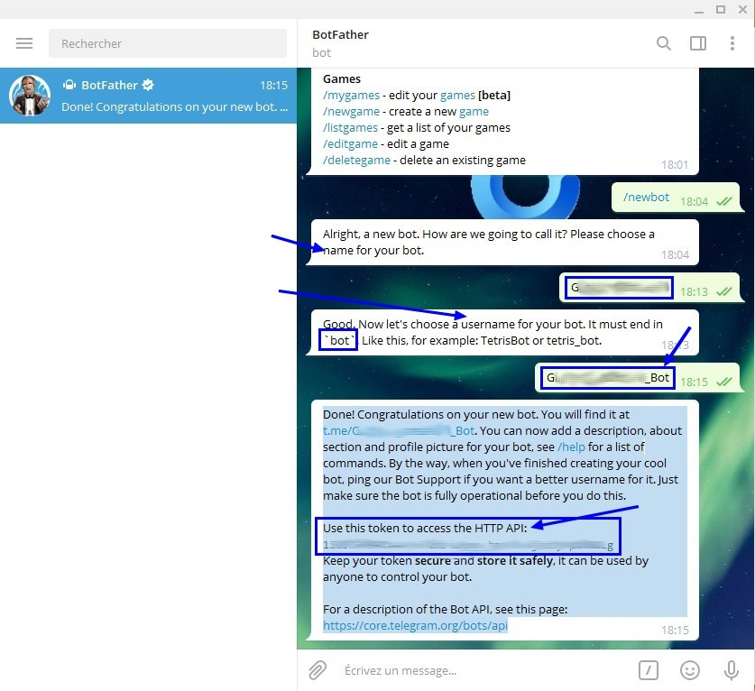

In the message sent to you by BotFather, there is the API key under the line "Use this token to access the HTTP API:"

## Enter this key in Gladys Assistant

Go to "Integrations" -> "Telegram".

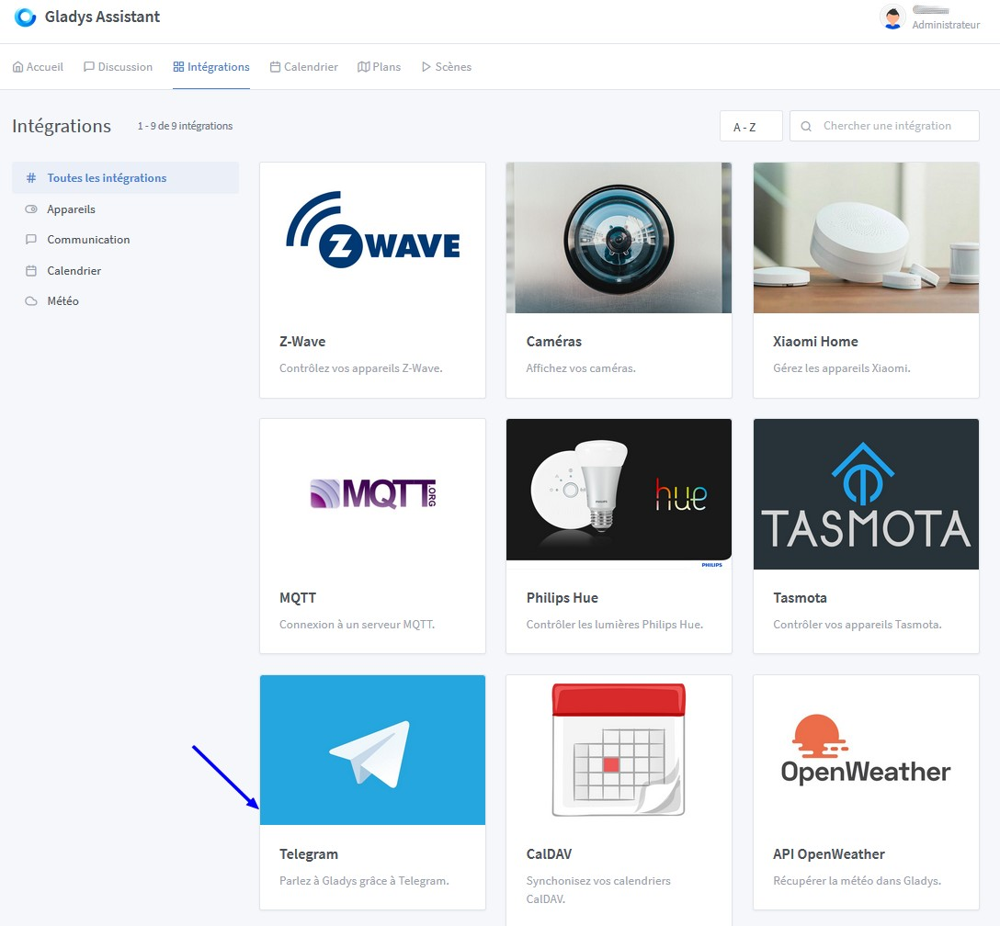

Enter your API key then click "Save".

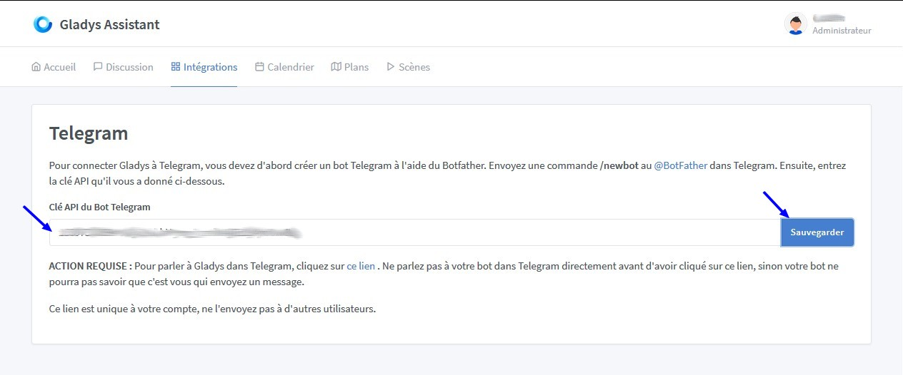

## Create the link between Gladys Assistant and Telegram

Click on "this link" to communicate with Gladys Assistant in Telegram.

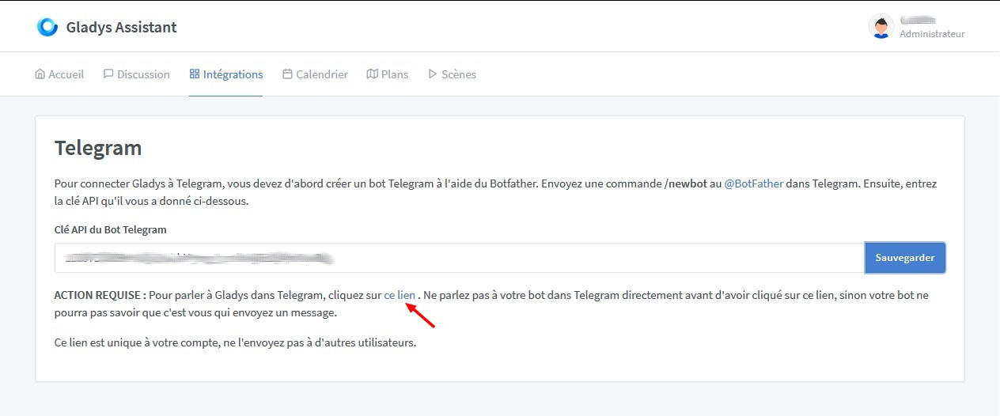

Click on "Send message".

A window asking you to open this link in the Telegram Desktop app may appear.

In this window, click on "Telegram Desktop", then check the box "Remember my choice for tg links." This will hide this window for the next times.

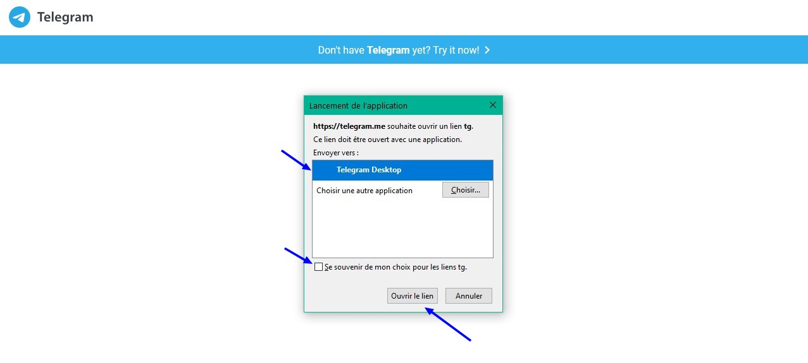

Then click on "Open link" to open the Telegram app.

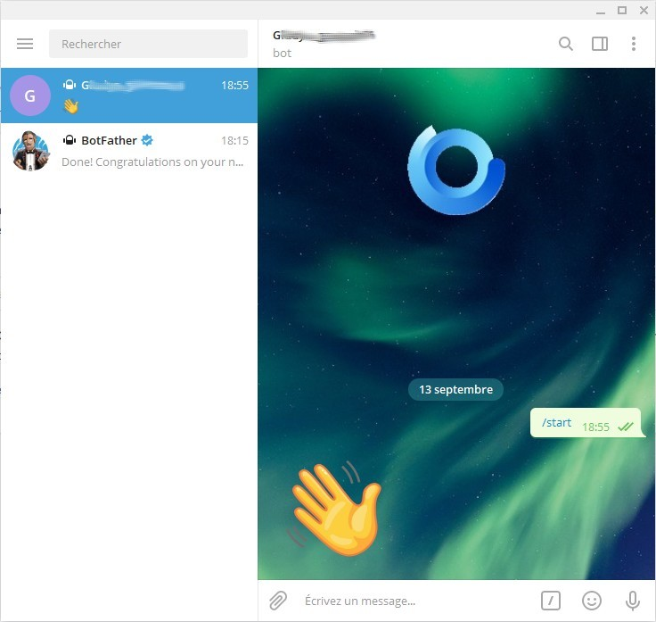

Click on "Start"

## First communication between Telegram and Gladys Assistant

Enter your first question for your Gladys Assistant, for example : "What's the weather like?"

Wait a bit and ......... magic!!!

Your assistant answers you!

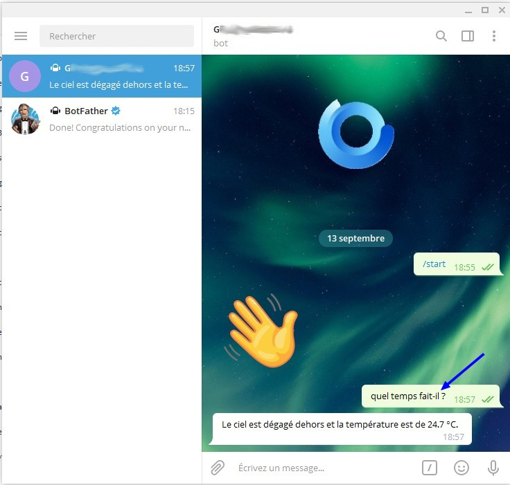

Check on the Gladys Assistant home page:

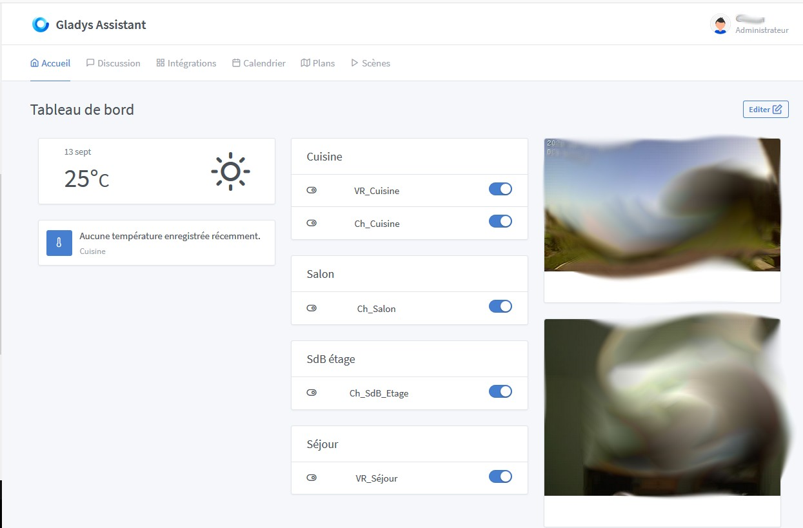

You can also view the conversations in the `Discussion` tab of Gladys Assistant.

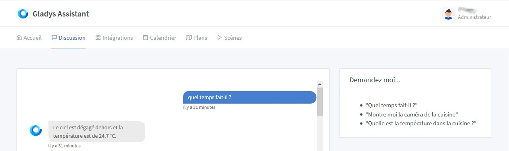

Let's see what it looks like on a smartphone:

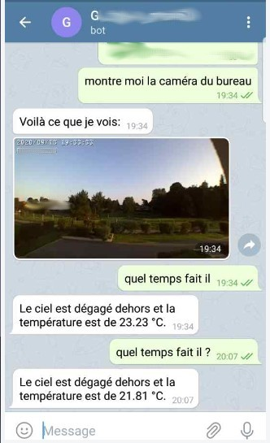

Enjoy !
