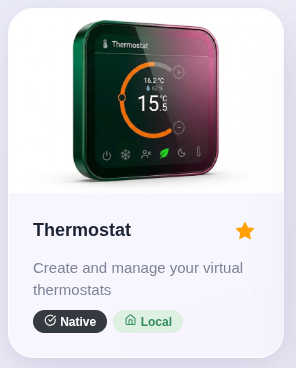
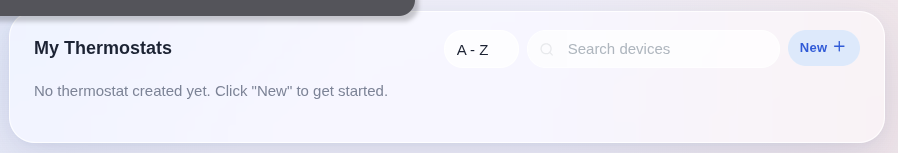
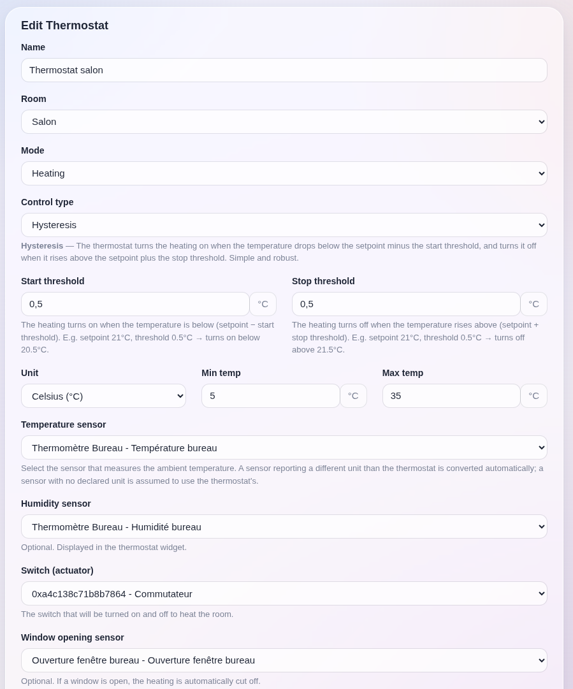
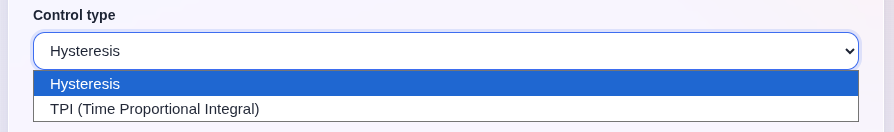
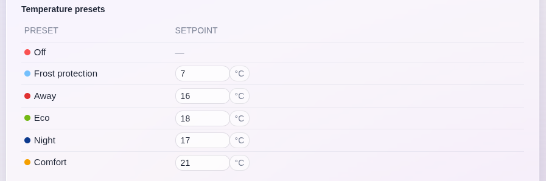
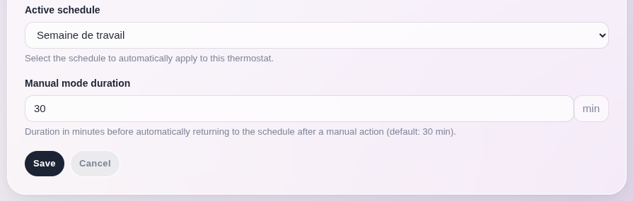
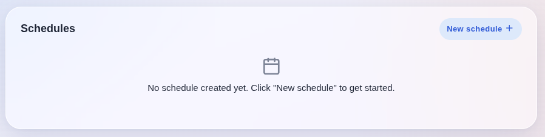
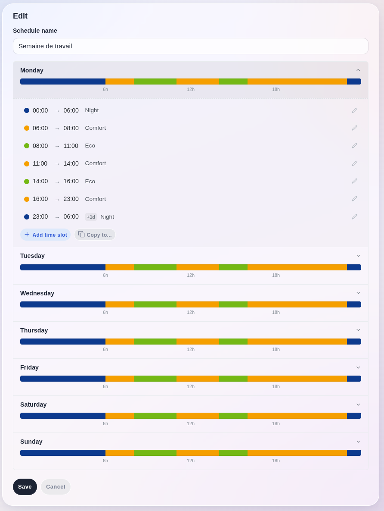

The **Thermostat** integration turns any temperature sensor plus any switch into a fully regulated heating (or cooling) zone, with a weekly schedule.

It is meant for the most common setup there is: an electric or hydronic heater driven by a relay, a smart plug or a boiler contact, a separate temperature sensor in the room, and no branded thermostat anywhere. Instead of writing one scene per temperature threshold, you create a virtual thermostat, tell it which sensor to read and which switch to drive, and Gladys regulates the room for you.

The thermostat Gladys creates is a device like any other: it appears in your rooms, in scenes, in the REST API, in MQTT and in Gladys Plus, exactly like a Netatmo or a Zigbee thermostat would.

## Prerequisites

Before creating a thermostat, you need two devices already working in Gladys:

- a **temperature sensor** in the room (Zigbee, Z-Wave, MQTT, Bluetooth… any integration will do),
- a **switch** that turns your heater on and off (a smart plug, a relay, a dry contact on your boiler…).

Optionally, you can also use:

- a **humidity sensor**, displayed in the widget,
- an **opening sensor** on a window, which suspends the heating while the window is open.

:::note
Pilot wire (fil pilote) heaters are not supported yet: the actuator picker only accepts a switch/binary feature.
:::

## Create your first thermostat

Go to "Integrations" → "Thermostat", then click "New".

### Name and room

Give your thermostat a name (e.g. "Living Room Thermostat") and pick the room it regulates.

### Mode

- **Heating**: the switch is turned on when the room is too cold.
- **Cooling**: the switch is turned on when the room is too warm.

### Devices

| Field | Description |
| --- | --- |
| Temperature sensor | The sensor the regulation reads. Required. |
| Humidity sensor | Optional, displayed in the widget only. |
| Switch (actuator) | The switch that will be turned on and off. Required. |
| Window opening sensor | Optional. While the window is open, the switch is cut. |

:::note
A sensor reporting a different unit than the thermostat (a °C probe next to a thermostat set to °F) is converted automatically. A sensor with no declared unit is assumed to already use the thermostat's unit.
:::

### Control type

**Hysteresis** (default) is the simple and robust one. In heating mode, the heater starts when the temperature drops below `setpoint − start threshold`, and stops when it rises above `setpoint + stop threshold`. With a 21 °C setpoint and 0.5 °C thresholds, the heater runs below 20.5 °C and stops above 21.5 °C. Between the two, the current state is held, which is what prevents the relay from short-cycling.

**TPI** (Time Proportional Integral) computes an ON/OFF ratio over a fixed cycle, proportional to how far the room is from the setpoint. With a 30-minute cycle and a 2 °C proportional band, a 1 °C gap gives 50 % of the cycle on, so 15 minutes on and 15 minutes off. It is the right choice for underfloor heating and other high-inertia systems, where hysteresis overshoots.

| Setting | Default | Range |
| --- | --- | --- |
| Start threshold (hysteresis) | 0.5 ° | — |
| Stop threshold (hysteresis) | 0.5 ° | — |
| TPI cycle time | 30 min | 5 to 120 min |
| TPI proportional band | 2 ° | 0.5 to 10 ° |

:::note
TPI is a heating-only strategy: a compressor cannot be pulsed that way, so a thermostat in cooling mode always falls back to hysteresis.
:::

### Presets

A preset is a named target temperature. The integration ships six of them, and you can change every temperature to suit your home:

| Preset | Default |
| --- | --- |
| Off | no setpoint, the regulation is stopped |
| Frost | 7 °C |
| Away | 16 °C |
| Eco | 18 °C |
| Night | 17 °C |
| Comfort | 21 °C |

Presets are what makes a weekly schedule readable: you program "Comfort at 7 a.m." rather than "21 °C at 7 a.m.", and changing your mind about what comfort means only takes one edit.

### Manual mode duration

When you turn the dial on the widget, or when a scene sets a temperature, the thermostat switches to **manual mode**: your setpoint takes over the schedule for the duration set here (30 minutes by default), then the schedule takes the thermostat back.

If the thermostat follows **no** schedule, a manual setpoint holds indefinitely, like on a physical thermostat.

## Create a weekly schedule

Go to the "Schedules" tab, then click "New schedule".

A schedule is a set of time slots, each one carrying a preset, for each day of the week. Give it a name ("Work week", "Holidays"…) and add your slots.

A few things worth knowing:

- A slot ending at `00:00` means "end of day". A `00:00 → 00:00` slot covers the whole day.
- A slot whose end is **before** its start crosses midnight: a single `22:00 → 06:00` "Night" slot is enough, no need to split it in two.
- **Copy to…** applies the day you are editing to the other days you pick, which is the fastest way to build a Monday-to-Friday schedule.
- **Duplicate** copies an entire schedule, handy for building a variant of an existing one.
- If some hours of a day are left uncovered, a warning lists them. During those slots the thermostat simply keeps its current preset.

Once the schedule is saved, go back to your thermostat, edit it, and pick it in "Active schedule". Several thermostats can share the same schedule.

:::note
Schedules are resolved in the timezone configured in Gladys, not in your browser's. A 7 a.m. slot heats the house at 7 a.m. local time, even if you consult your dashboard from another country.
:::

## Open window detection

If you configured an opening sensor, the regulation is cut as soon as the window opens — immediately, without waiting for the next regulation cycle — and resumes when it closes. The widget shows a "Window open — heating suspended" banner while this lasts, or "Window open — cooling suspended" in cooling mode.

## Control your thermostat

Three ways, all equivalent:

- The **dashboard widget**, documented in [Thermostat widget](../dashboard/thermostat.md).
- A **scene**, with the "Set a value on a device" action targeting the setpoint of your thermostat. Like the dial, this counts as a manual override.
- The **REST API**, since the thermostat is a standard Gladys device.

## FAQ

### How often is the regulation applied?

Every minute. Only a window opening is applied immediately, because waiting up to a minute to cut a heater next to an open window would be a waste.

### My heating never starts

Check, in order: that the temperature sensor does report a value (its state must be visible in Gladys), that the switch can be turned on by hand from Gladys, that the setpoint is above the measured temperature, and that no window sensor is reading "open".

If the thermostat is set to Fahrenheit while the sensor reports Celsius without declaring its unit, the comparison is done on raw values and the heating stays off: declare the unit on the sensor's feature.

### Why does my manual setpoint disappear after a while?

That is manual mode expiring and the schedule taking over. Increase "Manual mode duration" in the thermostat settings, or cancel the schedule for that thermostat if you'd rather drive it by hand.

### What happens if I delete a schedule?

The thermostats following it are detached automatically, and fall back on their current preset. Nothing is left pointing at a schedule that no longer exists.

### Can I use one sensor for several thermostats?

Yes. The same temperature sensor, and even the same switch, can be used by several thermostats — though driving one switch from two thermostats means the last one to decide wins, so it is rarely what you want.
