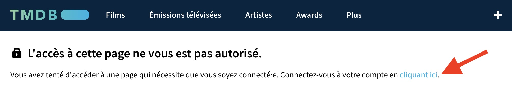
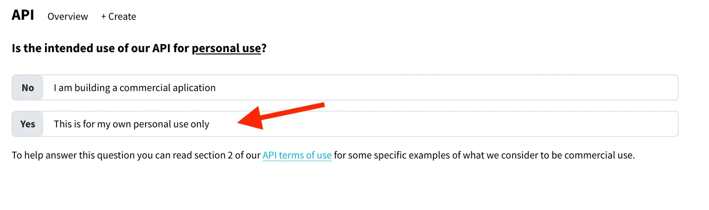
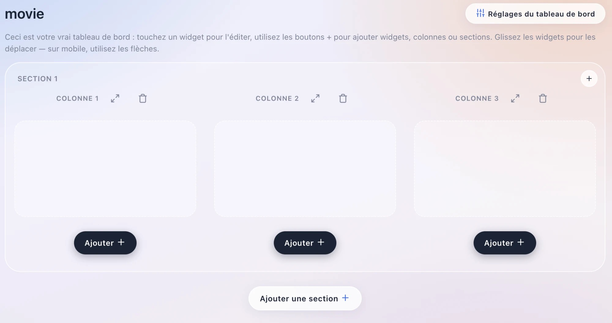
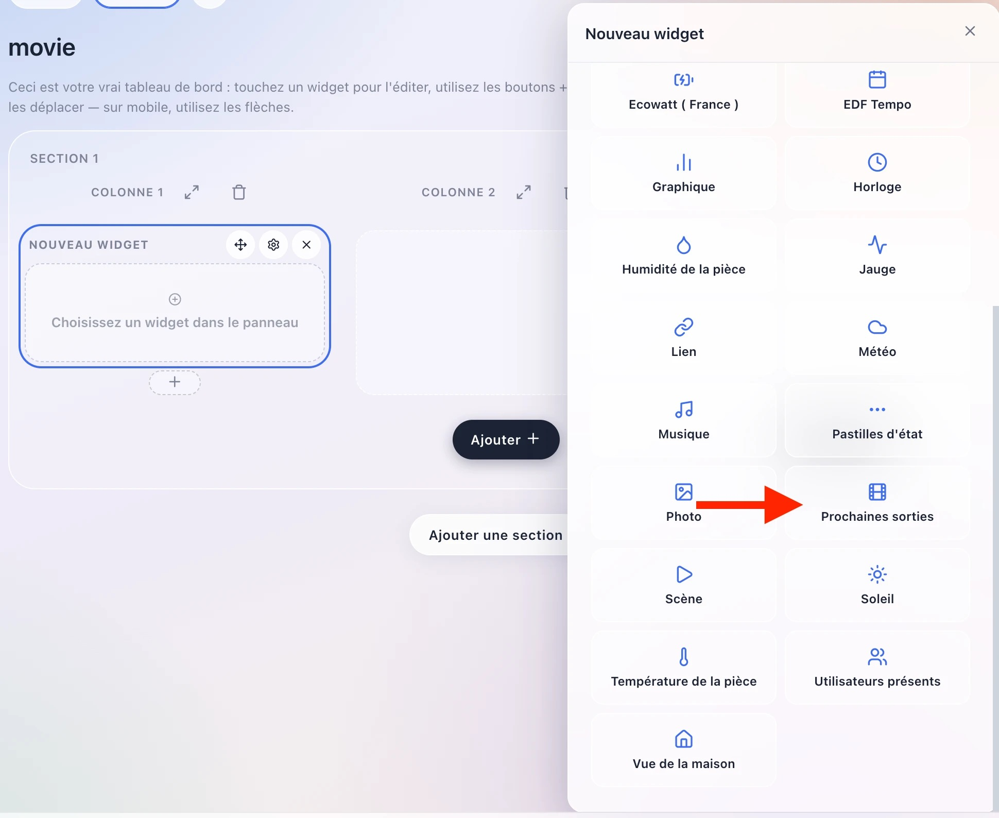

This integration lets you display upcoming movie releases in Gladys Assistant, using [The Movie Database (TMDB)](https://www.themoviedb.org/).

## Create a TMDB account

To configure TMDB, first go to [https://www.themoviedb.org/settings/api](https://www.themoviedb.org/settings/api).

Create a free account if you don't have one already.

Once logged in, open your account settings and go to the "API" section.

Click on "Create" (or "Request an API key" if this is your first time), choose "Developer", and fill in the short form describing your use (personal use is fine).

Your "API Key (v3 auth)" is generated instantly — this is the value Gladys needs.

## Enter the API key in Gladys Assistant

Go to "Integrations" -> "TMDB". Enter your API key, and click "Save".

## Add an Upcoming Releases widget to the dashboard

Go to the dashboard, and click on "Edit".

Add an "Upcoming Releases" widget.

Optionally choose how many days ahead to look for releases (15 days, 1 month or 2 months — 1 month by default), and the country whose theatrical release calendar you want to follow (2-letter code, ex. `FR`, `US`, `DE`... — France by default if left empty).

Click on "Save".

Voilà! Tap a poster to see its synopsis, trailer and a link to its TMDB page.

