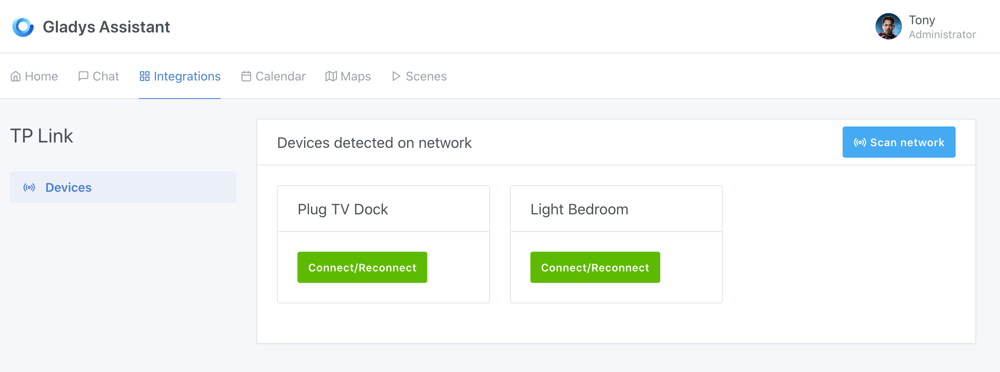
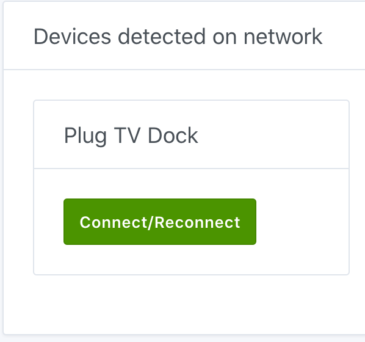
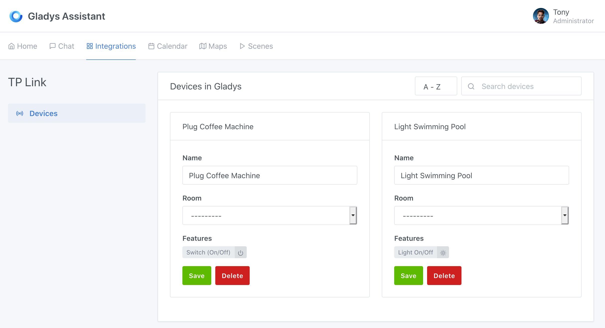

To connect your TP-Link lights and plugs, go to `Integrations / TP-Link` in Gladys.

## Scan devices on the network

By clicking on the button `Scan network`, Gladys will automatically detect different devices available on your Wi-Fi network. Make sure that they are installed, configured (with Kasa application) and turned on to be visible.

## Add a device

Whether it is a light or a plug, Gladys will let you add this device through to the `Connect` button. Once added, you can configure in which room your device is installed.

You will find the various features available in Gladys in the device's card description.

