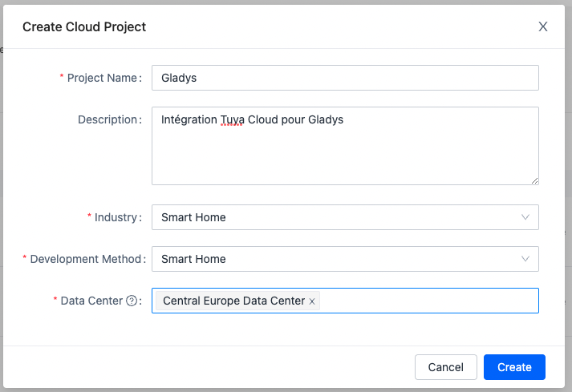
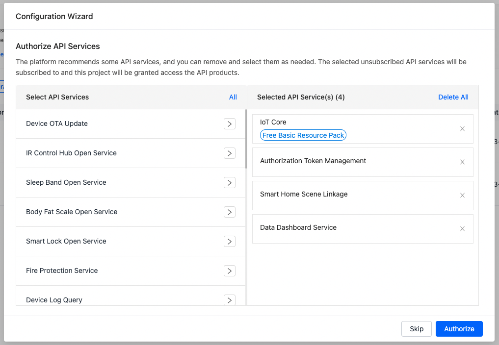
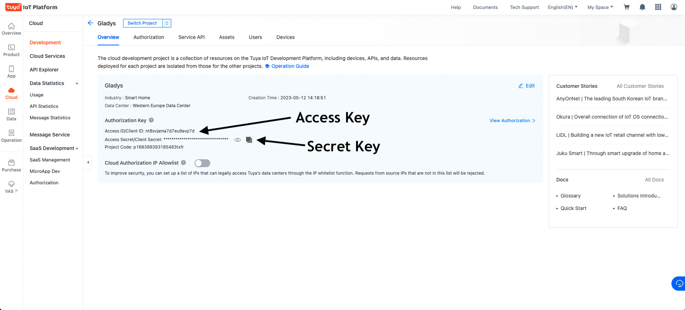
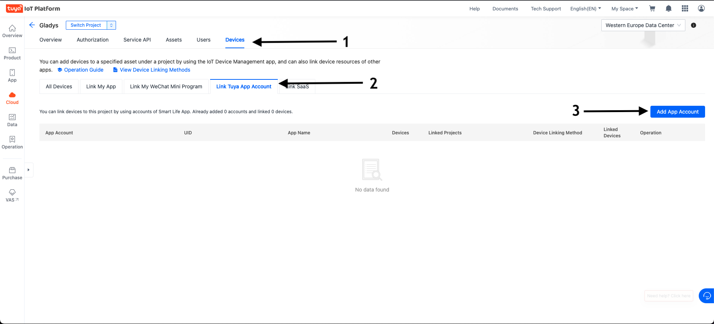
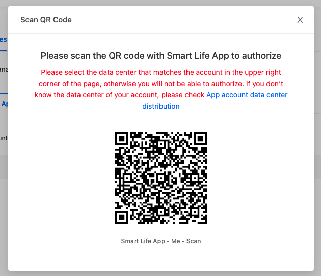

## Connect Tuya in Gladys

1. Create an account on [iot.tuya.com](http://iot.tuya.com).

2. Create a new cloud project in the « Cloud » → « Development » → « Create Cloud Project » section.

3. Choose a name for your project, and fill in the different fields:

- Project Name : Name of your project (for example "Gladys");
- Industry : Smart Home ;
- Development method : Smart Home ;
- Data Center : Central Europe Data Center (even if you live in Western Europe, it's better).

Click on « Create ».

4. Authorize the following API services:
   (It's selected by default)

- IoT Core
- Authorization Token Management
- Smart Home Scene Linkage
- Data Dashboard Service

5. Copy the information from "Access ID" and "Access Secret" in Gladys

6. Go to the Devices tab then Link Tuya App Account and click on the Add App Account button on the right.

7. Scan the QR Code with your Smart Life application by going to Profile then on the code scanner at the top right.

8. Select Automatic Link then Read, Write and Manage and validate with OK.

9. Copy the information "App account UID" in Gladys

10. Save the configuration on Gladys, go to the "Tuya Discovery" tab and TADAM... your devices have appeared 🙂

## FAQ

### Is the scan not working?

On the forum, Francis66 had this issue, and he resolved it this way:

- I no longer had access rights to the API resources
  - Access to Cloud Develop Base Resource and IoT Core was lost because the trial period had expired.
- For the region: I had selected Western Europe instead of Central Europe.

### Error: "Error: Unable to start service tuya TypeError: Cannot destructure property 'list' of 'result' as it is undefined."

If this error appears in your logs, please check the following:

- Internet connectivity of the device
  - Ensure that the system has proper DNS resolution and that internet access is not blocked by piHole or similar software.
- Double-check your credentials and verify that the correct data center is selected.
- Check the IoT Core package validity
> The IoT Core trial package is only active for one month and must be renewed manually. 
  
Due to the fast-paced evolution of the Tuya Developer Platform, there is no single, permanent tutorial available for this process.  
Open the Details section in the Tuya Developer Console and follow the on-screen wizard to extend your trial period.  
After extending the trial, it may take up to 15 minutes before your hardware becomes accessible again.  
This process is **only** neccessary for connecting your account to Gladys for the **first time**

If you have any questions, ask it on [our forum](https://en-community.gladysassistant.com/).
