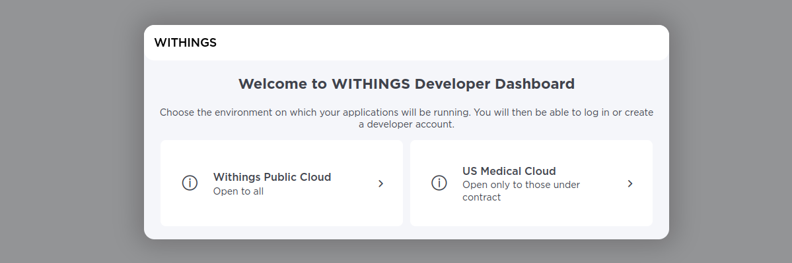
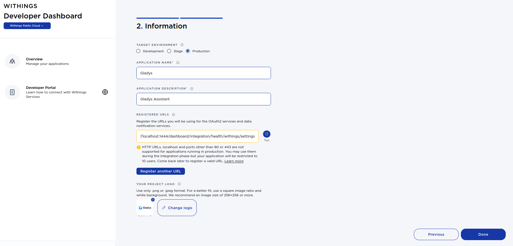
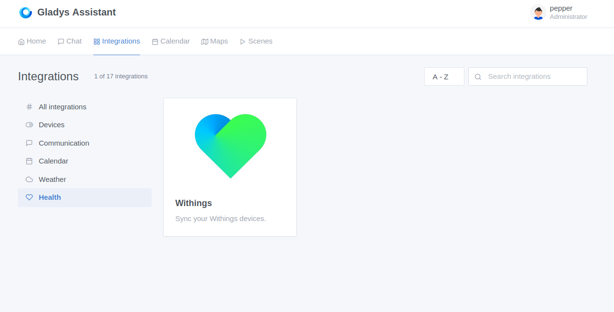
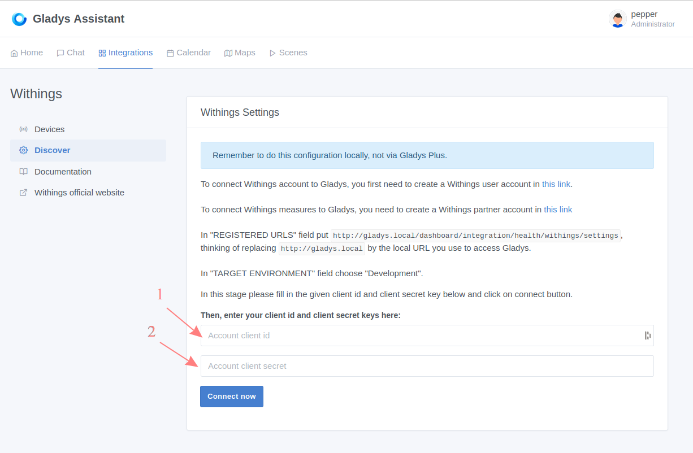
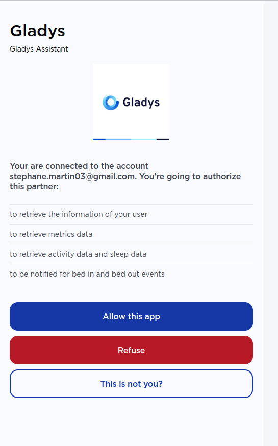
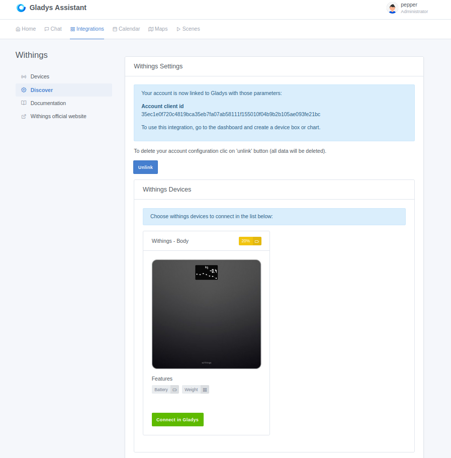
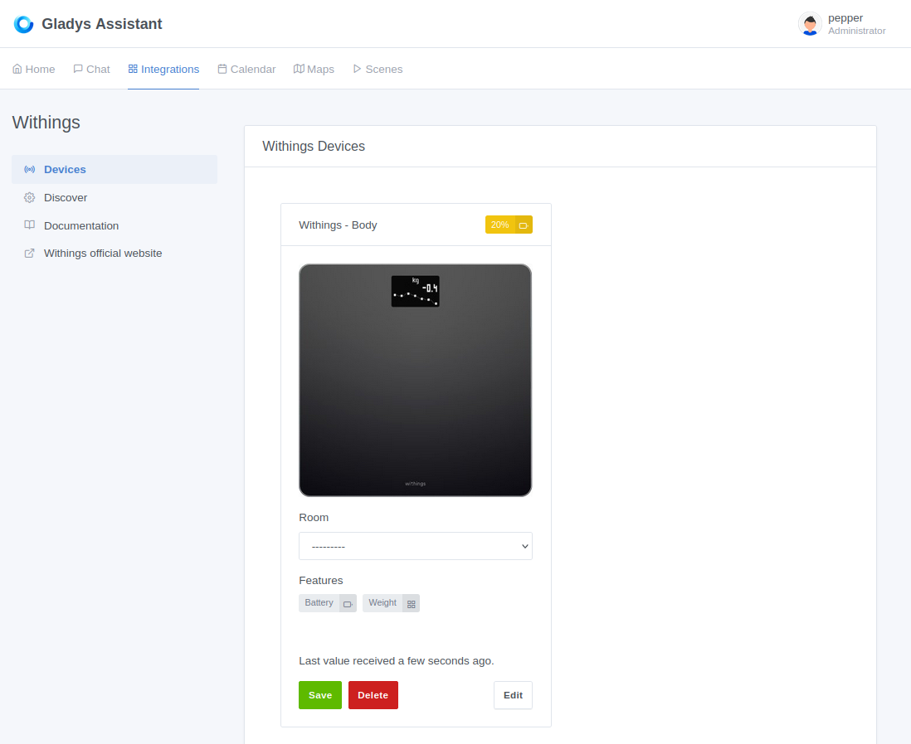

This integration allows you to retrieve data from Withings devices in Gladys Assistant.

## Prerequisite

To integrate the data from your Withings devices you must first have configured them in your Withings account (https://account.withings.com/connectionwou/account_login).

If your devices support multi-users it is necessary to configure one Withings account per user, details available here: https://support.withings.com/hc/fr/articles/218554788-Body-Param%C3%A9trer-la-balance-pour-plusieurs-utilisateurs.

## Withings partner account configuration

Creation of a 'partner' account to exchange data with Gladys: https://developer.withings.com/dashboard/welcome

On page below you must choose 'Withings Public Cloud':

After you have authenticated with your user account, click on 'Create an application' button, choose 'Public API integration' and accept the terms of use.

On next page fill out the form like this:

WARNING: you will have to adapt the callback url with the url you use to access Gladys (ex: http://gladys.local/dashboard/integration/health/withings/settings).

Then click on "Done".

The client_id and secret keys will be copied into the Withings integration in Gladys.

## Withings integration in Gladys

In Gladys go to the Withings settings page:

Go to the 'Discover' menu and fill in the fields:
1. client_id of the Withings partner account
2. secret of the Withings partner account

Then click on "Connect Now".

You are redirected to the withigs authorization site:

Click on "Authorize".

You are back on the Gladys interface, if everything went well you will see the next page:

To add a device in Gladys you need to click on 'Connect in Gladys' for one device. After connection, historical data of device store in Withngs server are donwloaded.

You can click on the "Devices" link in the left menu to view the syncronized devices:

## Usage

You can now use these Withings devices from the [Dashboard](../dashboard/devices-in-room.md) or from the [Scenes](../scenes/intro.md) automatically. Depending on the feature of each device, you will have access to measures, states or actions.
