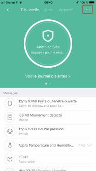
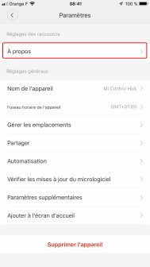
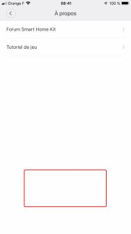
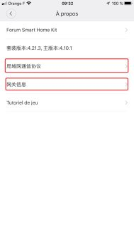

:::warning
2025: This integration is no longer very useful; it is simpler to use Zigbee or Matter for this type of device.
:::

## Activate developer mode

Activating developer mode allows Gladys to access Xiaomi API.

You first need to install the "Mi Home" application to activate the developer mode:

- Start the app
- Define your region to "Mainland China" when creating your account.
- Connect all your devices.
- Finally, upgrade the firmware.

## The Gateway

Open the gateway by clicking on its icon. Follow the steps below:

### Step 1

Click on the 3 dots.

### Step 2

Click on "About"

### Step 3

Click multiple time on the red zone to display additional menus.

### Step 4

First menu will bring you to step 5, second menu to step 6.

### Step 5

Activate the developer mode with the button, write down the password, then hit "ok".

### Step 6

In this menu, you'll find the mac address of your gateway, its SID and a useful to link the password you got in step 5.

:::note
The link to the password can be useful if you have several gateways.
:::

You are now ready to integrate your Xiaomi devices in Gladys!
