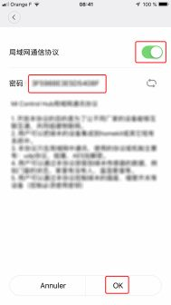
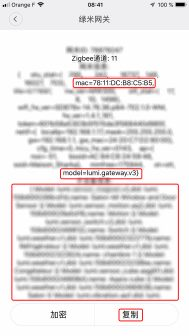

## Activate developer mode

Activating developer mode allows Gladys to access Xiaomi API.

You first need to install the "Mi Home" application to activate the developer mode:

- Start the app
- Define your region to "Mainland China" when creating your account.
- Connect all your devices.
- Finally, upgrade the firmware.

## The Gateway

Open the gateway by clicking on its icon. Follow the steps:

### Step 1

Click on the 3 dots.

### Step 2

Click on "About"

### Step 3

Click multiple time on the red zone to display additional menus.

### Step 4

First menu will bring you to step 5, second menu to step 6.

### Step 5

Activate the developer mode with the button, keep the password, then validate "ok".

### Step 6

In this menu, you'll find the mac address of your gateway, its sid, useful to link the password you got in the previous step to the gateway (if you have several gateway, it can be useful).

You are now ready to integrate your Xiaomi devices in Gladys!
