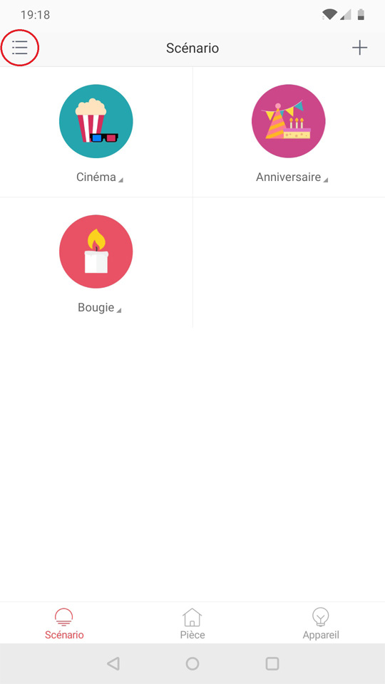
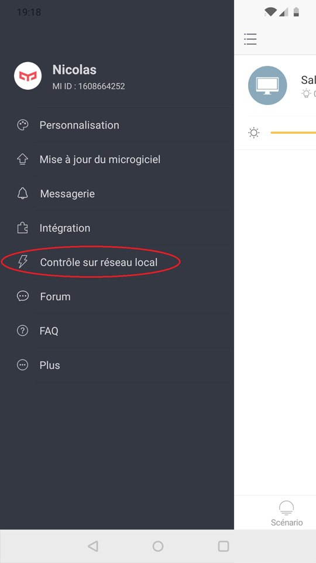
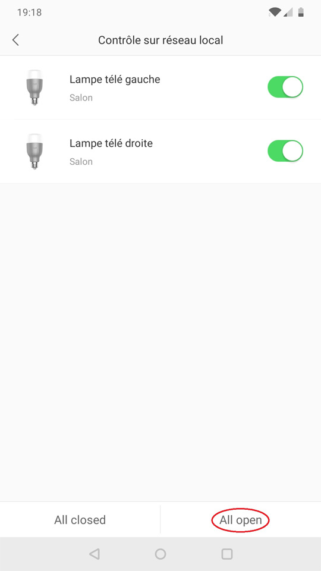

To connect your Yeelight devices in Gladys:
- activate "LAN Control" on the Yeelight devices
- go to `Integrations / Yeelight` in Gladys

Activating "LAN Control" allows Gladys to access Yeelight devices on the local network.
You first need to install the "Yeelight" application and connect all your devices ([how-to](https://www.yeelight.com/faqs/yeelight-app)), before activating "LAN Control" (*if this is already done, go to "[Activate LAN Control](#activate-lan-control)"*).

- [Yeelight for Android](https://play.google.com/store/apps/details?id=com.yeelight.cherry "Yeelight for Android")
- [Yeelight for iPhone/iPad](https://apps.apple.com/fr/app/yeelight/id977125608 "Yeelight for iPhone/iPad")

## Activate "LAN Control"

### Step 1

Open the "Yeelight" application and go to the main menu.

### Step 2

Choose "LAN Control".

### Step 3

Enable "LAN Control".

You are now ready to integrate your Yeelight devices in Gladys!
