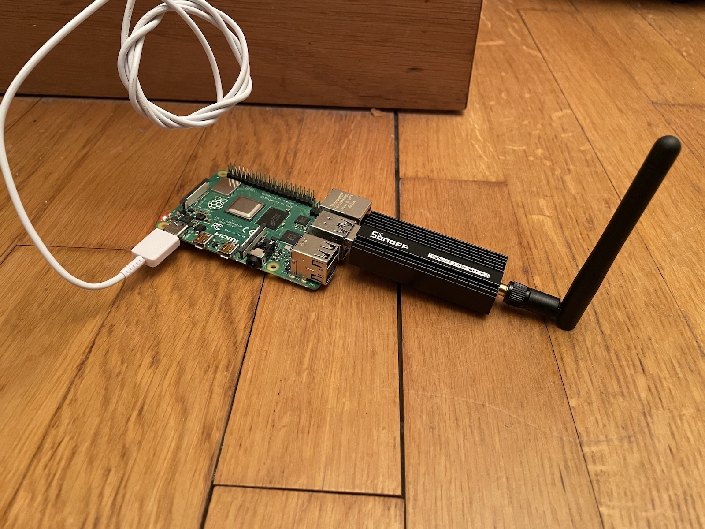
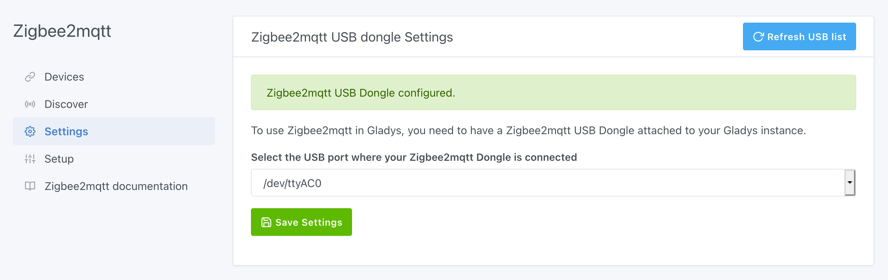
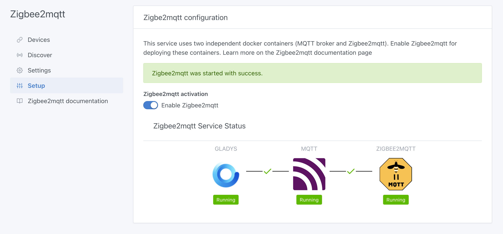
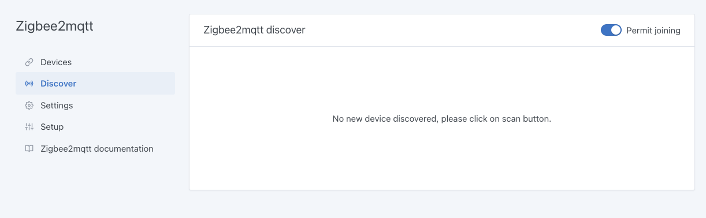
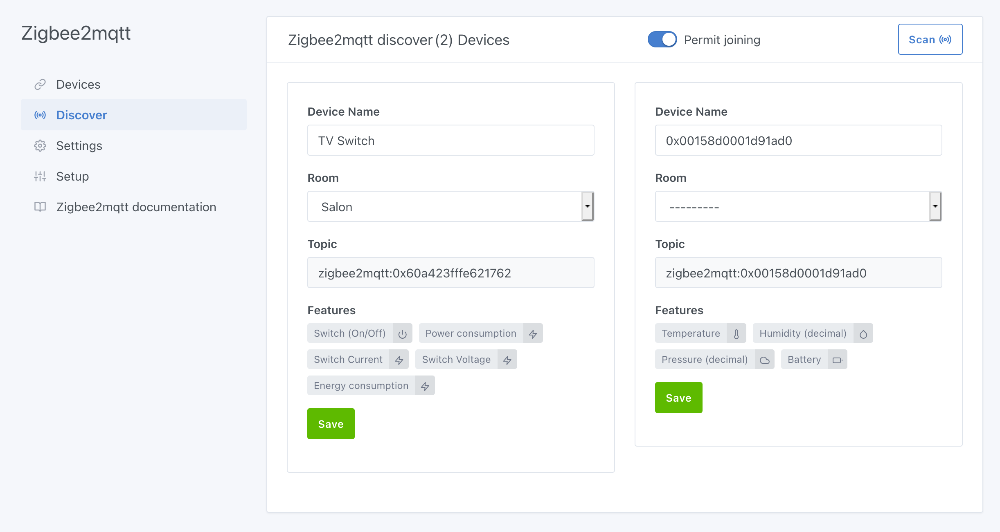
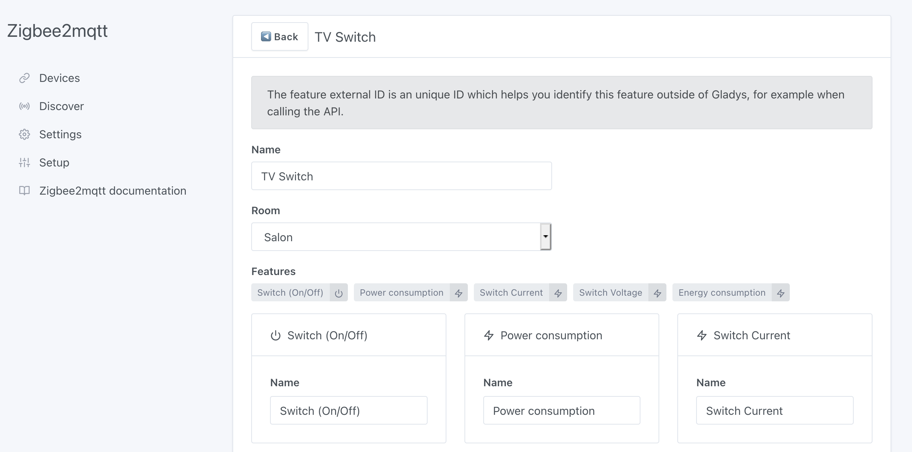

In this tutorial we'll show you how to connect your Zigbee devices directly to Gladys, without needing any third-party bridges (just by using an USB Zigbee dongle and [Zigbee2Mqtt](https://www.zigbee2mqtt.io/) project).

You can check the list of compatible devices [here](https://www.zigbee2mqtt.io/supported-devices/).

Before you start, make sure you have a USB Zigbee adapter.

An easy & affordable USB dongle we tested with Gladys is the [Sonoff Zigbee 3.0 USB dongle](https://amzn.to/3JZwzJy).

The full list of compatible adapters can be found on [Zigbee2mqtt supported adapters list](https://www.zigbee2mqtt.io/guide/adapters/).

## Configure the USB dongle port

Connect your Zigbee USB dongle to your machine running Gladys (your Raspberry Pi, your NAS).

In Gladys, go to `Integrations / Zigbee2Mqtt`.

Then, click on `Settings` in the menu. Gladys will automatically scan the different USB ports to suggest a drop-down list.

Select the settings the USB port is to use in order to allow Gladys to communicate with Zigbee.

## Activate Zigbee2Mqtt

Once your dongle is configured, Gladys needs to install two containers (MQTT and Zigbee2Mqtt) to use the dongle and communicate with all your devices. Don't worry, all this has been automated.

Go to the `Setup` section and click on the **Enable Zigbee2mqtt** button. After a few moments (the waiting time depends on your Raspberry Pi model and your bandwidth), you should see all the elements started and the links between each one green.

## Allow device association

To allow devices to be associated to your Zigbee network, you must allow `joining in` the Zigbee configuration.

Click on the `Discover` menu, then click on the `Permit joining` button.

:warning: Once your devices are associated, you will have to come back here to forbid the association, for security.

## Add devices

To make your device join the network, please refer to its manual. In most cases, a long press on the physical button allows this operation.

Still in the same screen, click on the **Scan** button to ask the Zigbee network for the list of known devices.

The devices already associated to your Zigbee network will appear in the list of detected features. You can rename them and associate them to a room using the drop-down list.

## Modify the devices

If necessary, you can go to the `Devices` menu to modify/complete the configuration of your devices.

Click on the **Edit** button of a device. You can then edit its name, the room it belongs to and the name of each feature.

## Usage

You can now use these Zigbee devices from the [Dashboard](../dashboard/devices-in-room.md) or from the [Scenes](../scenes/intro.md) automatically. Depending on the feature of each device, you will have access to measures, states or actions.
