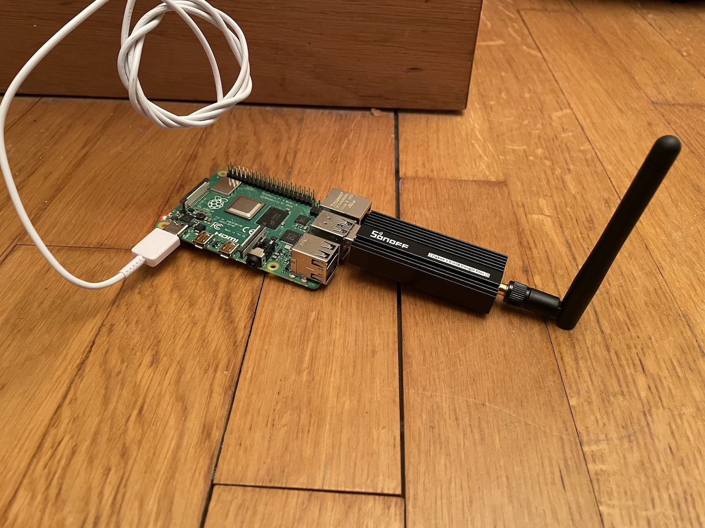
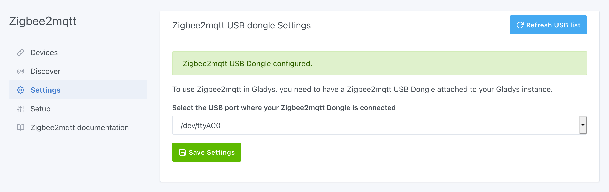
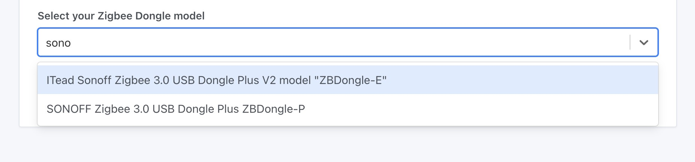
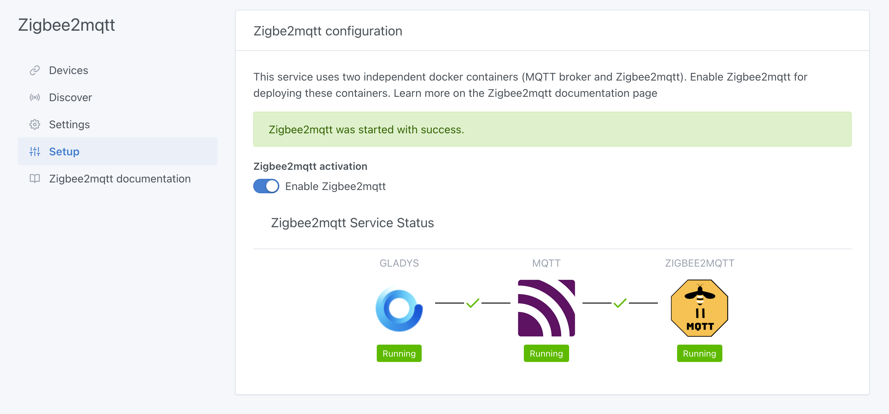
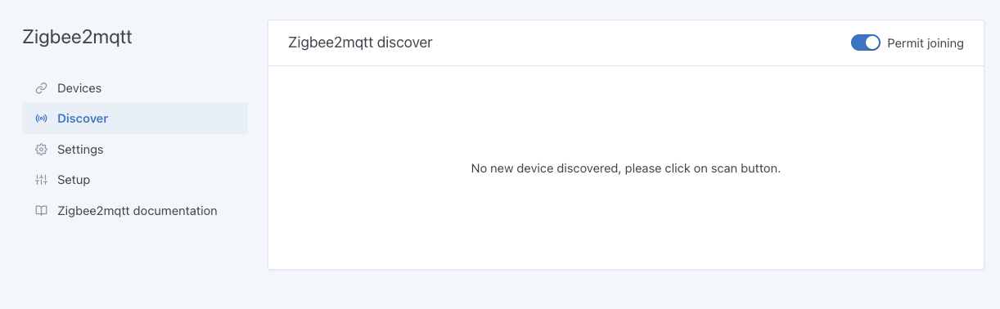
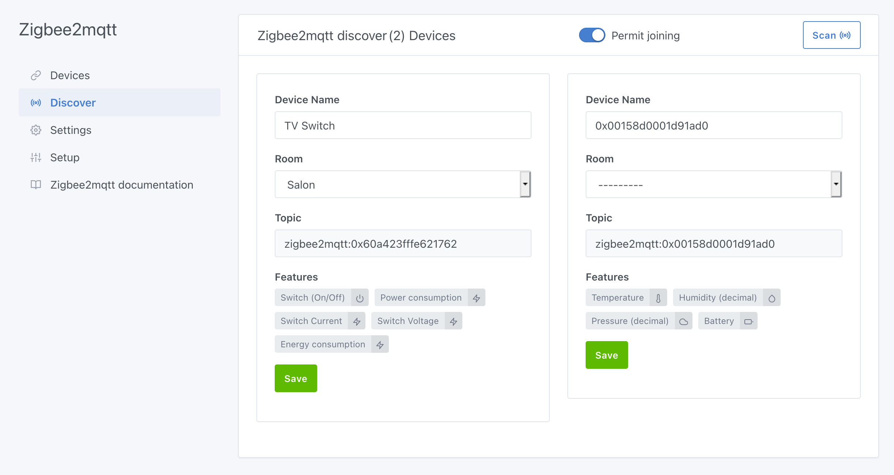
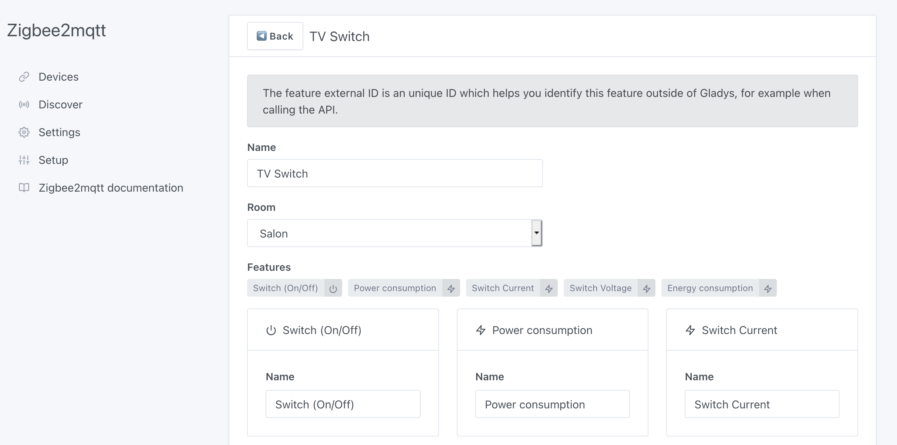

import JsonLd from '@site/src/components/seo/JsonLd';

Zigbee2MQTT lets you run your own **local Zigbee hub** with Gladys: you plug a USB Zigbee dongle into the machine running Gladys, and you control every Zigbee device directly from your home, with no cloud account and no vendor bridge. This tutorial shows you how to set it up, pair your dongle, and add devices.

In short, we'll connect your Zigbee devices directly to Gladys, without needing any third-party bridges (just by using a USB Zigbee dongle and the [Zigbee2Mqtt](https://www.zigbee2mqtt.io/) project).

You can check the list of compatible devices [here](https://www.zigbee2mqtt.io/supported-devices/).

Before you start, make sure you have a USB Zigbee adapter.

An easy & affordable USB dongle we tested with Gladys is the [Sonoff Zigbee 3.0 USB dongle](https://amzn.to/3JZwzJy).

The full list of compatible adapters can be found on [Zigbee2mqtt supported adapters list](https://www.zigbee2mqtt.io/guide/adapters/).

## Configure the USB dongle port

Connect your Zigbee USB dongle to your machine running Gladys (your Raspberry Pi, your NAS).

In Gladys, go to `Integrations / Zigbee2Mqtt`.

Then, click on `Settings` in the menu. Gladys will automatically scan the different USB ports to suggest a drop-down list.

Select the settings the USB port is to use in order to allow Gladys to communicate with Zigbee.

**13 May 2023:** You can now select the Zigbee dongle model you're using:

This tells Zigbee2mqtt which configuration to run.

:::warning
If you own an [EmberZNet](https://www.zigbee2mqtt.io/guide/adapters/emberznet.html) based dongle (like for example the Sonoff Zigbee 3.0 ZBDongle-E), it's recommended to [update](https://www.zigbee2mqtt.io/guide/adapters/emberznet.html#firmware-flashing) the firmware dongle. Otherwise, you should choose the `(legacy ezsp)` option in the list.
:::

:::warning
If you run Gladys on an external disk connected in USB, you may have power issues as your Pi can struggle to give enough power to both the disk and the Zigbee USB key.

We recommend you use a externaly powered USB charging tower.

You can read more about it on ZigbeeMQTT website: [Zigbee2MQTT fails to start](https://www.zigbee2mqtt.io/guide/installation/20_zigbee2mqtt-fails-to-start.html)
:::

## Activate Zigbee2Mqtt

Once your dongle is configured, Gladys needs to install two containers (MQTT and Zigbee2Mqtt) to use the dongle and communicate with all your devices. Don't worry, all this has been automated.

Go to the `Setup` section and click on the **Enable Zigbee2mqtt** button. After a few moments (the waiting time depends on your Raspberry Pi model and your bandwidth), you should see all the elements started and the links between each one green.

## Allow device association

To allow devices to be associated to your Zigbee network, you must allow `joining in` the Zigbee configuration.

Click on the `Discover` menu, then click on the `Permit joining` button.

:warning: Once your devices are associated, you will have to come back here to forbid the association, for security.

## Add devices

To make your device join the network, please refer to its manual. In most cases, a long press on the physical button allows this operation.

The devices already associated to your Zigbee network will automatically appear in the list with detected features. You can rename them and associate them to a room using the drop-down list.

## Modify the devices

If necessary, you can go to the `Devices` menu to modify/complete the configuration of your devices.

Click on the **Edit** button of a device. You can then edit its name, the room it belongs to and the name of each feature.

## Usage

You can now use these Zigbee devices from the [Dashboard](../dashboard/devices.md) or from the [Scenes](../scenes/intro.md) automatically. Depending on the feature of each device, you will have access to measures, states or actions.

## Frequently asked questions

### How do I add a device to Zigbee2MQTT in Gladys?

Once Zigbee2MQTT is enabled, open the `Discover` menu and click `Permit joining`, then put your device into pairing mode (usually a long press on its button). The device appears automatically in the list with its detected features, where you can rename it and assign it to a room. Remember to turn joining off again afterwards for security.

### What USB Zigbee dongle should I use with a Raspberry Pi or NAS?

Any adapter on the [Zigbee2MQTT supported adapters list](https://www.zigbee2mqtt.io/guide/adapters/) works. An affordable dongle we tested with Gladys is the Sonoff Zigbee 3.0 USB dongle. Plug it into the machine running Gladys (your Raspberry Pi or NAS); if you boot from a USB disk, use a powered USB hub so the dongle gets enough power.

### Does Zigbee2MQTT with Gladys work without the cloud?

Yes. Zigbee2MQTT runs locally on your own hardware and talks to your devices through the USB dongle, so your Zigbee network keeps working with no internet connection and no manufacturer cloud account.

### Which port and settings should I select for my Zigbee dongle?

In Gladys go to `Integrations / Zigbee2Mqtt`, then `Settings`. Gladys scans your USB ports and suggests them in a drop-down, so you simply pick the one matching your dongle and select your dongle model so Zigbee2MQTT loads the right configuration.

<JsonLd
  data={{
    "@context": "https://schema.org",
    "@type": "FAQPage",
    mainEntity: [
      {
        "@type": "Question",
        name: "How do I add a device to Zigbee2MQTT in Gladys?",
        acceptedAnswer: {
          "@type": "Answer",
          text: "Once Zigbee2MQTT is enabled, open the Discover menu and click Permit joining, then put your device into pairing mode (usually a long press on its button). The device appears automatically in the list with its detected features, where you can rename it and assign it to a room. Turn joining off again afterwards for security.",
        },
      },
      {
        "@type": "Question",
        name: "What USB Zigbee dongle should I use with a Raspberry Pi or NAS?",
        acceptedAnswer: {
          "@type": "Answer",
          text: "Any adapter on the Zigbee2MQTT supported adapters list works. An affordable dongle tested with Gladys is the Sonoff Zigbee 3.0 USB dongle. Plug it into the machine running Gladys, such as your Raspberry Pi or NAS. If you boot from a USB disk, use a powered USB hub so the dongle gets enough power.",
        },
      },
      {
        "@type": "Question",
        name: "Does Zigbee2MQTT with Gladys work without the cloud?",
        acceptedAnswer: {
          "@type": "Answer",
          text: "Yes. Zigbee2MQTT runs locally on your own hardware and talks to your devices through the USB dongle, so your Zigbee network keeps working with no internet connection and no manufacturer cloud account.",
        },
      },
      {
        "@type": "Question",
        name: "Which port and settings should I select for my Zigbee dongle?",
        acceptedAnswer: {
          "@type": "Answer",
          text: "In Gladys go to Integrations then Zigbee2Mqtt, then Settings. Gladys scans your USB ports and suggests them in a drop-down, so you pick the one matching your dongle and select your dongle model so Zigbee2MQTT loads the right configuration.",
        },
      },
    ],
  }}
/>
