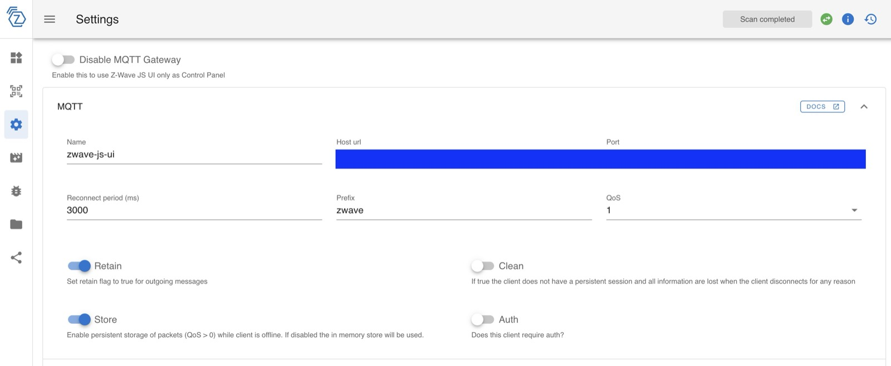
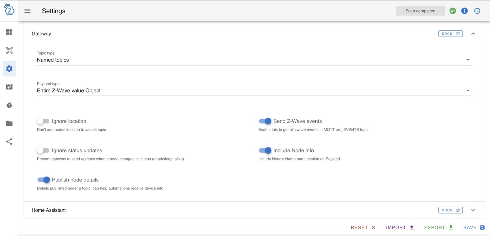

import JsonLd from '@site/src/components/seo/JsonLd';

Gladys Assistant offers integration with [Z-Wave JS UI](https://zwave-js.github.io/zwave-js-ui/#/), a software application for controlling Z-Wave devices. It runs **locally** on your own hardware, so your Z-Wave network keeps working with no cloud account.

Gladys connects to the same MQTT broker as Z-Wave JS UI and receives MQTT messages whenever a device's status changes.

:::note Choosing a Z-Wave USB stick for your region
Z-Wave uses a different radio frequency depending on where you live, so your stick must match your country: **908.42 MHz in the US and Canada**, 868.42 MHz in Europe. For North America, popular sticks include the Zooz ZST10 700 / ZST39 and the Aeotec Z-Stick 7 (US version). Make sure you buy the US/Canada model, not the EU one.
:::

## Installing Z-Wave JS UI

Please visit the [Z-Wave JS UI](https://zwave-js.github.io/zwave-js-ui/#/) website for Z-Wave JS UI installation instructions.

## Configuring Z-Wave JS UI

For integration with Gladys to work properly, 2 settings are required.

First, you need to set the MQTT parameters in the parameters, in particular the "name" field, which defines the MQTT topic to which messages will be sent.

Next, configure the "Gateway" section as follows:

## Connect Gladys to Z-Wave JS UI

To enable Gladys to communicate with Z-Wave JS UI, you need to provide Gladys with the URL and connection information for the MQTT broker on which Z-Wave JS UI is published.

Go to the "Configuration" tab to add this information.

## Discover Z-Wave JS UI

Go to the "Discovered" tab to see the devices your Z-Wave JS UI instance exposes.

You can then add them to Gladys with a single click!

## Supported Features

- **Door/Window Sensors** – Detect open/close status, such as the [Fibaro Door Opening Sensor](https://www.amazon.com/Fibaro-FGDW-002-1-Window-Temperature-Sensor/dp/B074FCG1PF?crid=AMCFKK427FRN&keywords=Fibaro+door+sensor+2&qid=1704977401&sprefix=fibaro+door+sensor+2%2Caps%2C164&sr=8-1&linkCode=ll1&tag=gladproj-20&linkId=3e61bb12444e6d8265e7440bd0174456&language=en_US&ref_=as_li_ss_tl).
- **Binary Switches** – Control lights or power outlets (on/off). Supported devices include:
  - [Fibaro Wall Plug](https://www.fibaro.com/en/products/wall-plug/)
  - [Fibaro Switches](https://www.fibaro.com/en/products/switches/)
- **Air Temperature Sensors** – Monitor room temperature.
- **Power Metering** – Track energy consumption analytics.
- **Curtain/Shutter Control** – Open, close, and check curtain position. Supported devices include:
  - [Fibaro Walli Roller Shutter](https://manuals.fibaro.com/fr/walli-roller-shutter/)
  - [Qubino Flush Shutter](https://qubino.com/products/flush-shutter/)
- **Dimmers** – Adjust brightness or control voltage-based devices. Supported devices include:
  - [Fibaro Walli Dimmer](https://manuals.fibaro.com/fr/walli-dimmer/)
  - [Fibaro Dimmer 2](https://manuals.fibaro.com/fr/dimmer-2/)
- **Luminosity Sensors** – Measure ambient light levels.
- **Alarm Sensors** – Detect security threats.
- **Binary Sensors** – Support various on/off detection scenarios.

If your device is not currently supported, let us know on the forum!

## Frequently asked questions

### How do I add a Z-Wave device to Gladys?

First pair the device with Z-Wave JS UI (its own inclusion process). Once it is on your Z-Wave network, open the "Discovered" tab in the Gladys Z-Wave JS UI integration to see the devices your instance exposes, and add the ones you want to Gladys with a single click.

### Which Z-Wave USB stick should I use in the US or Canada?

Pick a stick built for the North American 908.42 MHz frequency, such as the Zooz ZST10 700 / ZST39 or the Aeotec Z-Stick 7 (US version). A European 868.42 MHz stick will not talk to US or Canadian Z-Wave devices, so always check the region before buying.

### Does Gladys connect to Z-Wave directly or through Z-Wave JS UI?

Gladys connects through Z-Wave JS UI over MQTT. Z-Wave JS UI drives the USB stick and publishes device states to an MQTT broker, and Gladys subscribes to that broker to read states and send commands in real time.

### Does Z-Wave with Gladys work locally without the cloud?

Yes. Z-Wave JS UI, the MQTT broker and Gladys all run on your own hardware, so your Z-Wave automations keep running with no internet connection and no manufacturer cloud.

<JsonLd
  data={{
    "@context": "https://schema.org",
    "@type": "FAQPage",
    mainEntity: [
      {
        "@type": "Question",
        name: "How do I add a Z-Wave device to Gladys?",
        acceptedAnswer: {
          "@type": "Answer",
          text: "First pair the device with Z-Wave JS UI using its own inclusion process. Once it is on your Z-Wave network, open the Discovered tab in the Gladys Z-Wave JS UI integration to see the devices your instance exposes, and add the ones you want to Gladys with a single click.",
        },
      },
      {
        "@type": "Question",
        name: "Which Z-Wave USB stick should I use in the US or Canada?",
        acceptedAnswer: {
          "@type": "Answer",
          text: "Pick a stick built for the North American 908.42 MHz frequency, such as the Zooz ZST10 700 or ZST39, or the Aeotec Z-Stick 7 US version. A European 868.42 MHz stick will not talk to US or Canadian Z-Wave devices, so always check the region before buying.",
        },
      },
      {
        "@type": "Question",
        name: "Does Gladys connect to Z-Wave directly or through Z-Wave JS UI?",
        acceptedAnswer: {
          "@type": "Answer",
          text: "Gladys connects through Z-Wave JS UI over MQTT. Z-Wave JS UI drives the USB stick and publishes device states to an MQTT broker, and Gladys subscribes to that broker to read states and send commands in real time.",
        },
      },
      {
        "@type": "Question",
        name: "Does Z-Wave with Gladys work locally without the cloud?",
        acceptedAnswer: {
          "@type": "Answer",
          text: "Yes. Z-Wave JS UI, the MQTT broker and Gladys all run on your own hardware, so your Z-Wave automations keep running with no internet connection and no manufacturer cloud.",
        },
      },
    ],
  }}
/>
