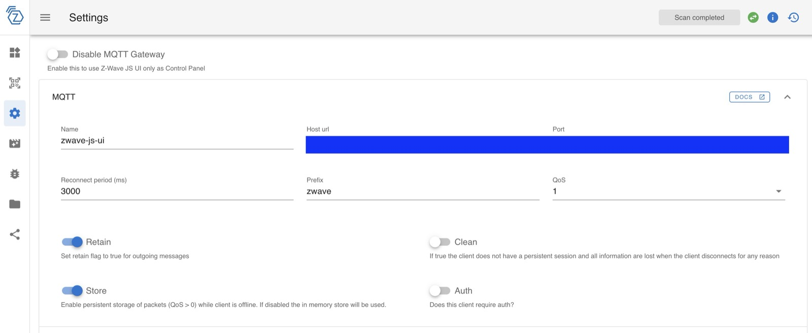

The following features are supported: 

 - Door/Window sensor such as the [Fibaro Door Opening Sensor](https://www.amazon.com/Fibaro-FGDW-002-1-Window-Temperature-Sensor/dp/B074FCG1PF?crid=AMCFKK427FRN&keywords=Fibaro+door+sensor+2&qid=1704977401&sprefix=fibaro+door+sensor+2%2Caps%2C164&sr=8-1&linkCode=ll1&tag=gladproj-20&linkId=3e61bb12444e6d8265e7440bd0174456&language=en_US&ref_=as_li_ss_tl)
 - Binary Switch: turn on/off lights or cut off power from the sockets. Sample of supported devices: [Fibaro Wall Plug](https://www.fibaro.com/en/products/wall-plug/), [Fibaro Switches](https://www.fibaro.com/en/products/switches/)
 - Air Temperature sensors
 - Power Meter analytics
 - UP/DOWN curtains: open/close and see your curtains position. Sample of supported devices: [Fibaro Walli Roller Shutter](https://manuals.fibaro.com/fr/walli-roller-shutter/), [Qubino Flush Shutter](https://qubino.com/products/flush-shutter/)
 - Dimmers: turn ON/OFF your lights (or any device accepting a controlled voltage). Sample of supported devices: [Fibaro Walli Dimmer](https://manuals.fibaro.com/fr/walli-dimmer/), [Fibaro Dimmer 2](https://manuals.fibaro.com/fr/dimmer-2/)

We are looking for help to integrate other devices!
:::

Gladys Assistant offers integration with [Z-Wave JS UI](https://zwave-js.github.io/zwave-js-ui/#/), a software application for controlling Z-Wave devices.

Gladys connects to the same MQTT broker as Z-Wave JS UI and receives MQTT messages whenever a device's status changes.

## Installing Z-Wave JS UI

Please visit the [Z-Wave JS UI](https://zwave-js.github.io/zwave-js-ui/#/) website for Z-Wave JS UI installation instructions.

## Configuring Z-Wave JS UI

For integration with Gladys to work properly, 2 settings are required.

First, you need to set the MQTT parameters in the parameters, in particular the "name" field, which defines the MQTT topic to which messages will be sent.

Next, configure the "Gateway" section as follows:

## Connect Gladys to Z-Wave JS UI

To enable Gladys to communicate with Z-Wave JS UI, you need to provide Gladys with the URL and connection information for the MQTT broker on which Z-Wave JS UI is published.

Go to the "Configuration" tab to add this information.

## Discover Z-Wave JS UI

Go to the "Discovered" tab to see the devices your Z-Wave JS UI instance exposes.

You can then add them to Gladys with a single click!
