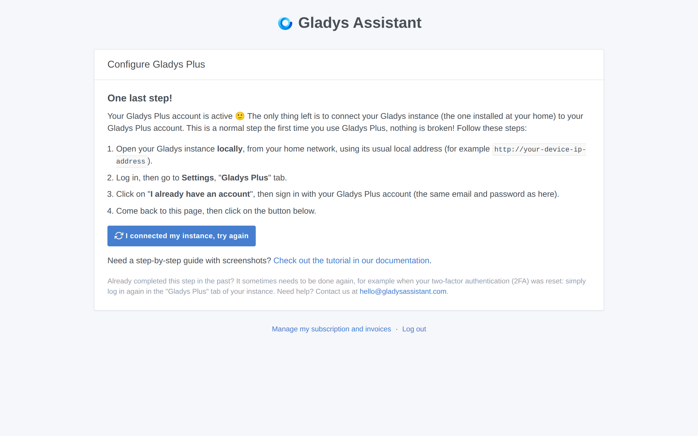
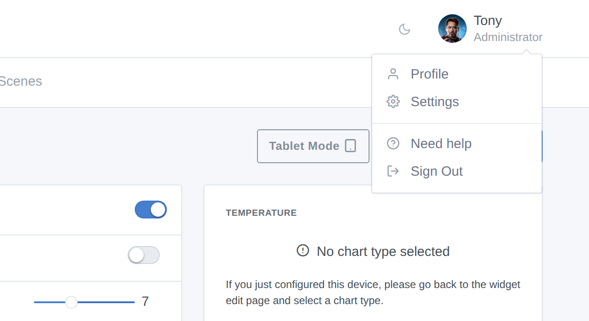
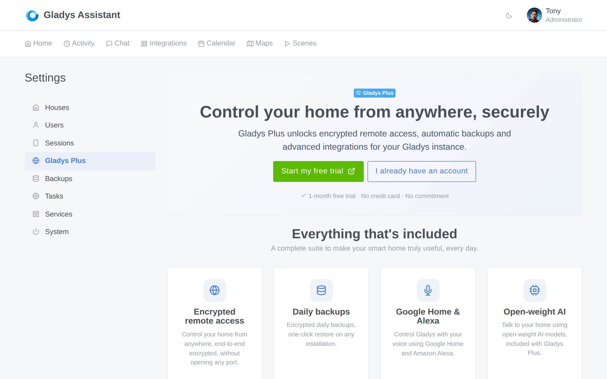
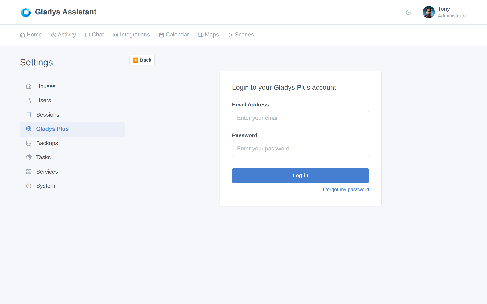

When you create a [Gladys Plus](/plus/) account, there is one last step to complete: **connecting your local Gladys instance (the one installed at your home) to your Gladys Plus account.**

Until this step is done, [plus.gladysassistant.com](https://plus.gladysassistant.com) shows a "**One last step!**" page: this is completely normal, nothing is broken! Your Gladys Plus account is active, it just doesn't know yet which Gladys instance it should connect to.

This tutorial walks you through this step, with screenshots.

## Prerequisites

- A Gladys instance installed and running at your home (see the [installation documentation](/docs/) if needed).
- A Gladys Plus account (created on [gladysassistant.com/plus](https://gladysassistant.com/plus/)).

## Step 1: Open your Gladys instance locally

Open your Gladys instance **from your home network**, using its usual local address: for example `http://192.168.1.30` (the IP address of your Raspberry Pi or the machine where Gladys is installed), or the address provided by your installation method.

Log in with your **local Gladys account** (the account you created when you installed Gladys — it can be different from your Gladys Plus account).

## Step 2: Go to the settings

Click on your profile picture at the top right, then click on **"Settings"**.

## Step 3: Open the "Gladys Plus" tab

In the settings, click on the **"Gladys Plus"** tab in the left menu, then click on **"I already have an account"**.

## Step 4: Log in with your Gladys Plus account

Enter the **email and password of your Gladys Plus account** (the same credentials as on [plus.gladysassistant.com](https://plus.gladysassistant.com)), then click on "Login".

If it's the first time you connect, Gladys will ask you to configure two-factor authentication (2FA) to secure your account, and will then display your **backup key**: save this key somewhere safe outside of Gladys (a password manager for example), it is needed to restore your encrypted backups.

## Step 5: Go back to Gladys Plus

Your instance is now connected! Go back to [plus.gladysassistant.com](https://plus.gladysassistant.com) and click on the **"I connected my instance, try again"** button on the "One last step!" page.

You will then be asked to **select your Gladys user**: choose the local user you want to link to your Gladys Plus account. And that's it, you can now access your home remotely, securely! 🎉

## Troubleshooting

- **The "One last step!" page comes back even though you already completed this step in the past**: this can happen when your two-factor authentication (2FA) was reset. Simply log in again in the "Gladys Plus" tab of your local instance (steps 1 to 4 above).
- **"The user was not accepted locally" error**: in your local instance, go to the settings, "Gladys Plus" tab, "Users" section, and accept the user.
- **Need help?** Contact us at [hello@gladysassistant.com](mailto:hello@gladysassistant.com) or ask on the [community forum](https://community.gladysassistant.com/).
