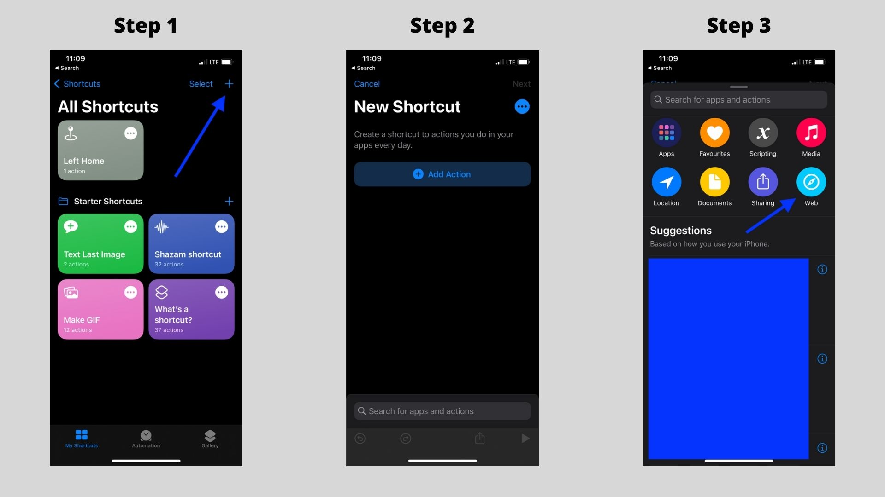
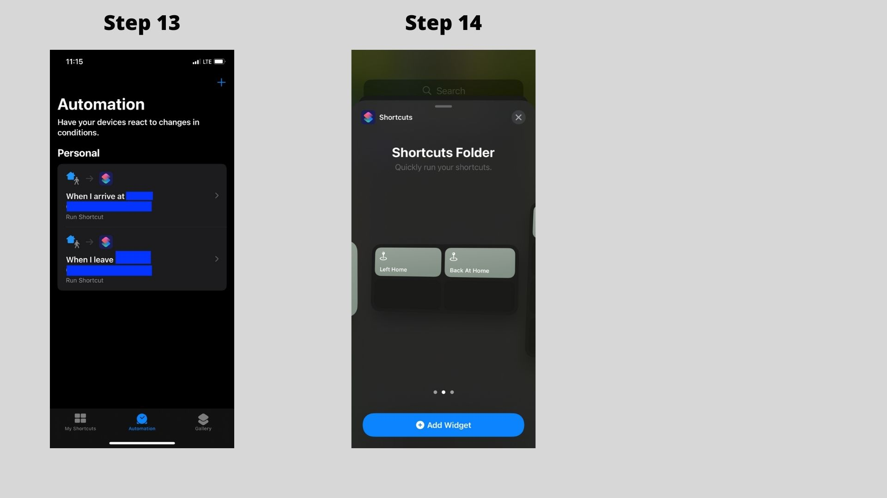

We provide an Open API in Gladys that lets our user send data from outside their network.

Let's imagine I want to send data from my phone: my location, an event when I come home, my battery, an event when my phone is near a NFC tag, an event when I enter a zone, anything is possible with the Open API.

## Prerequisites

You need to be a paid Gladys Plus user to use the Open API.

You can subscribe [here](/plus).

## Generate a new API Key

First, you need to create a new API key in Gladys Plus.

Go to [https://plus.gladysassistant.com/dashboard/settings/gateway-open-api](https://plus.gladysassistant.com/dashboard/settings/gateway-open-api).

Type a name for the device that will use your API key.


Click on "Generate", then copy-paste the API key and save it somewhere: it'll never be displayed again.

## Send a new sensor value

Now, let's send a new sensor value.

Tutorial scenario: 

Let's assume you want to send an event when your phone is home, and send another event when your phone has left home.

### Let's create a device in Gladys

You can use the "MQTT" integration to create devices, even if you don't use the MQTT integration.

Let's create a device for your phone:


**Note:** Say that your phone is a motion sensor, because it's a great binary device for this use case. It doesn't really matter here, you'll see how we'll use this here :)

You can keep the feature "external_id" for later, we'll need it in the API.

### Send an API request

Now, let's try to send an API request to the Open API to say "my phone is home".

We'll send:

```
POST https://api.gladysgateway.com/v1/api/device/state/YOUR_OPEN_API_KEY

Body:
{
	"device_feature_external_id": "mqtt:my-phone-presence",
	"state": 1
}
```

You can try the API using [Insomnia](https://insomnia.rest/).

If you want to say the opposite (my phone left home), you can send:

```
POST https://api.gladysgateway.com/v1/api/device/state/YOUR_OPEN_API_KEY

Body:
{
	"device_feature_external_id": "mqtt:my-phone-presence",
	"state": 0
}
```

### Create a scene in Gladys to put your user as "at home"/"left home"

You can create 2 scenes in Gladys to set your user as "left home" or "at home" when your phone is near home:


## Use Tasker or iOS Shortcuts to trigger this API

On Android you can use the Amazing [Tasker](https://play.google.com/store/apps/details?id=net.dinglisch.android.taskerm&hl=fr&gl=US) to send an API request when you enter/leave your house (based on anything: GPS location, NFC trigger, Wi-Fi detection, or anything in your imagination)

On iOS, you can use Shortcuts.

Example with iOS:

### First step, install Shortcuts and create a new shortcut

You need to install the "Shortcuts" app on the app store. It's made by Apple and it's free to use.

Then, create a new shortcut, and add a new web action:



Copy the URL of the Gateway, and add the JSON body.

- The "device_feature_external_id" attribute should be a text field
- The "state' attribute should be a number field


You can create another shortcut for the "left home" event by duplicating the previous one, and changing 1 by 0.


Now, we can create an automation to make this shortcut run automatically when you arrive at home:


You can do the same for when you leave home.

You can also add the shortcut to your home screen if you want to trigger it manually:



## Send phone location using Owntracks

It's also possible to send your phone location to Gladys using the Open API and Owntracks:

[Read the tutorial in the documentation](/docs/integrations/owntracks)
