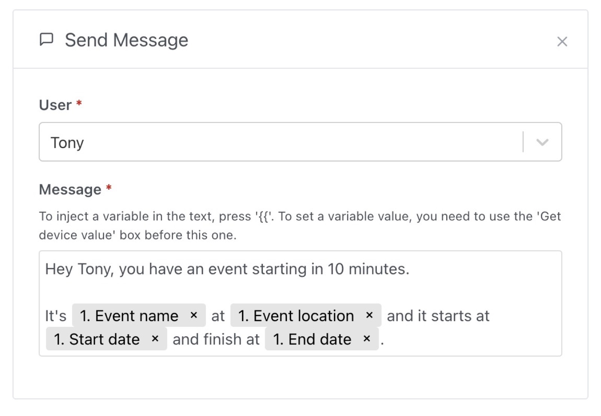

This trigger is very powerful. It uses the calendar integration (Like [Caldav](/docs/integrations/caldav)), and let you trigger a scene based on a calendar event coming or ending.

Let's imagine you want to start a scene when you need to go to the gym.

You can use this trigger in scene to match all events in the "work" or "sport" calendar, with "gym" in the title.

There are lots of different filters possible:

- starts with
- ends with
- is exactly
- contains
- has any name (will be triggered no matter what the name of the event is)

You can use the event that triggered the scene in other actions after, like the message action:

