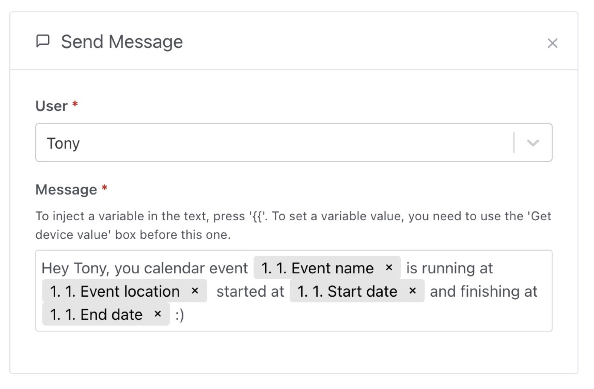

Let's imagine you want to create a scene that only run if you are currently in holidays, at the gym or in a call?

You can use the calendar integration (Like [Caldav](/docs/integrations/caldav)) to add a condition in a scene on the presence of an event in your calendar.

It looks like this :

You can use the event found in other actions after, like the message action:

