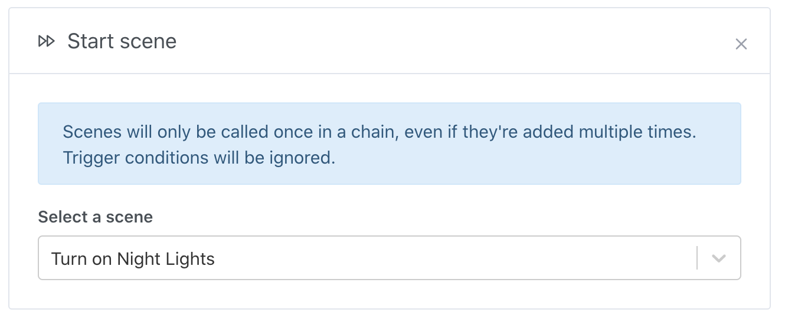

You can trigger one scene from another by adding a scene action.

The chained scene will only be triggered once, ignoring all trigger conditions on that scene.

Adding the same scene multiple times in a chain, even in different action groups, will have no effect. This is in order to prevent loops.

