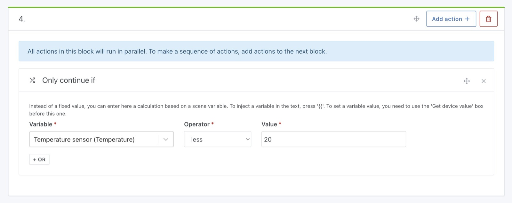

This action allows you to continue (or not) the execution of the scene according to a given condition.

Let's take an example.

## Continue the scene with a condition on the temperature of a room

Suppose you want to do a scene that fetch the temperature of the room, then continues the scenario only if the temperature is below 20 ° C.

The first step in your scene is to add a "get last state" action, and select the sensor you want to use.

Then, in the next action block, you can add a "Continue only if" action, by selecting the variable retrieved previously.

By setting the condition `kitchen temperature sensor <20°C`, this gives us this:

In this action, you can inject variables and use mathematical functions.

See [Math functions available](/docs/scenes/math-functions).
