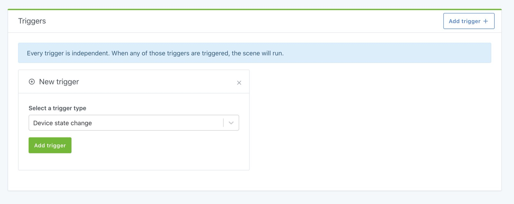
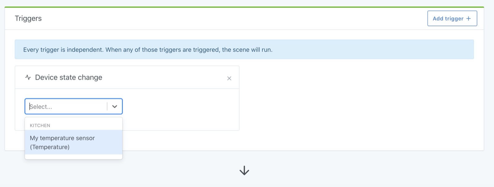
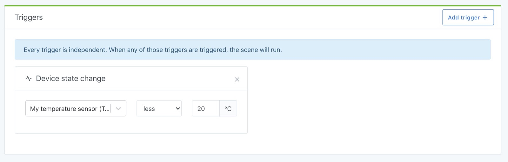
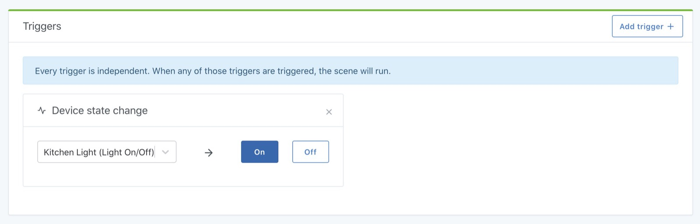

Say you want to do a scene that performs an action if the temperature drops below 20°C in a room.

For this you need a "device state change" trigger.

Click on "New trigger", then select "Device state change":

Then select the feature of the device that you want to "monitor".

For example, in our case, we will select a temperature sensor in the kitchen:

Then you can add under which condition this trigger should run the scene.

In our case, we want the scene to be executed if "The temperature is less than 20 ° C":

Depending on the type of device you select in this trigger, the interface adapts. For example, if you want to run a "when the kitchen light comes on" scene, your interface will look like this:

