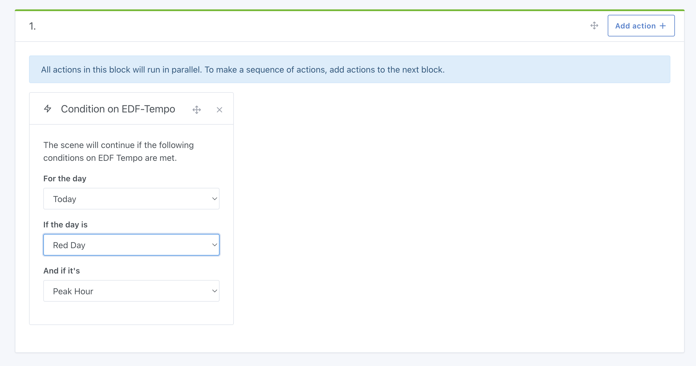

In France, EDF provides a service [EDF Tempo](https://particulier.edf.fr/fr/accueil/gestion-contrat/options/tempo.html) where the cost of electricity is generally cheaper all year round, except on certain "white" and "red" days when the price of electricity is much higher.
In 2024, there are 301 blue days, 43 white days and 22 red days.
This type of contract is practical for users who can easily shift their usage.

### Automatic scenarios with Gladys

In Gladys, you can retrieve the current status of the Tempo day in a scene, and find out whether we're in peak/off-peak mode.
To do this, create a "Condition on EDF-Tempo" scene action:

This condition may block execution of the scene if the condition is not met.

This condition allows you to create all types of smart scenes:

- Start the washing machine ONLY if it's a blue day
- In the morning at 8 a.m., if it's a red day, send me a message on Telegram
- In the evening at 7pm, if the next day is a red day, send me a message to warn me to start the dishwasher this evening.
  In short, the possibilities are endless!
