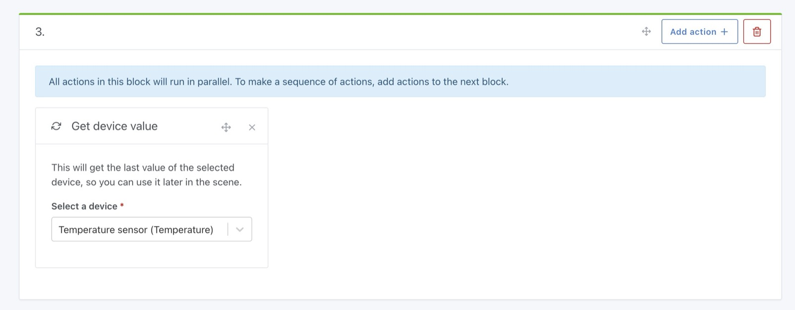
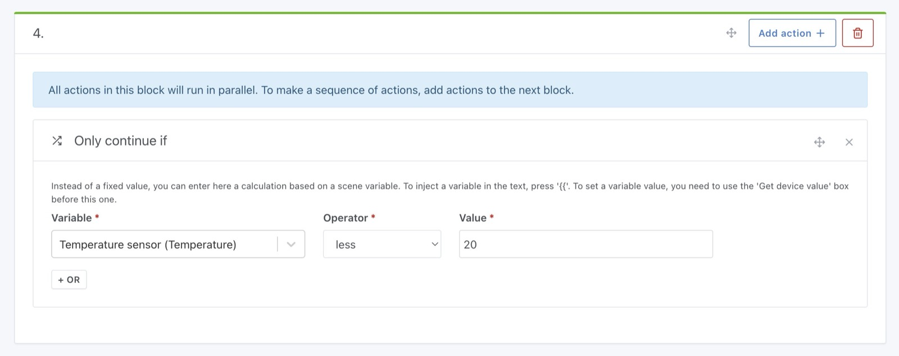

This action allows you to get the last state of a device managed by Gladys, and store this state in a variable.

Let's take an example.

## Add a condition on the temperature of a room

Suppose you want to build a scene that fetches the temperature of the room, then continues the scenario only if the temperature is below 20°C.

The first step in your scene is to add a "get last state" action, and select the sensor you want to use.

Then, in the next action block, add a "Continue only if" action, by selecting the variable retrieved previously.

By setting the condition "kitchen temperature sensor < 20 ° C", this gives us this:

