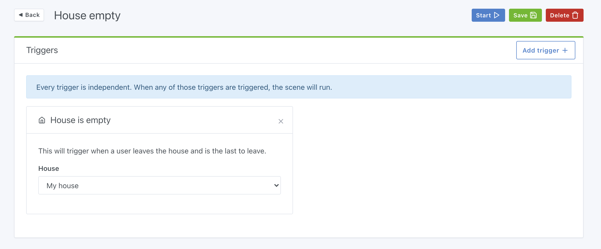

This trigger is triggered when the last user of the house leaves the house.

## Simple example

To set user presence at home, you can read our tutoriel on [Bluetooth presence](/docs/integrations/bluetooth) or set presence [in scene](/docs/scenes/user-presence).
