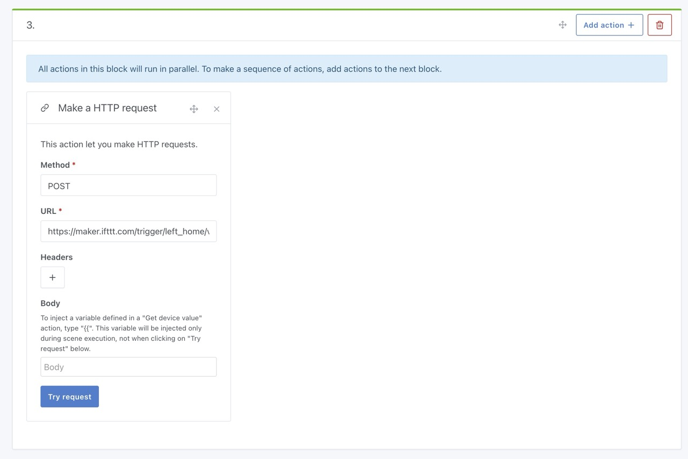
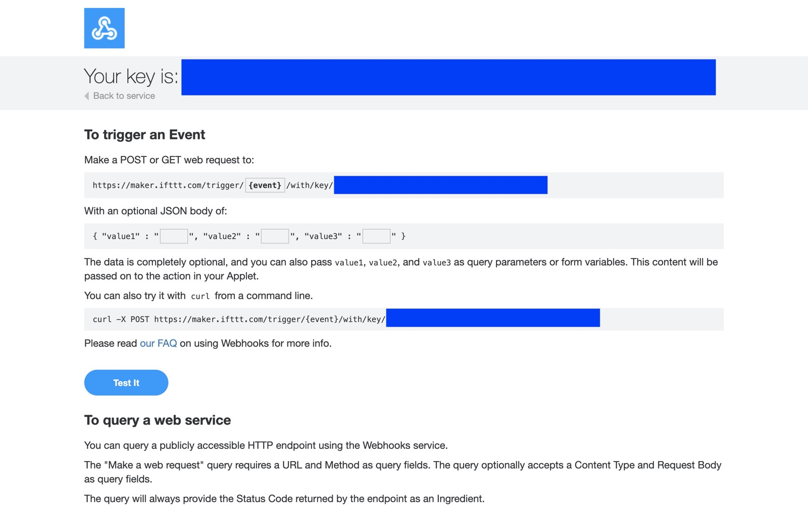
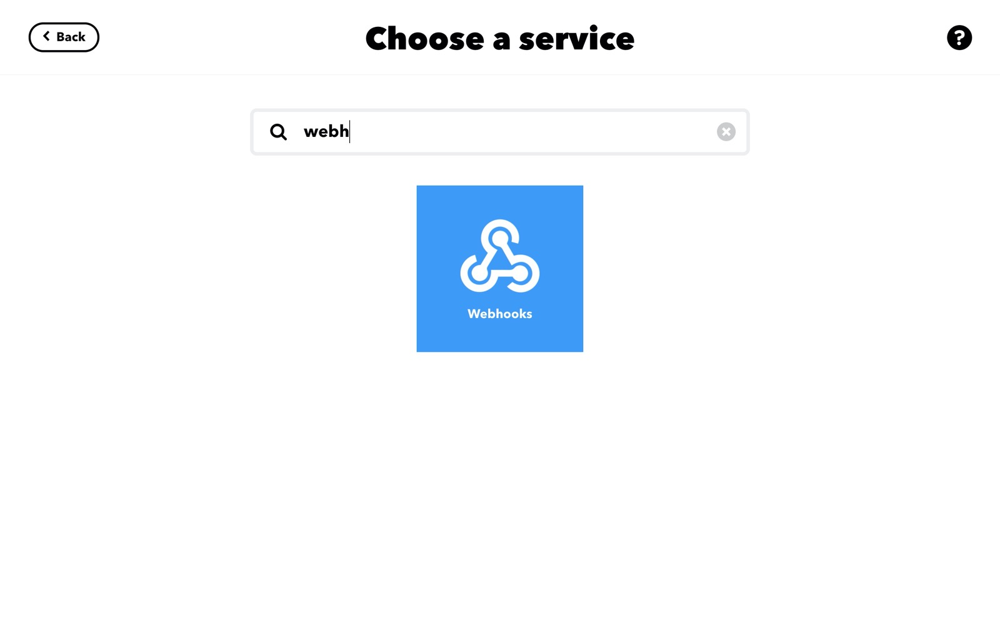
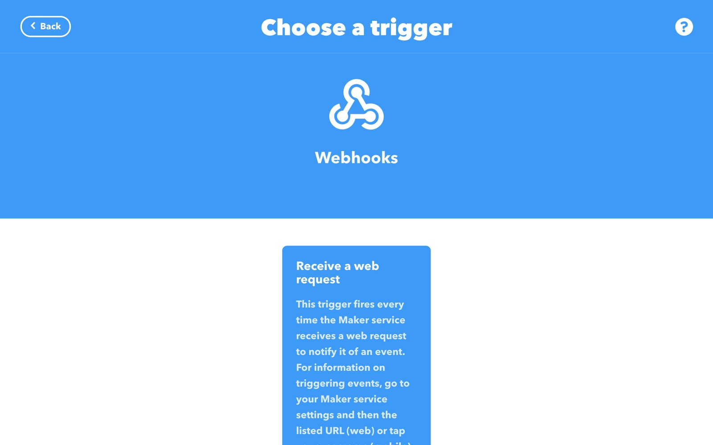
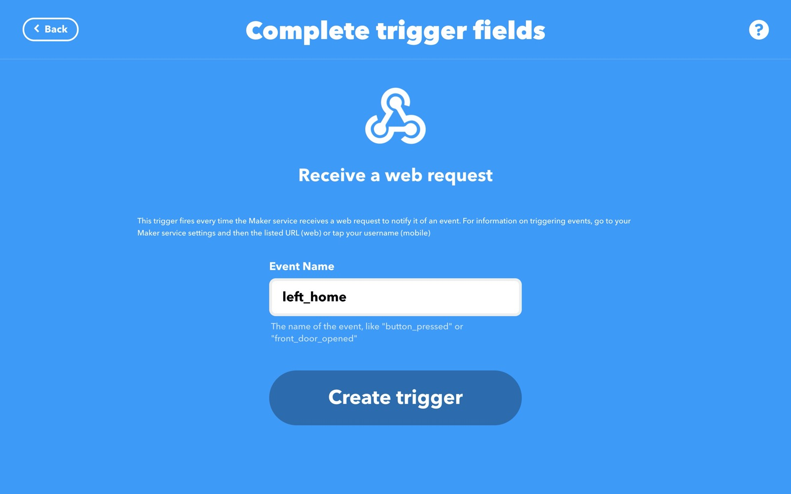
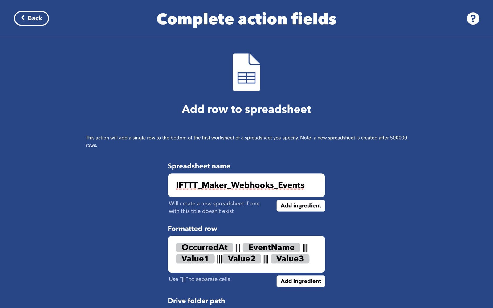
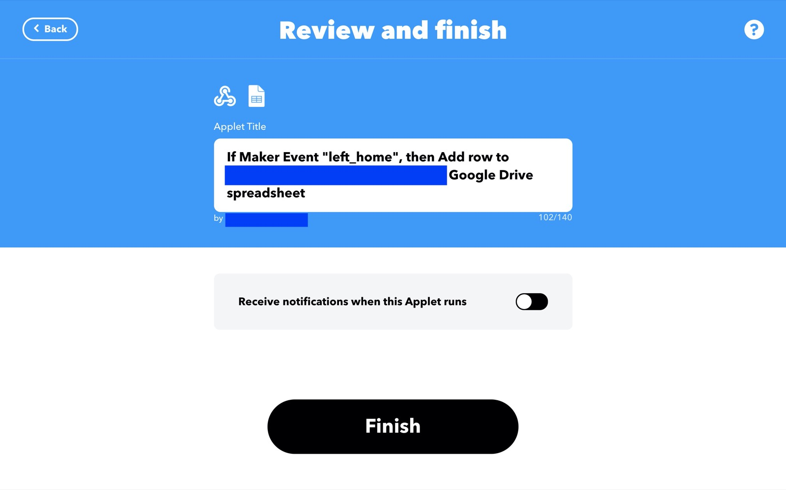
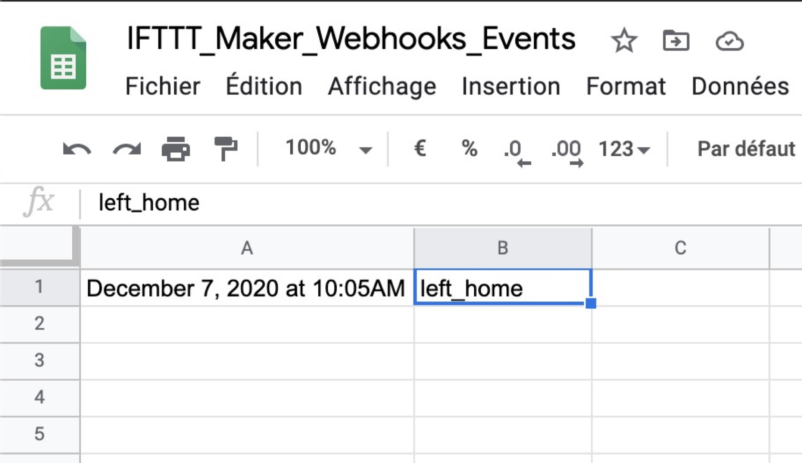

In scenes, it is sometimes practical to call an external API in order to control devices not necessarily managed by Gladys Assistant, or to simply call an external service without developing a service specifically for the occasion.

## Prerequisites

You must be in Gladys Assistant v4.0.3 minimum to have this functionality.

## Send an HTTP request in a scene

In scenes, you can create an "Make HTTP Request" action, which allows you to make an HTTP GET, POST, PATCH, PUT, or DELETE request.

You can add headers if you need them for authentication for example.

## Concrete example: Trigger an IFTTT action from a Gladys Assistant scene

You are probably familiar with [IFTTT] (https://ifttt.com/), a service that allows different services to be connected to each other. Their business model having changed recently, it is only possible to create 3 actions per account, but this is more than enough if you want to use it only to compensate for a lack of Gladys for example.

In this example, we'll use IFTTT to save a value to Google Sheet each time a scene is called.

Here we are going to send a "departure from home" event to IFTTT and ask it to log this event in a Google Sheet, in order for example to track your departures from home.

This is of course an example that you can adapt according to your needs 😁

### Configure Maker Webhooks in IFTTT

In IFTTT, go to [https://ifttt.com/maker_webhooks Danemark(https://ifttt.com/maker_webhooks) to configure Maker Webhooks.

I let you follow the IFTTT tutorial to configure the Maker Webhooks.

Normally, after configuring the webhooks, you should come to a page like this:

Replace `{event}` with the name of your event, in my example "left_home", then copy and paste the URL.

Save the URL for later.

### Configure the Google Sheet service in IFTTT

On the IFTTT "Explore" page, find the "Google Sheet" service, and connect your Google account. This will be used for the rest.

### Create an applet

Look for the "Webhooks" service that you configured just before.

Select "Receive a web request":

Enter the name of the event you entered in the previous step, here "left_home":

Select where you want IFTTT to save the data (in which spreadsheet on your Google Drive)

Click on "Save".

Then click on Finish.

### In Gladys, create a scene

Create a new scene in Gladys, then add an "make an HTTP request" action to it.

Select "method: POST", then in URL enter the URL of the IFTTT webhook that you configured previously.

Save the scene, then launch it.

If you go to Google Drive, you should see an "IFTTT" folder at the root, containing a "MakerWebhook" folder, as well as in this case a "let_home" folder.

Inside you'll find a spreadsheet with a line that recorded when you left the house:

## Conclusion

This was just one example, this action in the scenes allows you to do millions of things:

- Call the API of another home automation box
- Call IFTTT to control any API: Music through Sonos? Ring your phone? Send an email ? Send a tweet?
- Call [Zapier] API (https://zapier.com/) to call any API (Gmail, Calendar, Trello, and hundreds of others)

In short, the possibilities are limitless.
