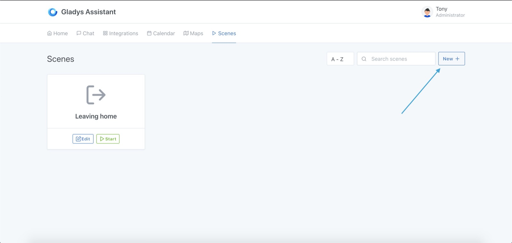
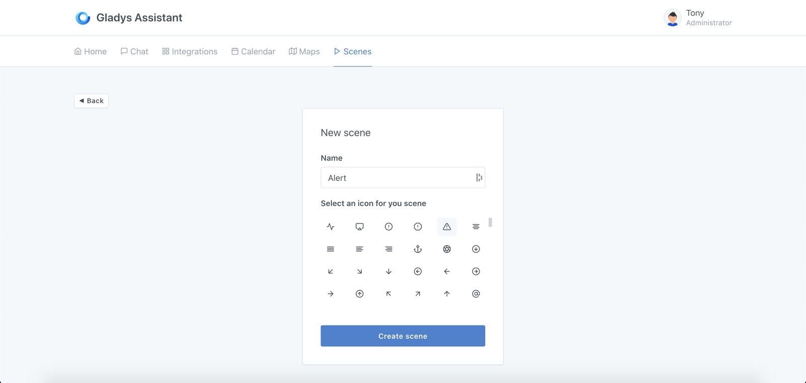
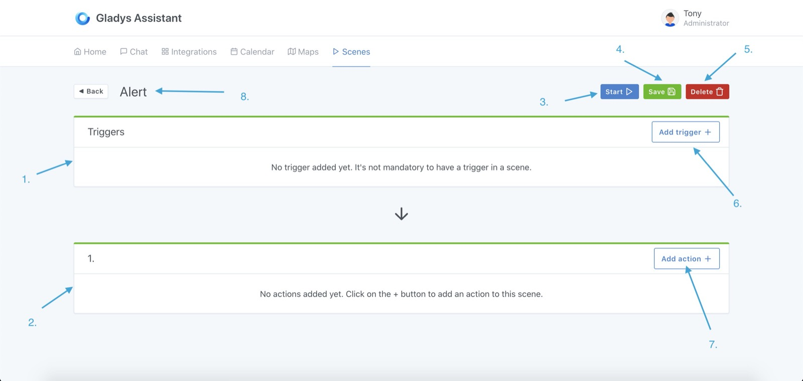

You can create **scenes** in Gladys Assistant. These are a set of **actions** executed consecutively or in parallel.

The scenes are entirely customisable: the users create their own action suites in the Gladys `scene editor`.

These scenes can be triggered manually, automatically (via a **trigger**) or from another scene.

Some examples:

- A "turn off the whole house" scene, which would turn off all the lights in the house. This scene can also be manually triggered, to turn all the lights off, at home, remotely.
- An "Intrusion alert" scene, which sends a Telegram message to the user. This scene would be configured to run after an "If motion is detected" trigger.

## Create a scene

To create a scene, go to the "Scenes" tab of your Gladys interface, and click on the "New +" button.

Choose a name for your scene, as well as an icon. This icon is only used in the Gladys interface.

You are now in the scene editor. Let's go through each part of the editor together:

1. Triggers: If you add triggers to your scene (this is optional), they will appear here. The same scene can be triggered by several different triggers. These triggers are all independent. 
:::note
Adding several triggers simply means: "When this event occurs OR When this event occurs OR ..."
:::
2. An action block: a scene is split into one or more action blocks. When you add actions to this action block, all actions in the block will run in parallel. If you add actions to the next action block (not visible in this screenshot), the scene will wait until action block # 1 is finished before moving on to the next one. You can therefore run actions in parallel and in a sequence.Pretty powerful, right?
3. Execute: This button allows you to test the execution of the scene. This button does not take triggers into account, it only executes action blocks.
4. Save: This button saves the scene.
5. Delete: This button deletes the scene.
6. Add trigger: This button allows you to add a trigger to the scene. You can add as many triggers as you want.
7. Add action: This button adds an action to the action block.
8. Click on the scene title to edit it.
