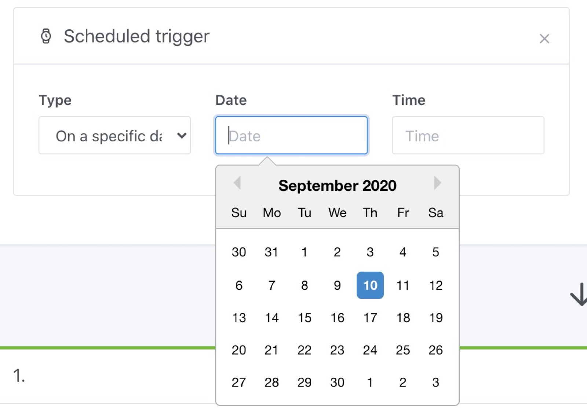

It is common in home automation to want to schedule a scene: every day? Once a day? once a week? Once a month? Every 15 minutes?

Gladys offers a trigger that allows you to schedule the execution of a scene.

There are 5 types of scheduling possible:

- Every month
- Every week
- Everyday
- At intervals
- On a specific day

Let's run throug the different options available:

## Every month

This trigger allows you to schedule the execution of a scene, every month on a specific day of the month.

This is useful if, for example, you want to run a scene every 1st of the month.

## Every week

This trigger lets you schedule a scene to run on certain days of the week at a specific time.

It is probably the most used trigger because it allows you to set any "daily routine" elements up.

If you want to wake up to a custom scene, every day of the week (Monday-Friday) at 7am, this is what your scene will look like:

## Everyday

This trigger allows you to trigger a scene every day at a specific time.

Useful for all recurring tasks that occur every day of the week.

## Interval

This trigger is special. It allows you to program a scene, not by "day" but at a particular interval (ie: every 30 seconds, every 15 minutes, every hour).

Example:

## On a specific date

This trigger allows you to schedule your scene on a specific day and at a specific time.

Example: June 4, 2020 at 2:00 p.m.

