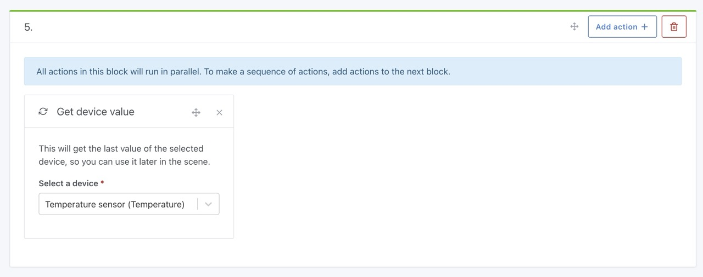

This action allows you to send a message to a Gladys user in a scene.

Gladys will then use Telegram / Gladys web chat to contact the user.

## Simple example

To send a message, it's very simple, create a "send a message" action in a scene, and select the user who should receive the message.

## Inject a variable into a message

Say you want to send yourself an alert when the temperature is too low in your home.

You want to inject the current temperature value into the message, in order to know the current temperature value.

To do this, you must add a "retrieve the last state" action to your scene and select the sensor you want to request.

Then, further in the scene, you can add a "send message" action, and in the message you type `{{` and select the previously defined variable.

When the scene runs, you should get the value in your message 🥳
