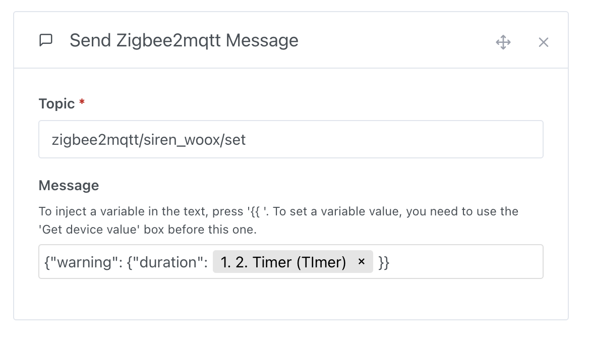

In scenes, it is sometimes useful to send an order to control zigbee2mqtt devices that are not managed by Gladys Assistant.

## Send a Zigbee2Mqtt message in a scene

To send a Zigbee2Mqtt message, it's very simple, create a "send a Zigbee2Mqtt message" action in a scene.

## Concrete example: Trigger a siren [Woox R7051](https://www.zigbee2mqtt.io/devices/R7051.html) from a Gladys Assistant scene

### In Gladys, create a scene

Create a new scene in Gladys, then add an "send a Zigbee2Mqtt message" action to it.

Specify the topic of your device.

Specify the command to control your device. You can find your device's information on the [Zigbee2mqtt](https://www.zigbee2mqtt.io/devices/R7051.html#warning-composite) website.

Save the scene and launch it.

## Inject a variable into a message

You want to inject the duration value into the message, in order to know the current duration value.

To do this, you must add a "retrieve the last state" action to your scene and select the device you want to request.

Then, further in the scene, you can add a "send a Zigbee2Mqtt message" action, and in the message you type `{{` and select the previously defined variable.

When the scene runs, you should get the value in your message 🥳
